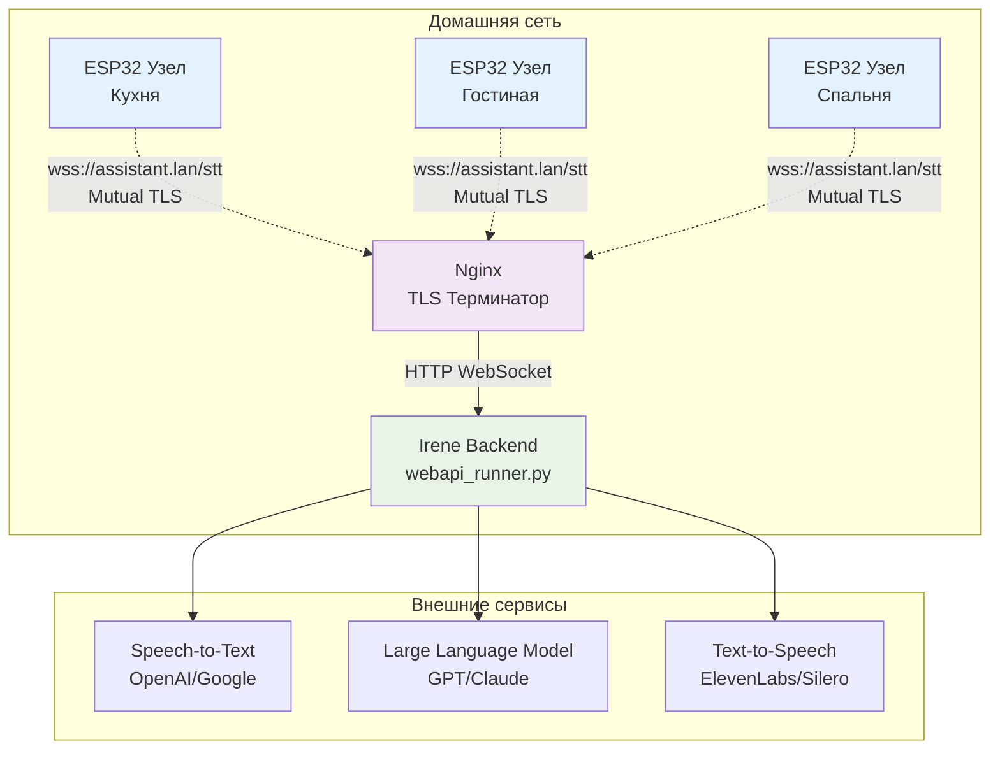
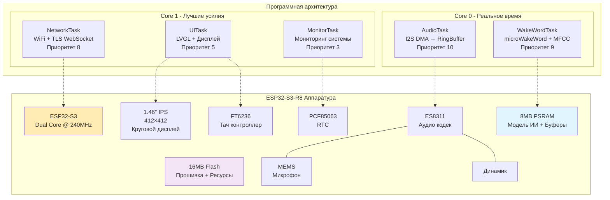
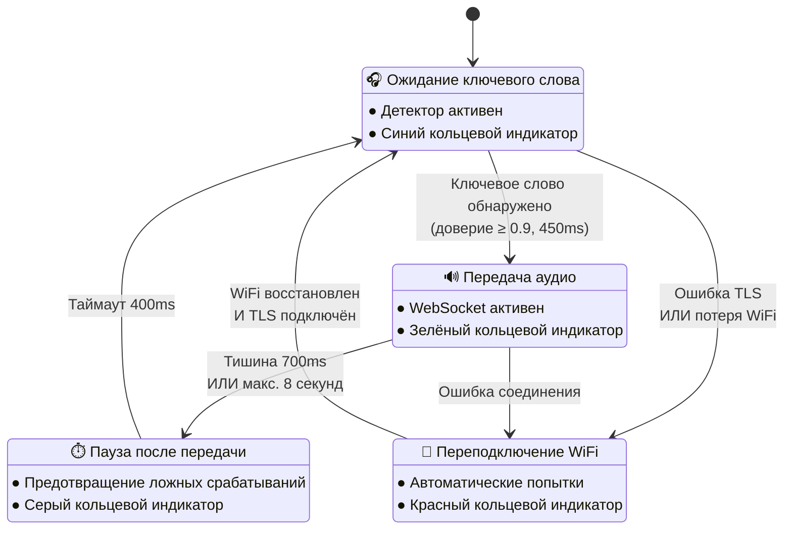

# ESP32 Firmware для Голосового Ассистента Irene

## Обзор

ESP32 подсистема представляет собой распределённую сеть "умных" микрофонных узлов для голосового ассистента Irene. Каждый узел работает на микроконтроллере ESP32-S3-R8 и обеспечивает:

- **Локальное обнаружение ключевых слов** с помощью нейронной сети microWakeWord
- **Безопасную аудиопередачу** через WebSocket с взаимной TLS аутентификацией  
- **Круговой пользовательский интерфейс** на базе LVGL с отображением состояния системы
- **Уникальные модели пробуждения** для каждого узла с оптимизацией INT8

## Архитектура системы



## Архитектура узла ESP32



## Конечный автомат состояний



## Обработка аудио и детекция пробуждающих слов

```mermaid
graph LR
    subgraph "Аудио пайплайн"
        MIC["🎤 Микрофон<br/>Аналоговый"]
        I2S["I2S DMA<br/>16kHz, 16-bit, Mono"]
        VAD["WebRTC VAD<br/>Детекция голоса"]
        RING["Ring Buffer<br/>300ms история"]
    end
    
    subgraph "Wake Word детекция"
        MFCC["MFCC Frontend<br/>49×40 признаки<br/>30ms окно"]
        QUANT["INT8 квантизация<br/>Автоматическая"]
        MODEL["TensorFlow Lite<br/>medium-12-bn модель<br/>140KB в PSRAM"]
        CONF["Confidence Score<br/>Пороговая проверка"]
    end
    
    subgraph "Передача данных"
        WS["WebSocket<br/>Raw PCM"]
        TLS["TLS 1.2<br/>Mutual Auth"]
        NGINX["Nginx<br/>assistant.lan"]
    end
    
    MIC --> I2S
    I2S --> VAD
    VAD --> RING
    
    RING --> MFCC
    MFCC --> QUANT
    QUANT --> MODEL
    MODEL --> CONF
    
    CONF -->|"Порог ≥ 0.9"| WS
    RING -->|"300ms буфер"| WS
    WS --> TLS
    TLS --> NGINX
    
    style MODEL fill:#ffecb3
    style TLS fill:#e8f5e8
```



## Структура проекта

```mermaid
graph TD
    ROOT["ESP32/"]
    
    ROOT --> DOCS["docs/"]
    ROOT --> FIRMWARE["firmware/"]
    
    DOCS --> DOC1["GETTING_STARTED.md"]
    DOCS --> DOC2["irene_firmware.md"] 
    DOCS --> DOC3["README_INT8_UPGRADE.md"]
    
    FIRMWARE --> COMMON["common/"]
    FIRMWARE --> NODES["nodes/"]
    FIRMWARE --> TOOLS["tools/"]
    FIRMWARE --> README_FW["README.md"]
    
    subgraph "Общие компоненты"
        COMMON --> INCLUDE["include/"]
        COMMON --> SRC["src/"]
        
        INCLUDE --> CORE["core/<br/>● state_machine.hpp<br/>● types.hpp<br/>● task_manager.hpp"]
        INCLUDE --> AUDIO["audio/<br/>● audio_manager.hpp<br/>● wake_word_detector.hpp<br/>● vad_processor.hpp<br/>● mfcc_frontend.hpp"]
        INCLUDE --> NETWORK["network/<br/>● network_manager.hpp<br/>● websocket_client.hpp<br/>● tls_manager.hpp<br/>● wifi_manager.hpp"]
        INCLUDE --> UI["ui/<br/>● ui_controller.hpp<br/>● display_manager.hpp"]
        INCLUDE --> HARDWARE["hardware/<br/>● i2s_driver.hpp<br/>● codec_es8311.hpp"]
        INCLUDE --> UTILS["utils/<br/>● ring_buffer.hpp"]
    end
    
    subgraph "Узлы"
        NODES --> KITCHEN["kitchen/"]
        NODES --> LIVING["living_room/"]
        
        KITCHEN --> MAIN_K["main/<br/>● main.cpp<br/>● node_config.h<br/>● certificates.h<br/>● ww_model.h"]
        KITCHEN --> CERTS_K["main/certs/<br/>● ca.pem<br/>● kitchen.pem<br/>● kitchen.key"]
        KITCHEN --> MODELS_K["main/models/<br/>● jarvis_medium.tflite"]
    end
    
    subgraph "Инструменты"
        TOOLS --> CERT_TOOL["generate_certs.sh<br/>Генерация сертификатов"]
        TOOLS --> SETUP_TOOL["setup_node.py<br/>Настройка узлов"]
    end
    
    style COMMON fill:#e3f2fd
    style NODES fill:#e8f5e8  
    style TOOLS fill:#fff3e0
```



## Компоненты системы

### 🔧 Управление состоянием (`StateMachine`)
Центральный координатор, управляющий:
- Переходами между состояниями (Ожидание → Прослушивание → Передача → Пауза)
- Обработкой событий от всех подсистем
- Синхронизацией между задачами FreeRTOS

### 🎵 Аудио менеджер (`AudioManager`)  
Отвечает за:
- Захват аудио через I2S DMA (16kHz, 16-bit, моно)
- Детекцию голосовой активности (WebRTC VAD)
- Буферизацию с кольцевым буфером на 300ms
- Потоковую передачу PCM данных

### 🧠 Детектор пробуждающих слов (`WakeWordDetector`)
Функции:
- Обработка MFCC признаков (49×40 матрица)
- Квантизация INT8 для эффективности
- Инференс через TensorFlow Lite Micro
- Латентность детекции < 150ms

### 🌐 Сетевой менеджер (`NetworkManager`)
Координирует:
- WiFi подключение с автопереподключением
- TLS взаимную аутентификацию
- WebSocket соединения для аудиопотока
- Обработку сетевых ошибок

### 🖥️ Контроллер интерфейса (`UIController`)
Управляет:
- LVGL-интерфейсом на круговом дисплее
- Цветовой индикацией состояний (кольцо)
- Отображением времени, погоды, состояния WiFi
- Обработкой сенсорного ввода

## Безопасность

### 🔐 Взаимная TLS аутентификация
- Локальный центр сертификации (CA)
- Уникальные клиентские сертификаты для каждого узла
- Ed25519 криптография для эффективности
- Защита от атак "человек посередине"

### 🔒 Шифрованная коммуникация
- TLS 1.2 для всех WebSocket соединений
- Шифрование сырого PCM аудио при передаче
- Конфигурационные сообщения по защищённому каналу

### 🏠 Локальная инфраструктура
- Самоподписанный корневой CA для домашней сети
- Никаких зависимостей от внешних сертификатов
- Полный контроль над жизненным циклом сертификатов

## Производительность

### 📊 Использование ресурсов
- **Flash**: ≈ 770 KB общий размер
- **RAM**: ≈ 180 KB внутренняя + 324 KB PSRAM
- **Латентность пробуждения**: < 150ms в среднем
- **Инференс**: 25ms на кадр (интервалы 30ms)

### ⚡ Архитектура задач
```
FreeRTOS задачи (ESP32-S3 двухъядерный):
├─ Core 0: Аудио + Wake Word (реальное время)
│   ├─ AudioTask (Приоритет 10)
│   └─ WakeWordTask (Приоритет 9)
└─ Core 1: Сеть + UI (лучшие усилия)
    ├─ NetworkTask (Приоритет 8)
    ├─ UITask (Приоритет 5)
    └─ MonitorTask (Приоритет 3)
```

## Требования к оборудованию

| Компонент | Технические характеристики |
|-----------|---------------------------|
| **MCU** | ESP32-S3-R8 (Xtensa LX7 @ 240 MHz, 2 ядра) |
| **Память** | 512 KB SRAM + 8 MB PSRAM (Octal 80 MHz) |
| **Flash** | 16 MB QSPI |
| **Аудио** | ES8311 (I²S, I²C 0x18) ↔ MEMS микрофон |
| **Дисплей** | 1.46″ IPS, 412×412, SPI 40 MHz |
| **Ввод** | Боковые кнопки BTN_L, BTN_R; ёмкостный сенсор FT6236 |
| **Периферия** | PCF85063 RTC, IMU, слот µSD |

## Быстрый старт

### 1. Инициализация центра сертификации
```bash
cd ESP32/firmware/tools
./generate_certs.sh init
```

### 2. Создание первого узла
```bash
./setup_node.py kitchen --wifi-ssid "YourWiFi" --wifi-password "YourPassword"
```

### 3. Обучение модели пробуждающих слов
```bash
# Установка инструментов для обучения (если работаете в директории проекта)
uv sync --extra wake-word-training
irene-record-samples --wake_word jarvis --num_samples 200

# Обучение ESP32-совместимой модели
irene-train-wake-word jarvis \
    --epochs 55 \
    --batch_size 16 \
    --model_size medium
```

### 4. Сборка и прошивка
```bash
cd ESP32/firmware/nodes/kitchen
export IDF_PATH=/path/to/esp-idf
idf.py set-target esp32s3
idf.py build
idf.py -p /dev/ttyUSB0 flash monitor
```

## Создание новых узлов

### Автоматическое создание
```bash
# Базовое создание узла
./tools/setup_node.py living_room

# С пользовательской конфигурацией  
./tools/setup_node.py office \
    --wifi-ssid "OfficeWiFi" \
    --wake-word "computer" \
    --threshold 0.85
```

### Ручная настройка
1. **Копирование шаблона узла**: Дублирование существующей директории узла
2. **Обновление конфигурации**: Изменение `node_config.h` с настройками узла
3. **Генерация сертификатов**: Запуск `./tools/generate_certs.sh node NODE_NAME`
4. **Обучение пробуждающего слова**: Создание пользовательской модели для локации/акустики узла
5. **Сборка и тестирование**: Компиляция и прошивка firmware

## Конфигурация сети

### Конфигурация сервера (nginx)
```nginx
server {
    listen 443 ssl;
    server_name assistant.lan;

    ssl_certificate     /etc/ssl/certs/server.crt;
    ssl_certificate_key /etc/ssl/private/server.key;
    ssl_client_certificate /etc/ssl/certs/ca.crt;
    ssl_verify_client on;  # Mutual TLS

    location /stt {
        proxy_pass http://127.0.0.1:5003;
        proxy_http_version 1.1;
        proxy_set_header Upgrade $http_upgrade;
        proxy_set_header Connection "Upgrade";
    }
}
```

### DNS конфигурация
Добавить в локальный DNS или `/etc/hosts`:
```
192.168.1.100  assistant.lan
```

## Протокол коммуникации

| Направление | Данные | Примечания |
|-------------|--------|------------|
| **Узел → Сервер** | `{"config":{"sample_rate":16000,"room":"kitchen"}}` (текст) | один раз за сессию |
|  | 320-байтовые raw PCM кадры | только при VAD = голос |
|  | `{"eof":1}` затем закрытие | конец сессии |
| **Сервер → Узел** | `{"partial":"…"}`, `{"text":"…"}` | опционально; игнорируется |

## Оптимизации INT8

### Ключевые улучшения
- **MFCC фронтенд**: 16 kHz, окно 30ms (480 отсчётов), скачок 10ms (160 отсчётов)
- **Признаки**: 40 мел-фильтров, 40 MFCC, выход матрицы 49×40
- **Поддержка INT8 тензоров**: Автоматическая квантизация входов MFCC в INT8
- **Валидация**: Проверка формы тензоров и логирование параметров квантизации

### Конфигурация памяти
- **Арена тензоров**: Начальный размер 160KB (может быть снижен до 128KB-96KB после тестирования)
- **MFCC буферы**: Выделены в PSRAM для оптимальной производительности
- **Операции резолвера**: Удалена неиспользуемая операция Softmax для бинарной классификации

## Поиск и устранение неисправностей

### Частые проблемы

**Сбой валидации сертификата**:
- Проверьте точность системного времени (RTC/SNTP)
- Проверьте сроки действия сертификатов
- Убедитесь, что CA правильно установлен на сервере

**Пробуждающее слово не срабатывает**:
- Проверьте аппаратные соединения микрофона
- Убедитесь, что файл модели правильно встроен
- Настройте порог в `node_config.h`
- Мониторьте отладочные логи для показателей уверенности

**Проблемы с аудиопотоком**:
- Проверьте сетевое соединение
- Проверьте состояние WebSocket соединения
- Мониторьте логи TLS handshake
- Убедитесь, что сервер принимает соединения

### Отладочное логирование
Включите подробное логирование в `node_config.h`:
```c
#define DEBUG_AUDIO_STATS 1
#define DEBUG_WAKE_WORD_STATS 1
#define DEBUG_NETWORK_STATS 1
#define DEBUG_MEMORY_USAGE 1
```

## Дальнейшие шаги

1. **Развёртывание нескольких узлов**: Создание узлов для разных комнат
2. **Настройка пробуждающих слов**: Обучение локально-специфических моделей
3. **Интеграция с Irene**: Подключение к основной системе голосового ассистента
4. **Добавление датчиков**: Расширение датчиками температуры, влажности, движения
5. **OTA обновления**: Реализация автоматических обновлений firmware

## Поддержка

Для вопросов и проблем:
- Проверьте основную документацию Irene
- Изучите документацию ESP-IDF для проблем с оборудованием
- Просмотрите спецификацию firmware в `docs/irene_firmware.md`
- Протестируйте с инструментами обучения пробуждающих слов: `irene-record-samples`, `irene-train-wake-word`, `irene-validate-model` 