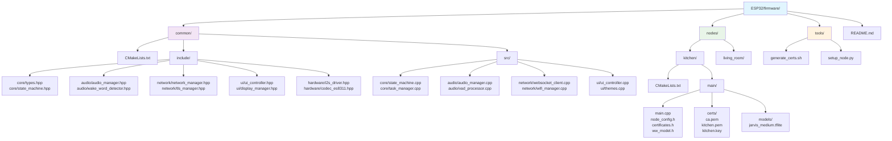

# Irene Voice Assistant - ESP32 Firmware



## Overview

This firmware implements secure voice assistant nodes for the Irene system, featuring:
- Local wake-word detection with microWakeWord
- Mutual TLS authentication with local CA
- Raw PCM audio streaming over WebSocket
- LVGL-based circular UI with real-time status
- Per-node wake-word models and certificates

## Hardware Requirements

- ESP32-S3-R8 development board
- 16MB Flash + 8MB PSRAM
- ES8311 audio codec
- 1.46" round IPS display (412×412)
- PCF85063 RTC

## Directory Structure

```
firmware/
├── common/                    # Shared components across all nodes
├── nodes/                     # Per-node configurations
│   ├── kitchen/              # Example node
│   └── living_room/          # Example node
├── tools/                    # Build and certificate tools
└── README.md                 # This file
```

## Building

1. Set up ESP-IDF v5.3+
2. Generate certificates (see tools/generate_certs.sh)
3. Build for specific node:

```bash
export NODE_ID=kitchen
cd nodes/${NODE_ID}
idf.py set-target esp32s3
idf.py build
idf.py -p /dev/ttyUSB0 flash monitor
```

## Node Configuration

Each node requires:
- Unique client certificate (client_pem.h, client_key.h)
- Trained wake-word model (ww_model.h)
- Node-specific configuration (node_config.h)

See `tools/setup_node.py` for automated node setup. 