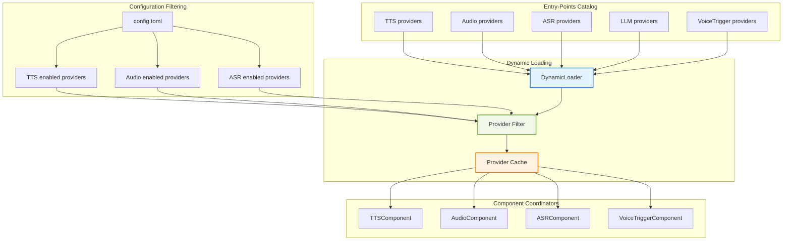
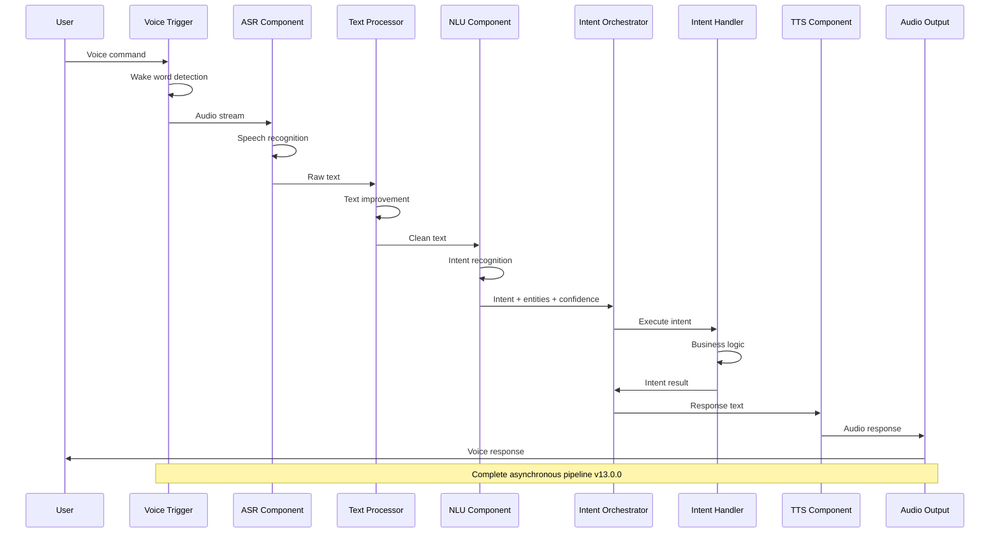
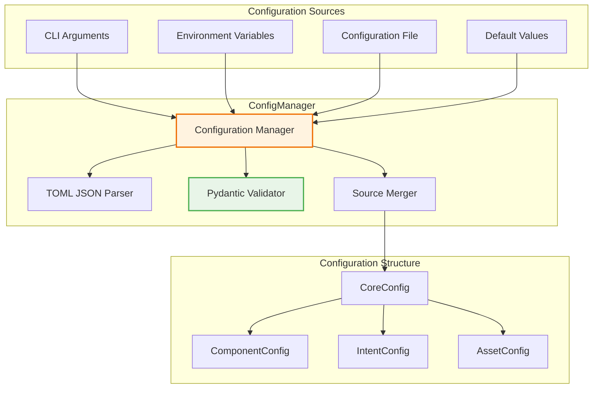
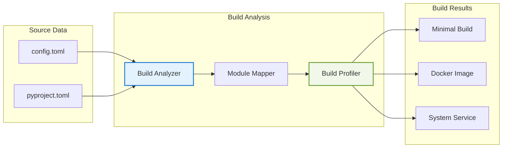

# Голосовой ассистент Ирина v13.0.0 🚀

# ПРОЕКТ НАХОДИТСЯ В РАЗРАБОТКЕ!!! (см. [TODO](docs/TODO.md))
# ЭТО СООБЩЕНИЕ БУДЕТ УДАЛЕНО ПОСЛЕ ЗАВЕРШЕНИЯ ВСЕХ TODO
# ПОКА ЧТО МОЖНО ПРОСТО ПОЗНАКОМИТЬСЯ С АРХИТЕКТУРОЙ

Ирина - русский голосовой ассистент для работы оффлайн с модульной архитектурой. Версия 14.0.0 представляет собой полноценную интеллектуальную платформу с системой интентов, динамической загрузкой компонентов и поддержкой wake word detection.

[Статья на Хабре](https://habr.com/ru/post/595855/) | [Вторая статья на Хабре](https://habr.com/ru/post/660715/) | [Третья статья на Хабре](https://habr.com/ru/articles/725066/) | [Группа в Телеграм](https://t.me/irene_va)

## Современная архитектура оффлайн голосового ассистента

**Ирина** — русский голосовой ассистент для работы оффлайн с компонентной архитектурой v13.0.0. Система построена на принципах модульности, асинхронности, понимания интентов и конфигурационного управления компонентами.

### 🎯 Ключевые возможности архитектуры

- **Оффлайн-первый подход**: Полная функциональность без интернета
- **Система интентов**: Понимание намерений пользователя через NLU
- **Voice Trigger System**: Wake word detection с поддержкой OpenWakeWord и microWakeWord
- **Динамическая загрузка**: Entry-points архитектура для оптимизации производительности
- **Асинхронная обработка**: Неблокирующие операции на всех уровнях
- **Модульная система**: Опциональные компоненты с грациозной деградацией
- **Конфигурационное управление**: TOML-файлы контролируют поведение системы

### Полный pipeline обработки v13.0.0:
```
Audio → Voice Trigger → ASR → Text Processing → Intent Recognition → Intent Execution → TTS → Audio Output
```

---

## 🏗️ Архитектура системы

### Общая схема архитектуры v13.0.0

```mermaid
graph TB
    subgraph EntryPoints["Entry Points"]
        CLI["CLI Runner"]
        WebAPI["WebAPI Runner"]
        Vosk["Vosk Runner"]
        Settings["Settings Runner"]
    end
    
    subgraph CoreSystem["Core System"]
        AsyncCore["AsyncVACore v13"]
        Context["ContextManager"]
        Commands["CommandProcessor"]
        Timers["AsyncTimerManager"]
    end
    
    subgraph ComponentSystem["Component System"]
        CompMgr["ComponentManager"]
        VoiceTrigger["VoiceTriggerComponent"]
        ASRComp["ASRComponent"]
        TextProc["TextProcessorComponent"]
        NLUComp["NLUComponent"]
        TTSComp["TTSComponent"]
        AudioComp["AudioComponent"]
        LLMComp["LLMComponent"]
    end
    
    subgraph IntentSys["Intent System"]
        IntentRec["IntentRecognizer"]
        IntentOrch["IntentOrchestrator"]
        IntentReg["IntentRegistry"]
        IntentHandlers["Intent Handlers"]
        ContextMgr["ContextManager"]
    end
    
    subgraph DynLoadSys["Dynamic Loading System"]
        EntryPointsDisc["Entry-Points Discovery"]
        DynamicLoader["DynamicLoader"]
        ConfigFilter["Configuration Filter"]
    end
    
    subgraph InputOutput["Input Output"]
        InputMgr["InputManager"]
        OutputMgr["OutputManager"]
        IOSources["Input Output Sources"]
    end
    
    subgraph Configuration["Configuration"]
        ConfigMgr["ConfigManager"]
        TOML["config.toml"]
        ENV["Environment variables"]
        Validation["Pydantic validation"]
    end
    
    CLI --> AsyncCore
    WebAPI --> AsyncCore
    Vosk --> AsyncCore
    Settings --> AsyncCore
    
    AsyncCore --> CompMgr
    AsyncCore --> IntentOrch
    AsyncCore --> InputMgr
    AsyncCore --> OutputMgr
    AsyncCore --> Context
    AsyncCore --> Commands
    AsyncCore --> Timers
    
    CompMgr --> VoiceTrigger
    CompMgr --> ASRComp
    CompMgr --> TextProc
    CompMgr --> NLUComp
    CompMgr --> TTSComp
    CompMgr --> AudioComp
    CompMgr --> LLMComp
    CompMgr --> DynamicLoader
    
    IntentOrch --> IntentRec
    IntentOrch --> IntentReg
    IntentOrch --> IntentHandlers
    IntentOrch --> ContextMgr
    
    DynamicLoader --> EntryPointsDisc
    DynamicLoader --> ConfigFilter
    
    ConfigMgr --> TOML
    ConfigMgr --> ENV
    ConfigMgr --> Validation
    
    style AsyncCore fill:#e1f5fe,stroke:#01579b,stroke-width:3px
    style CompMgr fill:#e8f5e8,stroke:#2e7d32,stroke-width:2px
    style IntentOrch fill:#fff3e0,stroke:#ef6c00,stroke-width:3px
    style DynamicLoader fill:#f3e5f5,stroke:#7b1fa2,stroke-width:2px
    style ConfigMgr fill:#fff3e0,stroke:#ef6c00,stroke-width:2px
```



### Архитектура динамической загрузки провайдеров



### Поток обработки команд с системой интентов



---

## 🗂️ Система конфигурации TOML

### Иерархия источников конфигурации



### Структура config.toml v13.0.0

```toml
# ============================================================
# ОСНОВНАЯ КОНФИГУРАЦИЯ СИСТЕМЫ
# ============================================================
[core]
name = "Irene"
version = "14.0.0"
debug = false
log_level = "INFO"
language = "ru-RU"

# ============================================================
# УПРАВЛЕНИЕ РЕСУРСАМИ
# ============================================================
[assets]
# Корневые директории для всех моделей, кэша и данных
# Переопределяются переменными окружения:
# IRENE_MODELS_ROOT, IRENE_CACHE_ROOT
models_root = "./models"
cache_root = "./cache"
data_root = "./data"

# ============================================================
# СИСТЕМА КОМПОНЕНТОВ
# ============================================================
[components]
# Включить/отключить основные компоненты
voice_trigger = true
asr = true
text_processor = true
nlu = true
tts = true
audio_output = true
llm = true
web_api = false

# Автоматическое обнаружение компонентов
auto_discover = true
discovery_paths = ["irene.components", "custom.components"]

# ============================================================
# СИСТЕМА ИНТЕНТОВ
# ============================================================
[intents]
enabled = true
confidence_threshold = 0.7
fallback_handler = "conversation"
max_history_turns = 10
session_timeout = 1800

# Intent handlers
[intents.handlers]
greetings = true
timer = true
weather = true
datetime = true
system = true
conversation = true

# ============================================================
# КОНФИГУРАЦИЯ КОМПОНЕНТОВ
# ============================================================

# Voice Trigger Configuration
[components.voice_trigger]
enabled = true
default_provider = "microwakeword"
wake_words = ["irene", "jarvis"]
threshold = 0.8

[components.voice_trigger.providers.microwakeword]
model_path = "./models/wake_word/irene_model.tflite"
feature_buffer_size = 49
detection_window_size = 3
num_mfcc_features = 40

# Text-to-Speech провайдеры
[components.tts]
enabled = true
default_provider = "elevenlabs"
fallback_providers = ["console"]

[components.tts.providers.elevenlabs]
enabled = true
# API ключ из переменной окружения: ELEVENLABS_API_KEY
voice = "Rachel"
model = "eleven_multilingual_v2"

[components.tts.providers.console]
enabled = true
color_output = true

# Audio провайдеры
[components.audio]
enabled = true
default_provider = "sounddevice"

[components.audio.providers.sounddevice]
enabled = true
sample_rate = 44100
channels = 2

[components.audio.providers.console]
enabled = true
timing_simulation = false

# ASR провайдеры
[components.asr]
enabled = true
default_provider = "whisper"

[components.asr.providers.whisper]
enabled = true
# API ключ из переменной окружения: OPENAI_API_KEY
model = "whisper-1"
language = "ru"

# NLU Configuration
[components.nlu]
provider = "rule_based"
fallback_provider = "spacy"
confidence_threshold = 0.7

# LLM провайдеры
[components.llm]
enabled = true
default_provider = "openai"

[components.llm.providers.openai]
enabled = true
# API ключ из переменной окружения: OPENAI_API_KEY
default_model = "gpt-4"
max_tokens = 150

# ============================================================
# ВЕБ-API СЕРВЕР
# ============================================================
[components.web]
host = "127.0.0.1"
port = 5003
cors_origins = ["*"]
enable_auth = false
```

### Переменные окружения

```bash
# Системные настройки
export IRENE_COMPONENTS__WEB_PORT=8080
export IRENE_ASSETS__MODELS_ROOT=/opt/irene/models
export IRENE_CORE__DEBUG=true

# Intent system
export IRENE_INTENTS__ENABLED=true
export IRENE_INTENTS__CONFIDENCE_THRESHOLD=0.7

# Voice Trigger
export IRENE_COMPONENTS__VOICE_TRIGGER__ENABLED=true
export IRENE_COMPONENTS__VOICE_TRIGGER__DEFAULT_PROVIDER=microwakeword

# API ключи провайдеров
export ELEVENLABS_API_KEY=your_api_key
export OPENAI_API_KEY=your_api_key
export ANTHROPIC_API_KEY=your_api_key
```

---

## 🏗️ Система сборки и развертывания

### Планируемая архитектура сборки на основе entry-points

В разработке находится система сборки, основанная на анализе entry-points каталога и TOML конфигурации для создания минимальных развертываний.



### Профили развертывания

Система поддерживает различные профили развертывания:

#### 1. Полная голосовая сборка
```toml
# config-voice.toml
[components]
voice_trigger = true
asr = true
nlu = true
tts = true
audio_output = true

[intents]
enabled = true

# Результат: Полнофункциональный голосовой ассистент
```

#### 2. Веб-API сервер
```toml
# config-webapi.toml
[components]
tts = true
asr = true
nlu = true

[components.web]
enabled = true
host = "0.0.0.0"
port = 8080

# Результат: RESTful API сервер с системой интентов
```

#### 3. Минимальная сборка (консольная)
```toml
# config-minimal.toml
[components]
tts = true
nlu = true

[components.tts.providers.console]
enabled = true

# Результат: Минимальная сборка для текстового взаимодействия
```

---

## 🚀 Быстрый старт

### Установка и запуск

```bash
# Клонирование проекта
git clone https://github.com/janvarev/Irene-Voice-Assistant.git
cd Irene-Voice-Assistant

# Установка с uv (рекомендуется)
curl -LsSf https://astral.sh/uv/install.sh | sh
uv sync

# Копирование конфигурации
cp config-example.toml config.toml
cp docs/env-example.txt .env
# Отредактируйте .env с вашими API ключами

# Запуск в CLI режиме
uv run python -m irene.runners.cli

# Запуск веб-сервера
uv run python -m irene.runners.webapi_runner
```

### Доступные команды

```bash
# CLI режим - интерактивная консоль с системой интентов
uv run python -m irene.runners.cli

# Одна команда и выход
uv run python -m irene.runners.cli --command "привет"

# Веб-API сервер с intent endpoints
uv run python -m irene.runners.webapi_runner

# Голосовой режим с VOSK
uv run python -m irene.runners.vosk_runner

# Управление настройками
uv run python -m irene.runners.settings_runner
```

### Проверка состояния системы

```bash
# Проверка доступных компонентов
uv run python -m irene.runners.cli --check-deps

# Список профилей развертывания
uv run python -m irene.runners.cli --list-profiles

# Тестирование системы интентов
uv run python -m irene.runners.cli --test-intents
```

---

## 📚 Документация

- **[Архитектура](docs/architecture.md)** - Подробное описание архитектуры системы v13.0.0
- **[TODO](docs/TODO.md)** - Текущие задачи разработки
- **[Конфигурация](config-example.md)** - Полное описание настроек
- **[Управление ресурсами](docs/ASSET_MANAGEMENT.md)** - Работа с моделями и кэшем

---

## 🤝 Вклад в развитие

Приветствуется участие в развитии проекта! Приоритетные направления:

- **Реализация системы интентов** - улучшение NLU компонентов
- **Создание новых провайдеров** для различных сервисов
- **Улучшение документации** и примеров
- **Тестирование** в различных конфигурациях

---

**Архитектура v13.0.0 обеспечивает создание современного, интеллектуального и производительного голосового ассистента с возможностью гибкого развертывания от минимального CLI до полнофункционального голосового интерфейса с wake word detection и веб-доступом.**
