# Архитектура Голосового Ассистента Irene
## Техническое описание системы v13.0.0

---

## 🎯 **Ситуация**

**Irene Voice Assistant** — это современный оффлайн голосовой ассистент для русского языка, построенный на языке Python. Система представляет собой модульную архитектуру с поддержкой множественных интерфейсов взаимодействия, расширяемой плагинной системой и возможностью развертывания в различных конфигурациях.

### Ключевые характеристики
- **Оффлайн-первый подход**: Полная функциональность без интернета
- **Асинхронная архитектура**: Неблокирующая обработка команд
- **Модульная система**: Опциональные компоненты с грациозной деградацией
- **Мультимодальность**: CLI, голос, веб-интерфейс
- **Расширяемость**: Универсальная плагинная архитектура

---

## ⚠️ **Проблематика**

### Вызовы предыдущей архитектуры:
1. **Синхронная блокировка**: Блокирующие операции TTS и ASR
2. **Жесткая связанность**: Прямые зависимости между компонентами
3. **Фрагментация плагинов**: 15+ отдельных плагинов без унификации
4. **Сложность конфигурации**: Разрозненные файлы настроек
5. **Ограниченная масштабируемость**: Проблемы с concurrent-обработкой

---

## ❓ **Ключевой вопрос**

**Как создать масштабируемую асинхронную архитектуру, которая обеспечивает:**
- Неблокирующую обработку команд
- Опциональность компонентов (микрофон, TTS)
- Унифицированную плагинную систему
- Простоту конфигурирования и развертывания

---

## ✅ **Архитектурное решение**

## 🏗️ **Общая архитектура системы**

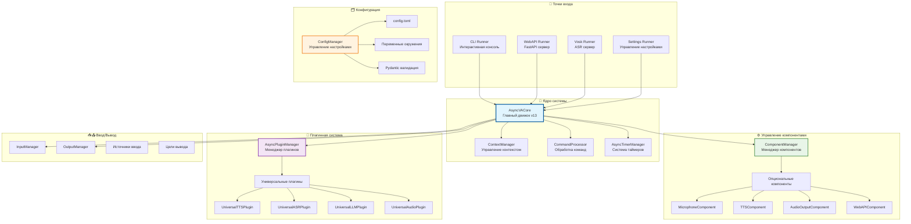

---

## 🎯 **1. ЯДРО СИСТЕМЫ**

### 1.1 AsyncVACore - Главный движок

**Расположение**: `irene/core/engine.py`

**Назначение**: Центральный координатор всей системы, обеспечивающий асинхронную обработку команд.

```python
class AsyncVACore:
    """Современный асинхронный движок голосового ассистента"""
    
    def __init__(self, config: CoreConfig):
        self.component_manager = ComponentManager(config.components)
        self.plugin_manager = AsyncPluginManager()
        self.input_manager = InputManager(self.component_manager)
        self.output_manager = OutputManager(self.component_manager)
        self.context_manager = ContextManager()
        self.timer_manager = AsyncTimerManager()
        self.command_processor = CommandProcessor()
```

**Последовательность запуска:**
1. **Инициализация компонентов** (микрофон, TTS, аудио, веб-API)
2. **Запуск менеджеров** (контекст, таймеры)
3. **Инициализация плагинов** (встроенные и внешние)
4. **Запуск ввода/вывода**
5. **Готовность к обработке команд**

### 1.2 Обработка команд

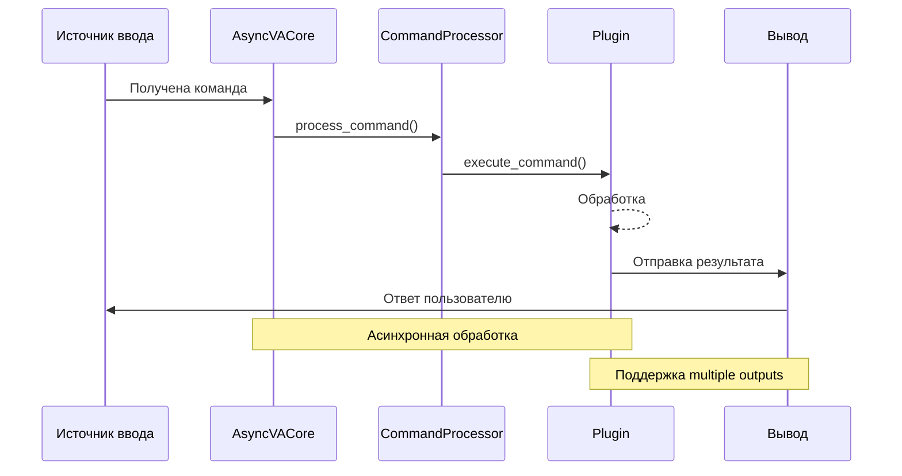

---

## ⚙️ **2. СИСТЕМА УПРАВЛЕНИЯ КОМПОНЕНТАМИ**

### 2.1 ComponentManager - Опциональные компоненты

**Философия**: Graceful degradation - система работает даже при отсутствии опциональных зависимостей.

**Компоненты:**

| Компонент | Зависимости | Функциональность |
|-----------|-------------|------------------|
| **MicrophoneComponent** | `vosk`, `sounddevice` | Распознавание речи |
| **TTSComponent** | `pyttsx3` | Синтез речи |
| **AudioOutputComponent** | `sounddevice`, `soundfile` | Воспроизведение аудио |
| **WebAPIComponent** | `fastapi`, `uvicorn` | Веб-сервер |

### 2.2 Профили развертывания

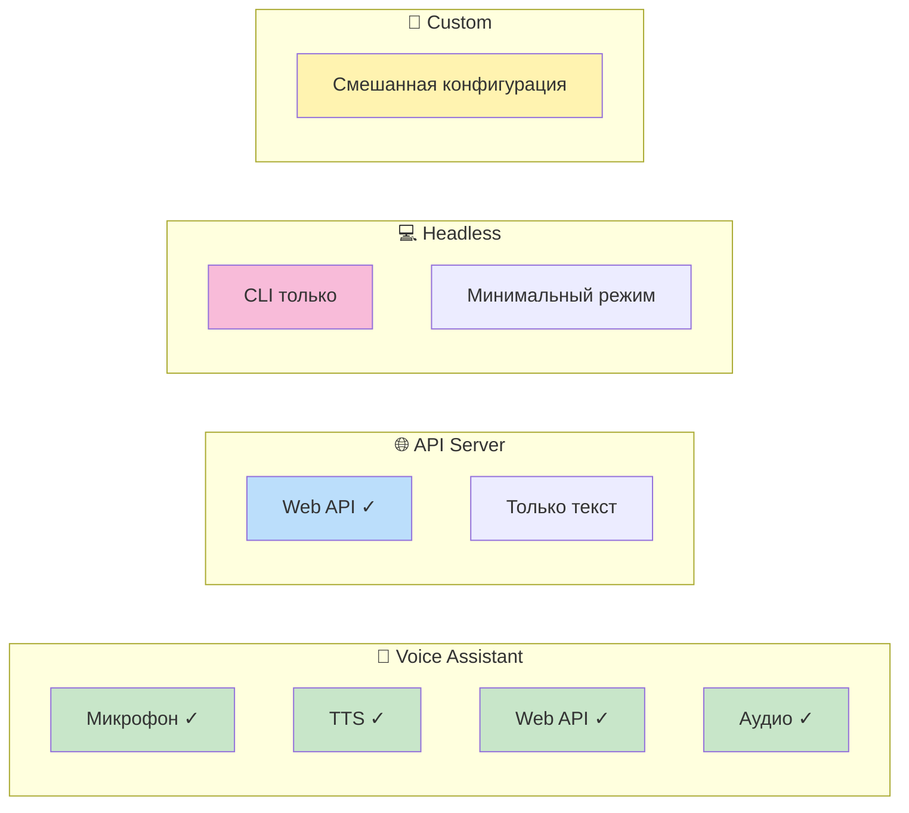

**Автоматическое определение профиля:**
```python
def get_deployment_profile(self) -> str:
    available = set(self._components.keys())
    
    if {"microphone", "tts", "web_api"} <= available:
        return "Voice Assistant"
    elif "web_api" in available:
        return "API Server"
    elif available:
        return "Custom"
    else:
        return "Headless"
```

---

## 🔌 **3. УНИВЕРСАЛЬНАЯ ПЛАГИННАЯ СИСТЕМА**

### 3.1 Архитектурная революция

**Было**: 15+ отдельных плагинов
**Стало**: 4 универсальных плагина + множество провайдеров

### 3.2 Паттерн "Универсальный плагин + Провайдер"

```mermaid
graph TB
    subgraph "🎯 Универсальные плагины (Координаторы)"
        UTTS[UniversalTTSPlugin<br/>🗣️ Управление TTS]
        UASR[UniversalASRPlugin<br/>🎤 Управление ASR]
        ULLM[UniversalLLMPlugin<br/>🧠 Управление LLM]
        UAudio[UniversalAudioPlugin<br/>🔊 Управление аудио]
    end
    
    subgraph "🔧 TTS Провайдеры"
        TTS_Console[Console TTS]
        TTS_ElevenLabs[ElevenLabs]
        TTS_Silero[Silero v4]
        TTS_Pyttsx[Pyttsx3]
        TTS_VOSK[VOSK TTS]
    end
    
    subgraph "🎙️ ASR Провайдеры"
        ASR_VOSK[VOSK ASR]
        ASR_Whisper[OpenAI Whisper]
        ASR_Google[Google Cloud]
    end
    
    subgraph "🤖 LLM Провайдеры"
        LLM_OpenAI[OpenAI GPT]
        LLM_Anthropic[Anthropic Claude]
        LLM_VseGPT[VseGPT]
        LLM_Local[Локальные модели]
    end
    
    subgraph "🔈 Audio Провайдеры"
        Audio_SoundDevice[SoundDevice]
        Audio_SimpleAudio[SimpleAudio]
        Audio_AudioPlayer[AudioPlayer]
        Audio_Console[Console Audio]
    end
    
    subgraph "🌐 Web API"
        API_TTS["/tts/*"]
        API_ASR["/asr/*"]
        API_LLM["/llm/*"]
        API_Audio["/audio/*"]
    end
    
    UTTS --> TTS_Console
    UTTS --> TTS_ElevenLabs
    UTTS --> TTS_Silero
    UTTS --> TTS_Pyttsx
    UTTS --> TTS_VOSK
    
    UASR --> ASR_VOSK
    UASR --> ASR_Whisper
    UASR --> ASR_Google
    
    ULLM --> LLM_OpenAI
    ULLM --> LLM_Anthropic
    ULLM --> LLM_VseGPT
    ULLM --> LLM_Local
    
    UAudio --> Audio_SoundDevice
    UAudio --> Audio_SimpleAudio
    UAudio --> Audio_AudioPlayer
    UAudio --> Audio_Console
    
    UTTS --> API_TTS
    UASR --> API_ASR
    ULLM --> API_LLM
    UAudio --> API_Audio
    
    style UTTS fill:#ffecb3,stroke:#ff8f00,stroke-width:2px
    style UASR fill:#e1f5fe,stroke:#0277bd,stroke-width:2px
    style ULLM fill:#f3e5f5,stroke:#7b1fa2,stroke-width:2px
    style UAudio fill:#e8f5e8,stroke:#388e3c,stroke-width:2px
```

### 3.3 Принципы универсальных плагинов

**Каждый универсальный плагин обеспечивает:**

1. **Управление провайдерами**
   - Конфигурационный выбор провайдера
   - Ленивая загрузка и кэширование
   - Автоматическое обнаружение провайдеров

2. **Унифицированный Web API**
   - RESTful эндпоинты для каждого типа
   - Единообразная обработка ошибок
   - Поддержка множественных форматов

3. **Грациозная обработка ошибок**
   - Fallback к альтернативным провайдерам
   - Детальное логирование проблем
   - Уведомления о недоступных функциях

**Пример конфигурации провайдера:**
```toml
[plugins.universal_tts]
default_provider = "silero_v4"
providers = ["console", "silero_v4", "elevenlabs"]

[plugins.universal_tts.provider_configs.silero_v4]
model_path = "models/silero_v4"
sample_rate = 48000
```

---

## 📥📤 **4. СИСТЕМА ВВОДА/ВЫВОДА**

### 4.1 Абстракция ввода

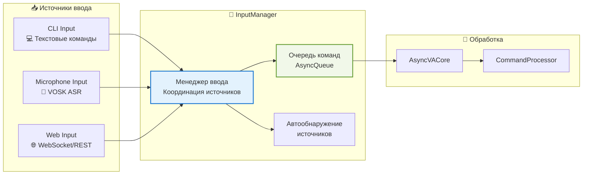

### 4.2 Абстракция вывода

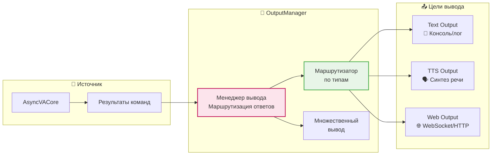

### 4.3 Многоканальная обработка

**Особенности:**
- **Неблокирующий ввод**: Множественные источники параллельно
- **Интеллектуальная маршрутизация**: Автоматический выбор целей вывода
- **Контекстная привязка**: Связывание запроса и ответа
- **Graceful degradation**: Работа при недоступности каналов

---

## 🗂️ **5. СИСТЕМА КОНФИГУРАЦИИ**

### 5.1 Иерархия конфигурации

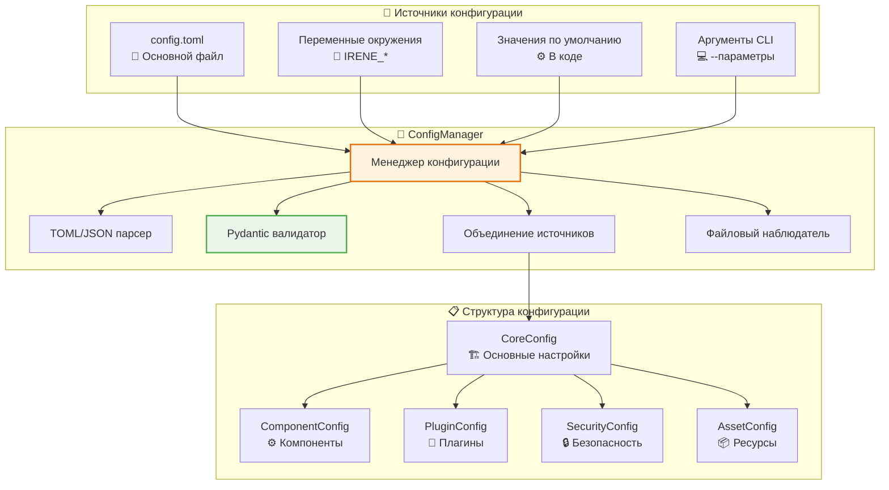

### 5.2 Приоритет источников конфигурации

**Порядок приоритета (высокий → низкий):**
1. **Аргументы командной строки** (`--host`, `--port`)
2. **Переменные окружения** (`IRENE_COMPONENTS__WEB_PORT`)
3. **Файл конфигурации** (`config.toml`)
4. **Значения по умолчанию** (в коде)

### 5.3 Примеры конфигурации

**config.toml:**
```toml
[core]
name = "Irene"
version = "13.0.0"
debug = false
log_level = "INFO"
language = "ru-RU"

[components]
microphone = true
tts = true
audio_output = true
web_api = false

[components.web]
host = "127.0.0.1"
port = 5003
cors_origins = ["*"]

[plugins]
load_builtin = true
external_paths = ["./plugins", "./custom_plugins"]

[plugins.universal_tts]
default_provider = "silero_v4"
cache_enabled = true

[security]
enable_auth = false
api_keys = []

[assets]
models_root = "./models"
cache_root = "./cache"
data_root = "./data"
```

**Переменные окружения:**
```bash
export IRENE_COMPONENTS__WEB_PORT=8080
export IRENE_PLUGINS__UNIVERSAL_TTS__DEFAULT_PROVIDER=elevenlabs
export IRENE_SECURITY__ENABLE_AUTH=true
export IRENE_ASSETS__MODELS_ROOT=/opt/irene/models
```

---

## 🌐 **6. WEB API ИНТЕГРАЦИЯ**

### 6.1 FastAPI архитектура

**Расположение**: `irene/runners/webapi_runner.py`

### 6.2 REST эндпоинты

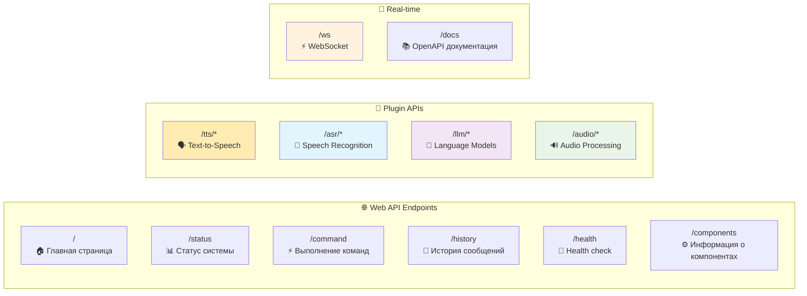

### 6.3 WebSocket интеграция

**Двунаправленная связь:**
- **Клиент → Сервер**: Команды, настройки
- **Сервер → Клиент**: Ответы, уведомления, статус

**Пример WebSocket сообщения:**
```json
{
  "type": "command",
  "command": "привет",
  "timestamp": "2024-01-15T10:30:00Z"
}
```

---

## 🚀 **7. РЕЖИМЫ РАЗВЕРТЫВАНИЯ**

### 7.1 Точки входа

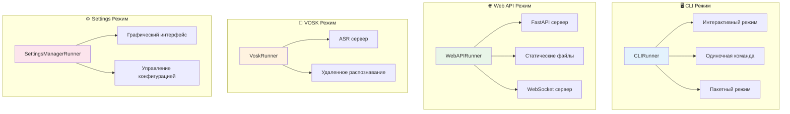

### 7.2 Команды запуска

```bash
# CLI режим
python -m irene.runners.cli
python -m irene.runners.cli --command "привет"
python -m irene.runners.cli --interactive

# Web API режим
python -m irene.runners.webapi_runner
python -m irene.runners.webapi_runner --host 0.0.0.0 --port 8080

# VOSK сервер
python -m irene.runners.vosk_runner

# Управление настройками
python -m irene.runners.settings_runner
```

---

## 🔄 **8. ПОТОКИ ОБРАБОТКИ ДАННЫХ**

### 8.1 Полный цикл команды

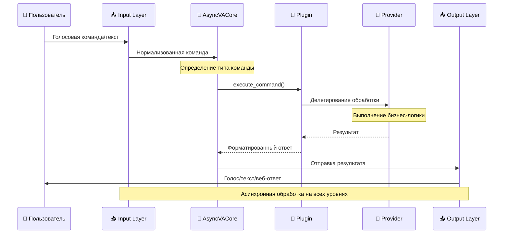

### 8.2 Многоканальная обработка

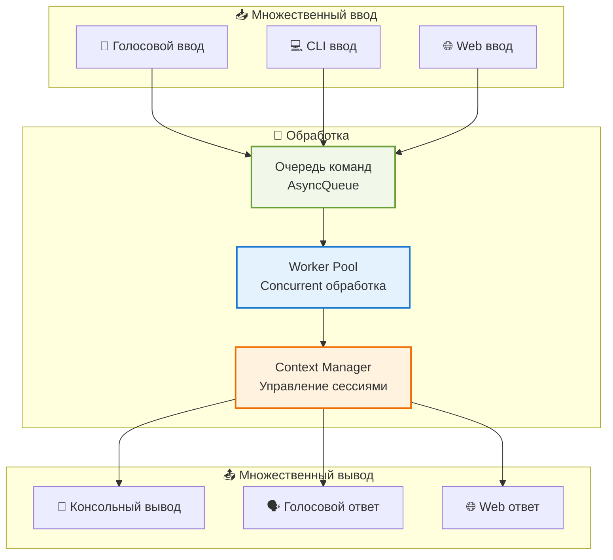

---

## 🔧 **9. ПАТТЕРНЫ ИНТЕГРАЦИИ**

### 9.1 Dependency Injection

**Принцип**: Каждый компонент получает зависимости через конструктор или инициализацию.

```python
# Пример: Инжекция ASR плагина в микрофонный ввод
class MicrophoneInput(InputSource):
    def __init__(self, asr_plugin: Optional[ASRPlugin] = None):
        self.asr_plugin = asr_plugin
        
# В InputManager:
asr_plugin = self.component_manager.core.plugin_manager.get_plugin("universal_asr")
mic_input = MicrophoneInput(asr_plugin=asr_plugin)
```

### 9.2 Observer Pattern

**Применение**: Уведомления о состоянии компонентов, завершении команд.

### 9.3 Strategy Pattern

**Применение**: Выбор провайдеров в универсальных плагинах.

### 9.4 Factory Pattern

**Применение**: Создание провайдеров на основе конфигурации.

---

## 📊 **10. МЕТРИКИ И МОНИТОРИНГ**

### 10.1 Ключевые метрики

| Метрика | Описание | Источник |
|---------|----------|----------|
| **Command latency** | Время обработки команды | CommandProcessor |
| **Plugin availability** | Доступность плагинов | PluginManager |
| **Component health** | Состояние компонентов | ComponentManager |
| **Input throughput** | Пропускная способность ввода | InputManager |
| **Error rate** | Частота ошибок | Система логирования |

### 10.2 Health checks

```python
# Пример health check эндпоинта
@app.get("/health")
async def health_check():
    return {
        "status": "healthy",
        "version": "13.0.0",
        "timestamp": asyncio.get_event_loop().time(),
        "components": get_component_status(),
        "deployment_profile": core.component_manager.get_deployment_profile()
    }
```

---

## 🎯 **ЗАКЛЮЧЕНИЕ**

### Ключевые достижения архитектуры:

✅ **Асинхронность**: Полностью неблокирующая обработка  
✅ **Модульность**: Опциональные компоненты с graceful degradation  
✅ **Масштабируемость**: Universal Plugin + Provider архитектура  
✅ **Конфигурируемость**: Мощная система настроек с TOML/ENV поддержкой  
✅ **Мультимодальность**: CLI, голос, веб-интерфейс  
✅ **Развертываемость**: Множественные режимы для разных сценариев  
✅ **Обратная совместимость**: Поддержка legacy плагинов  

### Принципы дизайна:

🔹 **MECE**: Четкое разделение ответственности между компонентами  
🔹 **Separation of Concerns**: Разделение интерфейса и реализации  
🔹 **Dependency Inversion**: Зависимости через абстракции  
🔹 **Single Responsibility**: Каждый компонент имеет одну ответственность  
🔹 **Open/Closed**: Открыт для расширения, закрыт для модификации  

Данная архитектура обеспечивает создание современного, масштабируемого и поддерживаемого голосового ассистента, способного работать в различных конфигурациях от минимального CLI до полнофункционального голосового интерфейса с веб-доступом. 