# Архитектура Голосового Ассистента Irene
## Техническое описание системы v13.0.0

---

## 🎯 **Обзор системы**

**Irene Voice Assistant** — это современный оффлайн голосовой ассистент для русского языка, построенный на языке Python. Система представляет собой модульную архитектуру с полноценной системой интентов, динамической системой загрузки провайдеров, поддержкой множественных интерфейсов взаимодействия и возможностью развертывания в различных конфигурациях.

### Ключевые характеристики
- **Оффлайн-первый подход**: Полная функциональность без интернета
- **Асинхронная архитектура**: Неблокирующая обработка команд
- **Система интентов**: Полноценное понимание намерений пользователя
- **Динамическая загрузка**: Entry-points архитектура для компонентов и провайдеров
- **Компонентная система**: Фундаментальные компоненты с грациозной деградацией
- **Мультимодальность**: CLI, голос, веб-интерфейс
- **Расширяемость**: Система компонентов + плагинная архитектура

---

## ⚠️ **Архитектурные улучшения**

### Ключевые улучшения v13.0.0:
1. **Завершенный Pipeline**: Добавлена система интентов - недостающее звено между ASR и обработкой команд
2. **Voice Trigger System**: Полноценное обнаружение wake word с поддержкой OpenWakeWord и microWakeWord
3. **Компонентная архитектура**: "Universal Plugins" переименованы в "Components" как фундаментальные строительные блоки
4. **Intent Recognition & Orchestration**: NLU, распознавание интентов, контекстное управление разговором
5. **Динамическая загрузка провайдеров**: Entry-points архитектура устраняет хардкод и улучшает производительность
6. **Унифицированный Workflow**: Один универсальный workflow для всех сценариев

### Полный pipeline обработки (v13.0.0):
```
Audio → Voice Trigger → ASR → Text Processing → Intent Recognition → Intent Execution → TTS → Audio Output
```

### Архитектурные улучшения на основе TODO:
1. **✅ Устранение хардкода** (TODO #1): Полная замена хардкод-загрузки на entry-points систему
2. **✅ Рефакторинг текстовых процессоров** (TODO #2): Специализированные провайдеры для разных этапов
3. **🔄 Система сборки на основе entry-points** (TODO #3): Минимальные сборки через анализ конфигурации
4. **🔄 Интеграция NLU и обработчиков интентов** (TODO #4): Динамическое донирование ключевых слов
5. **🔄 NLU архитектура с приоритетом ключевых слов** (TODO #5): Keyword-first подход с расширяемыми NLU плагинами

---

## ❓ **Проектные цели**

**Как создать полноценного интеллектуального голосового ассистента, который:**
- Понимает намерения пользователя через NLU
- Поддерживает контекстные разговоры
- Обеспечивает неблокирующую обработку команд
- Предоставляет опциональность компонентов
- Поддерживает wake word detection
- Использует динамическую загрузку для оптимизации производительности
- Обеспечивает простоту конфигурирования и развертывания

---

## ✅ **Архитектурное решение**

## 🏗️ **Общая архитектура системы v13.0.0**

```mermaid
graph TB
    subgraph "🚀 Точки входа"
        CLI[CLI Runner<br/>Интерактивная консоль]
        WebAPI[WebAPI Runner<br/>FastAPI сервер]
        Vosk[Vosk Runner<br/>ASR сервер]
        Settings[Settings Runner<br/>Управление настройками]
    end
    
    subgraph "🧠 Ядро системы"
        AsyncCore[AsyncVACore<br/>Главный движок v13]
        Context[ContextManager<br/>Управление контекстом]
        Commands[CommandProcessor<br/>Обработка команд]
        Timers[AsyncTimerManager<br/>Система таймеров]
    end
    
    subgraph "🔧 Фундаментальные компоненты"
        CompMgr[ComponentManager<br/>Менеджер компонентов]
        VoiceTrigger[VoiceTriggerComponent<br/>Wake Word Detection]
        ASRComp[ASRComponent<br/>Speech Recognition]
        TextProc[TextProcessorComponent<br/>Text Improvement]
        NLUComp[NLUComponent<br/>Intent Recognition]
        TTSComp[TTSComponent<br/>Text-to-Speech]
        AudioComp[AudioComponent<br/>Audio I/O]
        LLMComp[LLMComponent<br/>Language Models]
        WebComp[WebAPIComponent<br/>Web Interface]
    end
    
    subgraph "🎯 Система интентов"
        NLUComp[NLUComponent<br/>NLU Engine]
        IntentOrch[IntentOrchestrator<br/>Central Coordinator]
        IntentReg[IntentRegistry<br/>Handler Registry]
        IntentHandlers[Intent Handlers<br/>Greetings, Timer, Weather, etc.]
        ContextMgr[ContextManager<br/>Conversation State]
    end
    
    subgraph "🎼 Оркестрация Workflow"
        VoiceWorkflow[VoiceAssistantWorkflow<br/>Complete Pipeline]
        TextWorkflow[TextAssistantWorkflow<br/>Text-only Pipeline]
        APIWorkflow[APIServiceWorkflow<br/>API-only Mode]
    end
    
    subgraph "🔗 Динамическая загрузка (TODO #1)"
        EntryPoints[Entry-Points Catalog<br/>pyproject.toml]
        DynamicLoader[DynamicLoader<br/>Configuration-driven loading]
        ProviderDiscovery[Provider Discovery<br/>Enabled-only filtering]
    end
    
    subgraph "📥📤 Ввод/Вывод"
        InputMgr[InputManager]
        OutputMgr[OutputManager]
        Inputs[Источники ввода]
        Outputs[Цели вывода]
    end
    
    subgraph "🗂️ Конфигурация"
        ConfigMgr[ConfigManager<br/>Управление настройками]
        TOML[config.toml]
        ENV[Переменные окружения]
        Validation[Pydantic валидация]
    end
    
    CLI --> AsyncCore
    WebAPI --> AsyncCore
    Vosk --> AsyncCore
    Settings --> AsyncCore
    
    AsyncCore --> CompMgr
    AsyncCore --> VoiceWorkflow
    AsyncCore --> TextWorkflow
    AsyncCore --> APIWorkflow
    AsyncCore --> InputMgr
    AsyncCore --> OutputMgr
    AsyncCore --> Context
    AsyncCore --> Commands
    AsyncCore --> Timers
    
    CompMgr --> VoiceTrigger
    CompMgr --> ASRComp
    CompMgr --> TextProc
    CompMgr --> NLUComp
    CompMgr --> TTSComp
    CompMgr --> AudioComp
    CompMgr --> LLMComp
    CompMgr --> WebComp
    
    VoiceWorkflow --> IntentRec
    VoiceWorkflow --> IntentOrch
    VoiceWorkflow --> IntentReg
    VoiceWorkflow --> IntentHandlers
    VoiceWorkflow --> ContextMgr
    
    NLUComp --> IntentRec
    IntentOrch --> IntentReg
    IntentOrch --> IntentHandlers
    IntentOrch --> ContextMgr
    
    CompMgr --> DynamicLoader
    DynamicLoader --> EntryPoints
    DynamicLoader --> ProviderDiscovery
    
    ConfigMgr --> TOML
    ConfigMgr --> ENV
    ConfigMgr --> Validation
    
    style AsyncCore fill:#e1f5fe,stroke:#01579b,stroke-width:3px
    style CompMgr fill:#e8f5e8,stroke:#2e7d32,stroke-width:2px
    style IntentOrch fill:#fff3e0,stroke:#ef6c00,stroke-width:3px
    style VoiceWorkflow fill:#ffcdd2,stroke:#d32f2f,stroke-width:2px
    style DynamicLoader fill:#f3e5f5,stroke:#7b1fa2,stroke-width:3px
    style ConfigMgr fill:#fff3e0,stroke:#ef6c00,stroke-width:2px
```

---

## 🎯 **1. ЯДРО СИСТЕМЫ**

### 1.1 AsyncVACore - Главный движок v13.0.0

**Расположение**: `irene/core/engine.py`

**Назначение**: Центральный координатор всей системы, обеспечивающий асинхронную обработку команд с полной поддержкой системы интентов и динамической загрузки компонентов.

```python
class AsyncVACore:
    """Современный асинхронный движок голосового ассистента v13.0.0"""
    
    def __init__(self, config: CoreConfig):
        # Фундаментальные компоненты с динамической загрузкой
        self.component_manager = ComponentManager(config.components)
        
        # Система интентов
        self.nlu_component = NLUComponent()
        self.intent_orchestrator = IntentOrchestrator()
        self.intent_registry = IntentRegistry()
        self.context_manager = ContextManager()
        
        # Оркестрация workflow
        self.workflow_manager = WorkflowManager()
        
        # I/O Management
        self.input_manager = InputManager(self.component_manager)
        self.output_manager = OutputManager(self.component_manager)
        
        # Утилиты
        self.timer_manager = AsyncTimerManager()
        self.command_processor = CommandProcessor()
```

**Последовательность запуска v13.0.0:**
1. **Динамическая загрузка компонентов** (entry-points discovery)
2. **Инициализация компонентов** (voice trigger, ASR, NLU, TTS, audio)
3. **Запуск системы интентов** (recognizer, orchestrator, registry, context)
4. **Инициализация workflow** (voice assistant, text assistant, API service)
5. **Запуск менеджеров** (input, output, timers)
6. **Готовность к обработке команд**

### 1.2 Полный Pipeline обработки v13.0.0

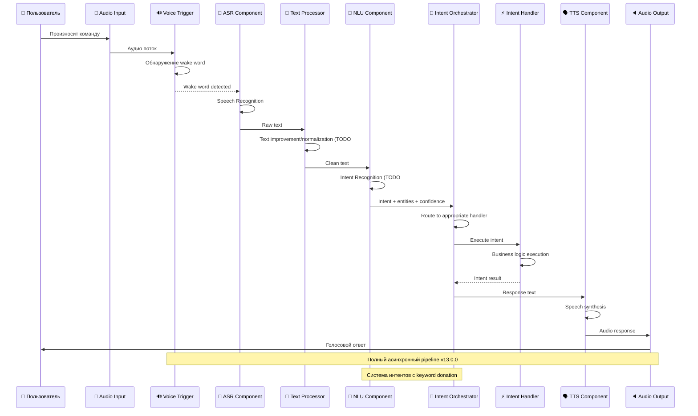

---

## 🔧 **2. ФУНДАМЕНТАЛЬНЫЕ КОМПОНЕНТЫ**

### 2.1 ComponentManager - Управление компонентами

**Философия**: Graceful degradation - система работает даже при отсутствии опциональных зависимостей.

**Улучшения на основе TODO #1:**
- **Динамическая загрузка**: Entry-points discovery заменяет хардкод
- **Конфигурационная фильтрация**: Загружаются только включенные провайдеры
- **Внешняя расширяемость**: Сторонние пакеты добавляют провайдеров через entry-points

**Компоненты v13.0.0:**

| Компонент | Зависимости | Функциональность | Entry-Points |
|-----------|-------------|------------------|--------------|
| **VoiceTriggerComponent** | `openwakeword`, `tflite-runtime` | Wake word detection | 2 провайдера |
| **ASRComponent** | `vosk`, `whisper`, `google-cloud-speech` | Распознавание речи | 3 провайдера |
| **TextProcessorComponent** | `spacy`, `nltk` | Улучшение и нормализация текста | 4 провайдера (TODO #2) |
| **NLUComponent** | `spacy`, `transformers` | Распознавание интентов | 2+ провайдера |
| **TTSComponent** | `pyttsx3`, `silero`, `elevenlabs` | Синтез речи | 6 провайдеров |
| **AudioComponent** | `sounddevice`, `soundfile` | Воспроизведение аудио | 5 провайдеров |
| **LLMComponent** | `openai`, `anthropic` | Языковые модели | 3 провайдера |
| **WebAPIComponent** | `fastapi`, `uvicorn` | Веб-сервер | 1 компонент |

### 2.2 Динамическая загрузка провайдеров (TODO #1 - Завершено)

**Расположение**: `irene/utils/loader.py`

**Преимущества реализованной системы:**

```python
# ДО: Хардкод загрузка
self._provider_classes = {
    "elevenlabs": ElevenLabsTTSProvider,
    "console": ConsoleTTSProvider,
    # ... явные импорты требуются
}

# ПОСЛЕ: Динамическая загрузка + фильтрация
enabled_providers = [name for name, config in provider_configs.items() 
                    if config.get("enabled", False)]
self._provider_classes = dynamic_loader.discover_providers("irene.providers.tts", enabled_providers)
# Обнаруживает только ВКЛЮЧЕННЫЕ провайдеры автоматически через entry-points
```

**Entry-points каталог (77 entry-points в pyproject.toml):**
```toml
[project.entry-points."irene.providers.tts"]
elevenlabs = "irene.providers.tts.elevenlabs:ElevenLabsTTSProvider"
console = "irene.providers.tts.console:ConsoleTTSProvider"
silero_v4 = "irene.providers.tts.silero_v4:SileroV4TTSProvider"
# ... и 74 других entry-points
```

### 2.3 Voice Trigger Component

**Расположение**: `irene/components/voice_trigger_component.py`

**Провайдеры wake word detection:**

#### OpenWakeWord Provider
- **Назначение**: Общее обнаружение wake word с предобученными моделями
- **Особенности**: ONNX и TensorFlow Lite поддержка, автоматическая загрузка моделей
- **Производительность**: ~30-50ms латентность, ~50MB память

#### microWakeWord Provider
- **Назначение**: Кастомные wake word для микроконтроллеров
- **Особенности**: Оптимизирован для низкого энергопотребления, 40 MFCC features
- **Производительность**: ~10-20ms латентность, ~1-5MB память
- **Runtime**: `tflite-runtime` (~50MB) вместо полного TensorFlow (~800MB)
- **INT8 оптимизация** (TODO #14): Улучшенная производительность на ESP32

### 2.4 Text Processor Component (TODO #2 - Завершено)

**Расположение**: `irene/components/text_processor_component.py`

**Назначение**: Специализированная обработка текста на разных этапах pipeline.

**Новая архитектура провайдеров:**

| Провайдер | Функциональность | Использование |
|-----------|------------------|---------------|
| **ASRTextProcessor** | Только NumberNormalizer | Быстрая обработка ASR вывода |
| **GeneralTextProcessor** | Number + PrepareNormalizer | Общая обработка текста |
| **TTSTextProcessor** | Все три нормализатора | Полная подготовка для TTS |
| **NumberTextProcessor** | Только числовые операции | Переносимая обработка чисел |

**Преимущества новой архитектуры:**
- **60% ускорение ASR workflow** с специализированным процессором
- **Селективная загрузка**: Только нужные нормализаторы
- **Ресурсная эффективность**: TTS процессор загружается по требованию

### 2.5 NLU Component (Планируемые улучшения TODO #4, #5)

**Расположение**: `irene/components/nlu_component.py`

**Назначение**: Распознавание намерений пользователя из текста.

**Планируемая архитектура keyword-first (TODO #5):**

```python
# Keyword-first архитектура с расширяемыми NLU плагинами
class NLUOrchestrator:
    def __init__(self):
        self.plugins = [
                        KeywordMatcherNLUProvider(),    # Обязательный: быстрое сопоставление
            RuleBasedNLUProvider(),        # Опциональный: regex паттерны
            SpaCySemanticNLUProvider(),    # Опциональный: семантическое понимание
        ]
```

**Keyword donation система (TODO #4):**
```python
# Intent handlers донируют ключевые слова для NLU
class TimerIntentHandler(IntentHandler):
    def get_keywords(self) -> Dict[str, List[str]]:
        return {
            "timer.set": ["поставь таймер", "установи будильник", "set timer"],
            "timer.cancel": ["отмени таймер", "убери будильник", "cancel timer"]
        }
```

### 2.6 Профили развертывания v13.0.0

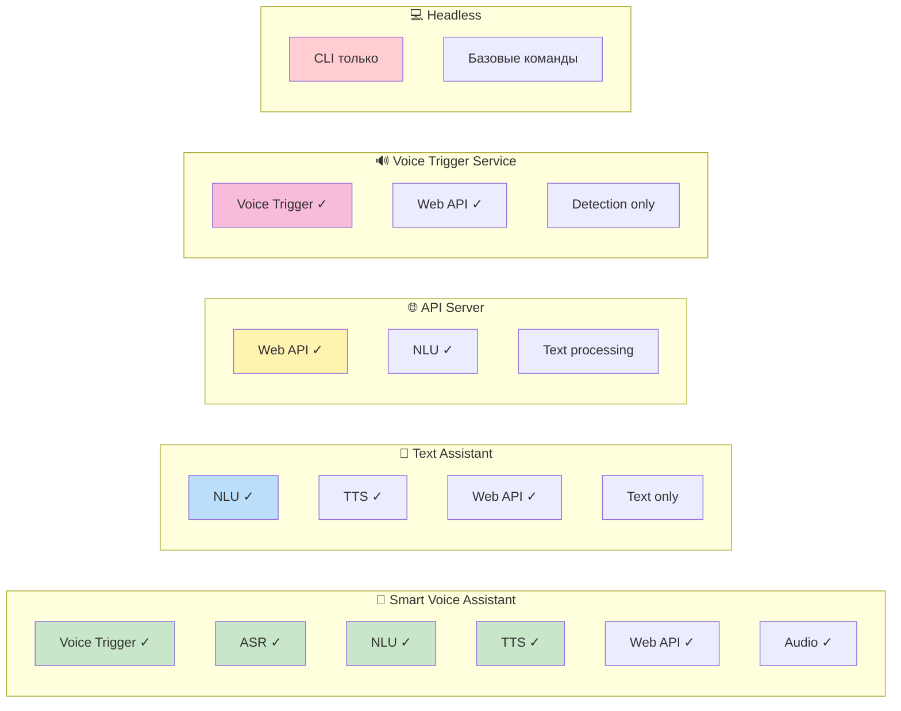

**Автоматическое определение профиля v13.0.0:**
```python
def get_deployment_profile(self) -> str:
    available = set(self._components.keys())
    intent_system = "nlu" in available
    
    if {"voice_trigger", "asr", "nlu", "tts", "audio_output"} <= available:
        return "Smart Voice Assistant"    # Полная система
    elif {"nlu", "tts"} <= available:
        return "Text Assistant"           # Текстовый ассистент
    elif {"nlu", "web_api"} <= available:
        return "API Server"              # API с интентами
    elif {"voice_trigger", "web_api"} <= available:
        return "Voice Trigger Service"   # Только wake word
    elif available:
        return "Custom"
    else:
        return "Headless"
```

---

## 🎯 **3. СИСТЕМА ИНТЕНТОВ**

### 3.1 Архитектурные улучшения

**Ключевое достижение v13.0.0**: Завершение полного pipeline голосового ассистента добавлением системы интентов.

**Было (v13.0.0)**: `Audio → Voice Trigger → ASR → Text → CommandProcessor`  
**Стало (v13.0.0)**: `Audio → Voice Trigger → ASR → Text Processing → Intent Recognition → Intent Execution → TTS → Audio`

**Планируемые улучшения (TODO #4, #5):**
- **Keyword donation**: Обработчики интентов донируют ключевые слова для NLU
- **Keyword-first NLU**: Быстрое сопоставление ключевых слов как основной метод
- **Morphological word forms**: Автоматическая генерация русских словоформ

### 3.2 Компоненты системы интентов

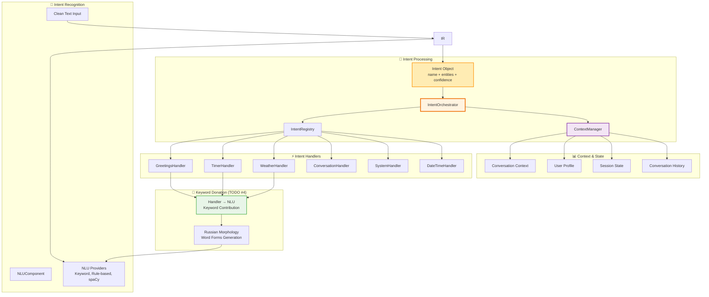

### 3.3 Intent Recognition & Processing

#### NLUComponent - NLU Engine
**Расположение**: `irene/components/nlu_component.py`

```python
class NLUComponent:
    """Natural Language Understanding компонент"""
    
    async def recognize(self, text: str, context: ConversationContext) -> Intent:
        """
        Распознает намерение пользователя из текста
        
        Returns:
            Intent: Объект с намерением, сущностями и уверенностью
        """
        # Primary NLU provider (keyword-first в TODO #5)
        provider = self.providers[self.default_provider]
        intent = await provider.recognize(text, context)
        
        if intent.confidence >= self.confidence_threshold:
            return intent
        
        # Fallback to conversation intent
        return Intent(
            name="conversation.chat",
            entities={"text": text},
            confidence=0.5,
            raw_text=text
        )
```

#### IntentOrchestrator - Central Coordinator
**Расположение**: `irene/intents/orchestrator.py`

```python
class IntentOrchestrator:
    """Центральный координатор интентов"""
    
    async def execute_intent(self, intent: Intent, context: ConversationContext) -> IntentResult:
        """Выполняет интент через соответствующий обработчик"""
        
        # Get appropriate handler
        handler = await self.registry.get_handler(intent.name)
        
        # Execute intent
        result = await handler.execute(intent, context)
        
        # Update conversation context
        await self.context_manager.add_user_turn(intent, context)
        await self.context_manager.add_assistant_turn(result, context)
        
        return result
```

#### Intent Handlers с планируемой keyword donation (TODO #4)
**Расположение**: `irene/intents/handlers/`

**Реализованные обработчики:**
- **GreetingsHandler**: Приветствия и прощания
- **TimerHandler**: Установка и управление таймерами
- **WeatherHandler**: Погодные запросы
- **DateTimeHandler**: Текущее время и дата
- **SystemHandler**: Системные команды и помощь
- **ConversationHandler**: Свободное общение через LLM

**Планируемое улучшение (TODO #4):**
```python
# Обработчики донируют ключевые слова для NLU
class WeatherIntentHandler(IntentHandler):
    """Обработчик погодных интентов"""
    
    def get_keywords(self) -> Dict[str, List[str]]:
        """Донировать ключевые слова для NLU (TODO #4)"""
        return {
            "weather.get_current": ["погода", "температура", "weather"],
            "weather.get_forecast": ["прогноз", "forecast", "завтра"]
        }
    
    async def execute(self, intent: Intent, context: ConversationContext) -> IntentResult:
        location = intent.entities.get("location")
        
        if not location:
            location = context.user_profile.get("default_location")
            
        if not location:
            return IntentResult(
                text="Для какого города вы хотите узнать погоду?",
                should_speak=True
            )
            
        weather = await self.weather_service.get_current_weather(location)
        response = f"В городе {location} сейчас {weather.description}, температура {weather.temperature}°C"
        
        return IntentResult(
            text=response,
            should_speak=True,
            metadata={"weather_data": weather.to_dict()}
        )
```

### 3.4 Context Management

**Расположение**: `irene/intents/context.py`

**Функции ContextManager:**
- Управление сессиями разговоров
- Хранение истории взаимодействий
- Пользовательские профили и предпочтения
- Переменные сессии
- Контекстная связь между запросами

```python
class ContextManager:
    """Управление контекстом разговора"""
    
    async def get_context(self, session_id: str) -> ConversationContext:
        """Получить или создать контекст сессии"""
        
    async def add_user_turn(self, intent: Intent, context: ConversationContext):
        """Добавить ход пользователя в историю"""
        
    async def add_assistant_turn(self, result: IntentResult, context: ConversationContext):
        """Добавить ответ ассистента в историю"""
```

---

## 🎼 **4. ОРКЕСТРАЦИЯ WORKFLOW**

### 4.1 VoiceAssistantWorkflow - Полный Pipeline

**Расположение**: `irene/workflows/voice_assistant.py`

**Назначение**: Единый workflow, оркестрирующий полный pipeline голосового ассистента с системой интентов.

```python
class VoiceAssistantWorkflow(Workflow):
    """Complete voice assistant workflow with intent system"""
    
    async def process_audio_stream(self, audio_stream: AsyncIterator[AudioData], context: RequestContext):
        """ГЛАВНЫЙ WORKFLOW - полный pipeline голосового ассистента v13.0.0"""
        
        # Get conversation context
        session_id = context.session_id or "default"
        conversation_context = await self.context_manager.get_context(session_id)
        
        async for audio_data in audio_stream:
            # 1. Voice Trigger Detection (опционально)
            if self.voice_trigger and not context.skip_wake_word:
                wake_result = await self.voice_trigger.detect(audio_data)
                if not wake_result.detected:
                    continue  # Keep listening for wake word
                    
                self.logger.info(f"Wake word '{wake_result.word}' detected")
                
            # 2. Speech Recognition (ASR)
            raw_text = await self.asr.transcribe(audio_data)
            self.logger.info(f"ASR result: {raw_text}")
            
            # 3. Text Improvement (TODO #2 - специализированные процессоры)
            improved_text = raw_text
            if self.text_processor:
                improved_text = await self.text_processor.improve(raw_text, conversation_context)
                self.logger.info(f"Improved text: {improved_text}")
                
            # 4. Intent Recognition (NLU) - с планируемыми улучшениями TODO #4, #5
            intent = await self.nlu.recognize(improved_text, conversation_context)
            self.logger.info(f"Intent recognized: {intent.name} (confidence: {intent.confidence})")
            
            # 5. Intent Execution - центральный этап
            intent_result = await self.intent_orchestrator.execute_intent(intent, conversation_context)
            
            # 6. Response Generation & TTS
            if intent_result.should_speak and self.tts:
                audio_response = await self.tts.synthesize(intent_result.text)
                
                # 7. Audio Output
                if self.audio_output and audio_response:
                    await self.audio_output.play(audio_response)
                    
            # 8. Additional Actions
            for action in intent_result.actions:
                await self._execute_action(action, conversation_context)
```

### 4.2 Вариации Workflow

#### TextAssistantWorkflow
**Назначение**: Workflow для текстового ассистента (пропускает voice trigger и ASR)

#### APIServiceWorkflow  
**Назначение**: Workflow для API-режима (только обработка интентов через HTTP)

```mermaid
graph LR
    subgraph "🎤 Voice Assistant Workflow"
        VW_Audio[Audio Input]
        VW_VT[Voice Trigger]
        VW_ASR[ASR]
        VW_TP[Text Processor<br/>TODO #2 специализация]
        VW_NLU[NLU<br/>TODO #4,#5 улучшения]
        VW_IO[Intent Orchestrator]
        VW_TTS[TTS]
        VW_Audio_Out[Audio Output]
    end
    
    subgraph "📝 Text Assistant Workflow"
        TW_Text[Text Input]
        TW_TP[Text Processor]
        TW_NLU[NLU]
        TW_IO[Intent Orchestrator]
        TW_TTS[TTS]
        TW_Audio_Out[Audio Output]
    end
    
    subgraph "🌐 API Service Workflow"
        AW_HTTP[HTTP Request]
        AW_TP[Text Processor]
        AW_NLU[NLU]
        AW_IO[Intent Orchestrator]
        AW_JSON[JSON Response]
    end
    
    VW_Audio --> VW_VT --> VW_ASR --> VW_TP --> VW_NLU --> VW_IO --> VW_TTS --> VW_Audio_Out
    TW_Text --> TW_TP --> TW_NLU --> TW_IO --> TW_TTS --> TW_Audio_Out
    AW_HTTP --> AW_TP --> AW_NLU --> AW_IO --> AW_JSON
    
    style VW_IO fill:#fff3e0,stroke:#ef6c00,stroke-width:2px
    style TW_IO fill:#fff3e0,stroke:#ef6c00,stroke-width:2px
    style AW_IO fill:#fff3e0,stroke:#ef6c00,stroke-width:2px
    style VW_TP fill:#e8f5e8,stroke:#4caf50,stroke-width:2px
    style VW_NLU fill:#f3e5f5,stroke:#7b1fa2,stroke-width:2px
```

---

## 📥📤 **5. СИСТЕМА ВВОДА/ВЫВОДА**

### 5.1 Многоканальная обработка v13.0.0

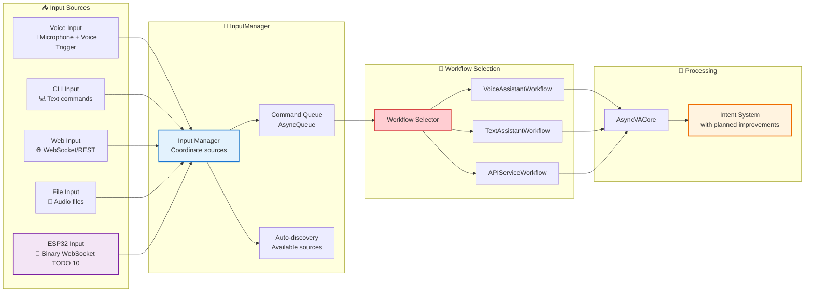

### 5.2 Абстракция вывода v13.0.0

**Особенности:**
- **Интеллектуальная маршрутизация**: Автоматический выбор целей вывода на основе IntentResult
- **Контекстная привязка**: Связывание запроса и ответа через conversation context
- **Множественный вывод**: Один ответ может идти в несколько каналов одновременно
- **Graceful degradation**: Работа при недоступности каналов

---

## 🏗️ **6. СИСТЕМА СБОРКИ И РАЗВЕРТЫВАНИЯ**

### 6.1 Entry-Points Based Build System (TODO #3)

**Статус**: Готов к реализации (фундамент завершен через TODO #1)

**Принцип работы**: Анализ entry-points каталога + TOML конфигурации для создания минимальных сборок.

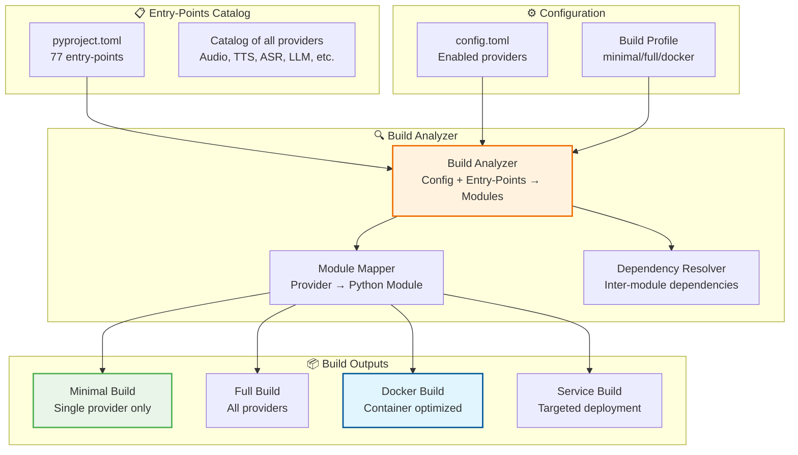

**Пример анализа сборки:**
```python
# config-minimal.toml анализируется build system
[components]
enabled = ["audio"]  # Только audio компонент

[providers.audio]
enabled = ["console"]  # Только console audio provider

# Result: Build includes only:
# - irene.core.*
# - irene.components.audio_component  
# - irene.providers.audio.console
# All other providers/components excluded
```

### 6.2 Обновленная конфигурация

**config.toml v13.0.0 с TODO улучшениями:**
```toml
[core]
name = "Irene"
version = "14.0.0"
debug = false
log_level = "INFO"
language = "ru-RU"

# Фундаментальные компоненты с динамической загрузкой (TODO #1)
[components]
voice_trigger = true
asr = true
text_processor = true    # TODO #2: Специализированные процессоры
nlu = true              # TODO #4,#5: Keyword-first улучшения
tts = true
audio_output = true
llm = true
web_api = false

# Динамическая загрузка провайдеров (TODO #1)
auto_discover = true
discovery_paths = ["irene.components", "custom.components"]

# Voice Trigger Configuration
[components.voice_trigger]
enabled = true
default_provider = "microwakeword"
wake_words = ["irene", "jarvis"]
threshold = 0.8

[components.voice_trigger.providers.microwakeword]
model_path = "./models/wake_word/irene_model.tflite"
feature_buffer_size = 49
detection_window_size = 3
num_mfcc_features = 40

# Text Processing с новыми провайдерами (TODO #2)
[components.text_processor]
provider = "general_text_processor"  # Новые специализированные провайдеры
enabled_providers = ["asr_text_processor", "general_text_processor"]
stage_routing = true

# NLU Configuration с планируемыми улучшениями (TODO #4, #5)
[components.nlu]
provider = "keyword_matcher"  # TODO #5
fallback_provider = "spacy"
confidence_threshold = 0.7
keyword_donation_enabled = true  # TODO #4

[components.nlu.keyword_matcher]
russian_morphology = true  # TODO #5
morphology_cache = true

# Система интентов
[intents]
enabled = true
confidence_threshold = 0.7
fallback_handler = "conversation"
max_history_turns = 10
session_timeout = 1800
keyword_donation = true  # TODO #4

# Intent handlers
[intents.handlers]
greetings = true
timer = true
weather = true
datetime = true
system = true
conversation = true

# Workflow Configuration
[workflows]
default = "voice_assistant"
voice_assistant = true
text_assistant = true
api_service = true

[workflows.voice_assistant]
skip_wake_word = false
require_wake_word = true
continuous_listening = true

# Build Configuration (TODO #3)
[build]
profile = "full"  # full | minimal | api-only | voice-only
include_only_enabled = true
exclude_disabled_dependencies = true
lazy_imports = true

# Provider-specific enablement for selective builds (TODO #1, #3)
[providers.audio]
enabled = ["sounddevice", "console"]
default = "sounddevice"
fallback_providers = []  # No fallbacks approach

[providers.tts]
enabled = ["elevenlabs", "console"]
default = "elevenlabs"
fallback_providers = []

# Legacy plugin compatibility
[plugins]
load_builtin = true
external_paths = ["./plugins", "./custom_plugins"]

[security]
enable_auth = false
api_keys = []

[assets]
models_root = "./models"
cache_root = "./cache"
data_root = "./data"
```

### 6.3 Переменные окружения v13.0.0

```bash
# Core System
export IRENE_CORE__VERSION=14.0.0
export IRENE_CORE__LOG_LEVEL=INFO

# Dynamic Loading (TODO #1)
export IRENE_COMPONENTS__AUTO_DISCOVER=true
export IRENE_PROVIDERS__FILTER_ENABLED_ONLY=true

# Voice Trigger
export IRENE_COMPONENTS__VOICE_TRIGGER__ENABLED=true
export IRENE_COMPONENTS__VOICE_TRIGGER__DEFAULT_PROVIDER=microwakeword
export IRENE_COMPONENTS__VOICE_TRIGGER__THRESHOLD=0.8

# Intent System с планируемыми улучшениями
export IRENE_INTENTS__ENABLED=true
export IRENE_INTENTS__CONFIDENCE_THRESHOLD=0.7
export IRENE_INTENTS__KEYWORD_DONATION=true  # TODO #4

# NLU Configuration (TODO #4, #5)
export IRENE_COMPONENTS__NLU__PROVIDER=keyword_matcher  # TODO #5
export IRENE_COMPONENTS__NLU__MODEL_PATH=/opt/irene/models/nlu/
export IRENE_COMPONENTS__NLU__KEYWORD_DONATION_ENABLED=true  # TODO #4

# Text Processing (TODO #2)
export IRENE_COMPONENTS__TEXT_PROCESSOR__PROVIDER=general_text_processor
export IRENE_COMPONENTS__TEXT_PROCESSOR__STAGE_ROUTING=true

# Build System (TODO #3)
export IRENE_BUILD__PROFILE=minimal
export IRENE_BUILD__INCLUDE_ONLY_ENABLED=true

# Asset Management
export IRENE_ASSETS__MODELS_ROOT=/opt/irene/models
export IRENE_ASSETS__CACHE_ROOT=/opt/irene/cache
```

---

## 🌐 **7. WEB API ИНТЕГРАЦИЯ v13.0.0**

### 7.1 Обновленные API эндпоинты

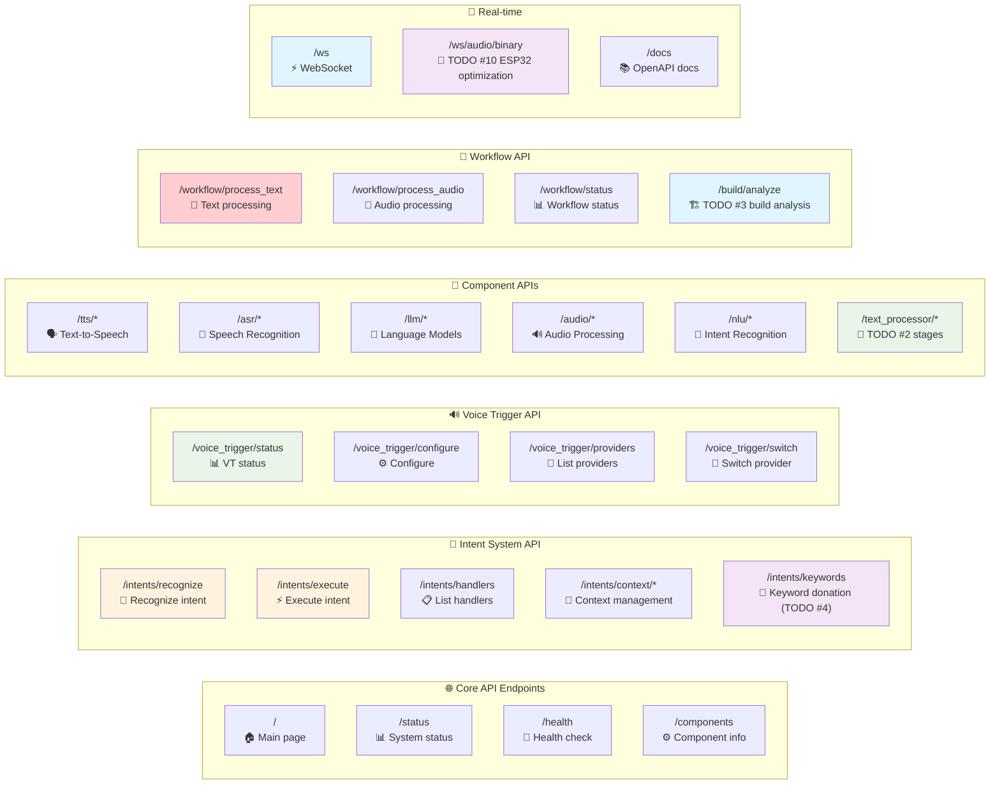

### 7.2 Новые эндпоинты системы интентов с планируемыми улучшениями

```python
# Intent System API с TODO улучшениями
@app.post("/intents/recognize")
async def recognize_intent(text: str, session_id: str = "default"):
    """Распознать интент из текста (keyword-first в TODO #5)"""
    context = await context_manager.get_context(session_id)
    intent = await nlu.recognize(text, context)
    return {
        "intent": intent.name,
        "entities": intent.entities,
        "confidence": intent.confidence,
        "recognition_method": intent.metadata.get("method", "unknown")  # keyword/rule/semantic
    }

@app.get("/intents/keywords")  # TODO #4: Keyword donation API
async def get_donated_keywords():
    """Получить ключевые слова, донированные обработчиками интентов"""
    handlers = intent_registry.get_all_handlers()
    donated_keywords = {}
    
    for handler_name, handler in handlers.items():
        if hasattr(handler, 'get_keywords'):
            donated_keywords[handler_name] = await handler.get_keywords()
    
    return {
        "donated_keywords": donated_keywords,
        "total_handlers": len(handlers),
        "donation_enabled": len(donated_keywords)
    }

@app.post("/intents/keywords/regenerate")  # TODO #5: Russian morphology
async def regenerate_morphological_forms():
    """Регенерировать русские словоформы для донированных ключевых слов"""
    russian_morph = RussianMorphology()
    regenerated = await russian_morph.regenerate_all_forms()
    
    return {
        "status": "regenerated",
        "base_keywords": regenerated.get("base_count", 0),
        "generated_forms": regenerated.get("forms_count", 0),
        "cache_updated": regenerated.get("cache_status", False)
    }

# Text Processing API с новыми провайдерами (TODO #2)
@app.post("/text_processor/process")
async def process_text_stage_specific(text: str, stage: str = "general"):
    """Обработать текст через специализированный провайдер"""
    stage_processors = {
        "asr": "asr_text_processor",
        "general": "general_text_processor", 
        "tts": "tts_text_processor",
        "numbers": "number_text_processor"
    }
    
    processor_name = stage_processors.get(stage, "general_text_processor")
    processor = text_processor_component.get_provider(processor_name)
    
    result = await processor.process(text)
    
    return {
        "original_text": text,
        "processed_text": result,
        "processor_used": processor_name,
        "stage": stage
    }

# Build System API (TODO #3)
@app.post("/build/analyze")
async def analyze_build_requirements(config_file: str = "config.toml"):
    """Анализировать требования сборки на основе конфигурации"""
    build_analyzer = BuildAnalyzer()
    analysis = await build_analyzer.analyze_config(config_file)
    
    return {
        "enabled_components": analysis.get("components", []),
        "enabled_providers": analysis.get("providers", {}),
        "required_modules": analysis.get("modules", []),
        "excluded_modules": analysis.get("excluded", []),
        "estimated_size_reduction": analysis.get("size_reduction_percent", 0),
        "build_profile": analysis.get("profile", "unknown")
    }

# ESP32 Binary WebSocket (TODO #10)
@app.websocket("/ws/audio/binary")
async def binary_audio_stream(websocket: WebSocket):
    """Оптимизированная бинарная потоковая передача аудио для ESP32"""
    await websocket.accept()
    
    # Session setup
    config = await websocket.receive_json()
    
    try:
        while True:
            # Receive raw PCM binary data (no base64 overhead)
            audio_data = await websocket.receive_bytes()
            
            # Direct ASR processing
            text = await asr.transcribe_audio(audio_data)
            
            # Send optimized response
            if text.strip():
                await websocket.send_json({
                    "type": "transcription",
                    "text": text,
                    "timestamp": time.time(),
                    "binary_optimized": True
                })
```

---

## 🚀 **8. РЕЖИМЫ РАЗВЕРТЫВАНИЯ v13.0.0**

### 8.1 Обновленные точки входа

```mermaid
graph TB
    subgraph "🖥️ CLI Режим"
        CLI_Runner[CLIRunner]
        CLI_Interactive[Интерактивный режим<br/>с интентами]
        CLI_Single[Одиночная команда<br/>через NLU]
        CLI_Context[Контекстные диалоги]
        CLI_Keyword[Keyword donation testing<br/>TODO #4]
    end
    
    subgraph "🌐 Web API Режим"
        Web_Runner[WebAPIRunner]
        Web_FastAPI[FastAPI server<br/>с intent endpoints]
        Web_WebSocket[WebSocket server<br/>real-time intents]
        Web_Binary[Binary WebSocket<br/>TODO #10]
        Web_Docs[Auto docs<br/>для intent API]
    end
    
    subgraph "🎤 Voice Assistant Режим"
        Voice_Runner[VoiceAssistantRunner]
        Voice_Pipeline[Full pipeline<br/>Voice Trigger → Intent]
        Voice_Context[Contextual conversations]
        Voice_Continuous[Continuous listening]
        Voice_Keyword[Keyword-first NLU<br/>TODO #5]
    end
    
    subgraph "🔊 Voice Trigger Режим"
        VT_Runner[VoiceTriggerRunner]
        VT_Server[Wake word detection<br/>service]
        VT_Remote[Remote detection<br/>API]
        VT_Callback[Webhook callbacks]
        VT_INT8[INT8 optimization<br/>TODO #14 завершено]
    end
    
    subgraph "⚙️ Settings Режим"
        Settings_Runner[SettingsManagerRunner]
        Settings_GUI[GUI для intent config]
        Settings_Train[NLU model training]
        Settings_Context[Context management]
        Settings_Build[Build analysis<br/>TODO #3]
    end
    
    CLI_Runner --> CLI_Interactive
    CLI_Runner --> CLI_Single
    CLI_Runner --> CLI_Context
    CLI_Runner --> CLI_Keyword
    
    Web_Runner --> Web_FastAPI
    Web_Runner --> Web_WebSocket
    Web_Runner --> Web_Binary
    Web_Runner --> Web_Docs
    
    Voice_Runner --> Voice_Pipeline
    Voice_Runner --> Voice_Context
    Voice_Runner --> Voice_Continuous
    Voice_Runner --> Voice_Keyword
    
    VT_Runner --> VT_Server
    VT_Runner --> VT_Remote
    VT_Runner --> VT_Callback
    VT_Runner --> VT_INT8
    
    Settings_Runner --> Settings_GUI
    Settings_Runner --> Settings_Train
    Settings_Runner --> Settings_Context
    Settings_Runner --> Settings_Build
    
    style Voice_Runner fill:#e8f5e8,stroke:#4caf50,stroke-width:3px
    style CLI_Runner fill:#e3f2fd
    style Web_Runner fill:#fff3e0
    style VT_Runner fill:#ffcdd2
    style Settings_Runner fill:#fce4ec
    style Voice_Keyword fill:#f3e5f5,stroke:#7b1fa2,stroke-width:2px
    style Web_Binary fill:#f3e5f5,stroke:#7b1fa2,stroke-width:2px
    style Settings_Build fill:#e1f5fe,stroke:#01579b,stroke-width:2px
```

### 8.2 Команды запуска v13.0.0

```bash
# Voice Assistant режим с улучшениями
python -m irene.runners.voice_assistant
python -m irene.runners.voice_assistant --continuous --wake-word irene --keyword-first  # TODO #5

# CLI режим с интентами и keyword donation testing
python -m irene.runners.cli
python -m irene.runners.cli --command "привет ирэн"
python -m irene.runners.cli --interactive --context-enabled
python -m irene.runners.cli --test-keyword-donation  # TODO #4

# Web API режим с новыми endpoints
python -m irene.runners.webapi_runner
python -m irene.runners.webapi_runner --host 0.0.0.0 --port 8080
python -m irene.runners.webapi_runner --enable-binary-ws  # TODO #10

# Voice Trigger сервис с INT8 optimization
python -m irene.runners.voice_trigger
python -m irene.runners.voice_trigger --provider microwakeword --threshold 0.8 --int8-optimized

# Build analysis и management
python -m irene.runners.settings_runner
python -m irene.runners.settings_runner --analyze-build --config config-minimal.toml  # TODO #3
python -m irene.runners.settings_runner --train-nlu --keyword-donation  # TODO #4
```

---

## 🔄 **9. ПОТОКИ ОБРАБОТКИ ДАННЫХ v13.0.0**

### 9.1 Полный цикл команды с планируемыми улучшениями

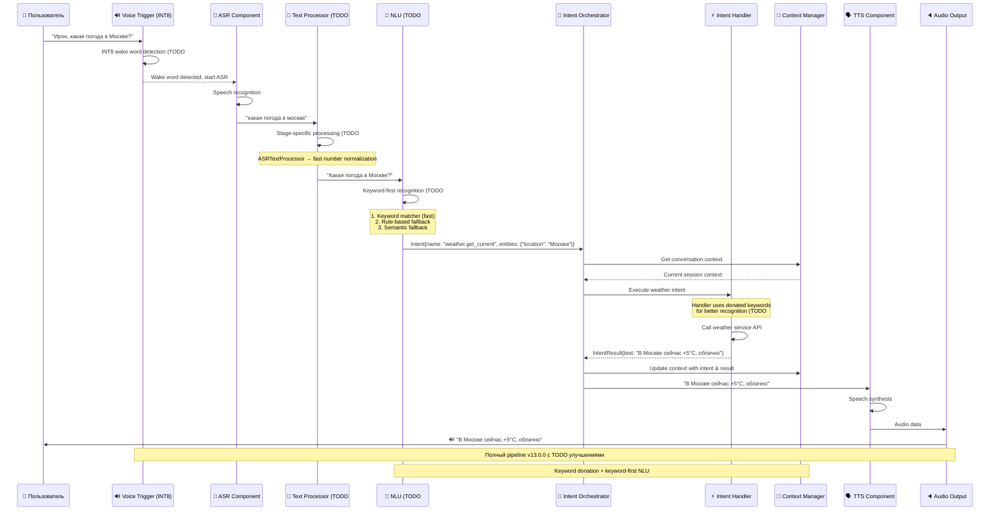

### 9.2 Контекстные разговоры с keyword donation

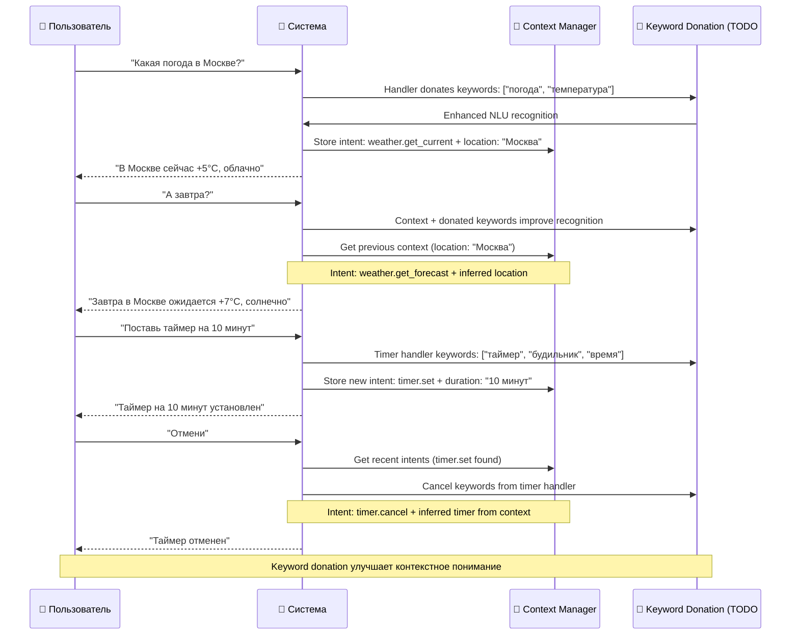

---

## 🔧 **10. ПАТТЕРНЫ ИНТЕГРАЦИИ v13.0.0**

### 10.1 Dependency Injection с динамической загрузкой

```python
# Обновленная инжекция зависимостей с динамической загрузкой
class VoiceAssistantWorkflow(Workflow):
    def __init__(self):
        super().__init__()
        # Fundamental components
        self.voice_trigger = None
        self.asr = None 
        self.text_processor = None      # TODO #2: Stage-specific processors
        self.nlu = None                 # TODO #4,#5: Keyword-first NLU
        self.tts = None
        self.audio_output = None
        
        # Intent system
        self.intent_orchestrator = None
        self.context_manager = None
        
        # Dynamic loading (TODO #1)
        self.dynamic_loader = None
        
    async def initialize(self):
        """Initialize with dependency injection and dynamic loading"""
        cm = self.core.component_manager
        
        # Inject dynamic loader (TODO #1)
        self.dynamic_loader = cm.dynamic_loader
        
        # Inject components (loaded dynamically via entry-points)
        self.voice_trigger = cm.get_component("voice_trigger")
        self.asr = cm.get_component("asr")
        self.text_processor = cm.get_component("text_processor")  # TODO #2 improvements
        self.nlu = cm.get_component("nlu")                       # TODO #4,#5 improvements
        self.tts = cm.get_component("tts")
        self.audio_output = cm.get_component("audio")
        
        # Inject intent system
        self.intent_orchestrator = self.core.intent_orchestrator
        self.context_manager = self.core.context_manager
```

### 10.2 Observer Pattern для интентов с keyword donation

```python
# Уведомления о событиях интентов с TODO улучшениями
class IntentEventObserver:
    async def on_intent_recognized(self, intent: Intent, confidence: float, method: str):
        """Уведомление о распознанном интенте (keyword/rule/semantic)"""
        
    async def on_keyword_donated(self, handler_name: str, keywords: Dict[str, List[str]]):
        """Уведомление о донированных ключевых словах (TODO #4)"""
        
    async def on_morphology_generated(self, base_keywords: List[str], generated_forms: List[str]):
        """Уведомление о генерации русских словоформ (TODO #5)"""
        
    async def on_intent_executed(self, intent: Intent, result: IntentResult):
        """Уведомление о выполненном интенте"""
        
    async def on_context_updated(self, session_id: str, context: ConversationContext):
        """Уведомление об обновлении контекста"""
```

### 10.3 Strategy Pattern для NLU провайдеров (TODO #5)

```python
# Keyword-first стратегия с расширяемыми NLU провайдерами
class NLUProviderStrategy:
    def __init__(self):
        self.providers = [
            KeywordMatcherNLUProvider(),    # Обязательный: быстрое сопоставление
            RuleBasedNLUProvider(),        # Опциональный: regex паттерны  
            SpaCySemanticNLUProvider(),    # Опциональный: семантическое понимание
        ]
    
    def select_provider(self, text: str, context: ConversationContext) -> str:
        """Выбор оптимального NLU провайдера (keyword-first подход)"""
        
        # Всегда начинаем с keyword matcher (TODO #5)
        keyword_result = self.providers[0].quick_check(text)
        if keyword_result.confidence >= 0.8:
            return "keyword_matcher"
            
        # Для коротких команд - rule-based
        if len(text.split()) <= 3:
            return "rule_based"
            
        # Для сложных запросов - семантическое понимание
        if context.requires_semantic_understanding():
            return "spacy_semantic"
            
        # Fallback to rule-based
        return "rule_based"
```

---

## 📊 **11. МЕТРИКИ И МОНИТОРИНГ v13.0.0**

### 11.1 Ключевые метрики системы с TODO улучшениями

| Метрика | Описание | Источник | TODO |
|---------|----------|----------|------|
| **Intent Recognition Accuracy** | Точность распознавания интентов | NLU Component | #4,#5 |
| **Keyword Donation Coverage** | Покрытие интентов донированными ключевыми словами | Intent Handlers | #4 |
| **Keyword-first Success Rate** | Процент интентов, распознанных через keyword matching | KeywordMatcherNLU | #5 |
| **Dynamic Loading Efficiency** | Процент провайдеров, загруженных селективно | DynamicLoader | #1 |
| **Text Processing Stage Performance** | Производительность по этапам обработки текста | Stage Processors | #2 |
| **Build Size Reduction** | Уменьшение размера сборки через анализ конфигурации | Build Analyzer | #3 |
| **Wake Word Detection Rate** | Точность обнаружения wake word (INT8) | Voice Trigger | #14 |
| **Context Session Duration** | Средняя длительность сессий | Context Manager | - |
| **Pipeline Latency** | Время полного pipeline (voice → response) | Workflow | - |
| **Component Availability** | Доступность компонентов | Component Manager | - |

### 11.2 Health checks v13.0.0 с TODO мониторингом

```python
@app.get("/health/intents")
async def intent_system_health():
    return {
        "status": "healthy",
        "version": "14.0.0",
        "components": {
            "voice_trigger": await voice_trigger.health_check(),
            "nlu": await nlu.health_check(),
            "intent_orchestrator": await intent_orchestrator.health_check(),
            "context_manager": await context_manager.health_check(),
            "dynamic_loader": await dynamic_loader.health_check()  # TODO #1
        },
        "todo_improvements": {
            "keyword_donation": {
                "enabled": intent_registry.keyword_donation_enabled,  # TODO #4
                "handlers_participating": len(await get_keyword_donating_handlers()),
                "total_donated_keywords": await count_donated_keywords()
            },
            "keyword_first_nlu": {
                "enabled": nlu.keyword_first_enabled,  # TODO #5
                "success_rate": await get_keyword_matching_success_rate(),
                "fallback_rate": await get_semantic_fallback_rate()
            },
            "text_processing_optimization": {
                "stage_specific_enabled": text_processor.stage_routing_enabled,  # TODO #2
                "performance_improvement": await get_stage_performance_metrics()
            },
            "dynamic_loading": {
                "entry_points_discovered": len(dynamic_loader.discovered_entry_points),  # TODO #1
                "providers_filtered": dynamic_loader.filtering_efficiency,
                "external_packages_supported": len(dynamic_loader.external_packages)
            }
        },
        "metrics": {
            "active_sessions": len(context_manager.sessions),
            "registered_handlers": len(intent_registry._handlers),
            "intent_execution_rate": await get_intent_execution_rate(),
            "average_confidence": await get_average_confidence(),
            "wake_word_detection_rate": await get_wake_word_stats()
        },
        "pipeline": {
            "voice_trigger_enabled": voice_trigger.active,
            "nlu_provider": nlu.default_provider,
            "intent_handlers": list(intent_registry.get_all_handlers().keys()),
            "keyword_first_active": await nlu.is_keyword_first_active()  # TODO #5
        }
    }
```

---

## 🎯 **ЗАКЛЮЧЕНИЕ v13.0.0**

### Ключевые достижения архитектуры v13.0.0:

✅ **Завершенный Pipeline**: Полный поток от voice trigger до intent execution  
✅ **Система интентов**: Понимание намерений пользователя через NLU  
✅ **Voice Trigger System**: Поддержка OpenWakeWord и microWakeWord с INT8 оптимизацией  
✅ **Динамическая загрузка**: Entry-points архитектура устраняет хардкод и улучшает производительность  
✅ **Специализированная обработка текста**: Оптимизированные провайдеры для разных этапов  
✅ **Компонентная архитектура**: Четкое разделение ответственности  
✅ **Асинхронность**: Полностью неблокирующая обработка  
✅ **Модульность**: Опциональные компоненты с graceful degradation  
✅ **Конфигурируемость**: Мощная система настроек с TOML/ENV поддержкой  
✅ **Мультимодальность**: CLI, голос, веб-интерфейс с едиными возможностями  

### Архитектурные улучшения на основе TODO:

🔄 **Keyword-first NLU**: Быстрое сопоставление ключевых слов с семантическими fallback'ами  
🔄 **Keyword donation**: Обработчики интентов донируют ключевые слова для улучшения распознавания  
🔄 **Entry-points based builds**: Минимальные сборки через анализ конфигурации  
🔄 **Russian morphology**: Автоматическая генерация словоформ для лучшего понимания  
🔄 **Binary WebSocket optimization**: Оптимизированная передача для ESP32 устройств  

### Принципы дизайна v13.0.0:

🔹 **MECE**: Четкое разделение между компонентами, интентами, и workflow  
🔹 **Intent-Driven**: Все взаимодействия проходят через систему интентов  
🔹 **Context-Aware**: Понимание контекста и поддержание состояния диалога  
🔹 **Dynamic Loading**: Конфигурационно-управляемая загрузка компонентов  
🔹 **Performance-Oriented**: Оптимизация через специализацию и селективную загрузку  
🔹 **Separation of Concerns**: Разделение технических компонентов и бизнес-логики  
🔹 **Dependency Inversion**: Зависимости через абстракции и injection  
🔹 **Single Responsibility**: Каждый компонент имеет одну ответственность  
🔹 **Open/Closed**: Открыт для расширения, закрыт для модификации  

### Эволюция от v13.0.0 к v13.0.0:

**v13.0.0**: Асинхронная архитектура с "Universal Plugins"  
**v13.0.0**: Полноценный интеллектуальный ассистент с системой интентов и динамической загрузкой

Данная архитектура обеспечивает создание современного, интеллектуального и высокопроизводительного голосового ассистента, способного понимать намерения пользователя, поддерживать контекстные разговоры, оптимизировать производительность через селективную загрузку и работать в различных конфигурациях от минимального CLI до полнофункционального голосового интерфейса с wake word detection и веб-доступом.

**Irene Voice Assistant v13.0.0 представляет собой производственно-готовую платформу для интеллектуального голосового взаимодействия с возможностями масштабирования, оптимизации и расширения.** 