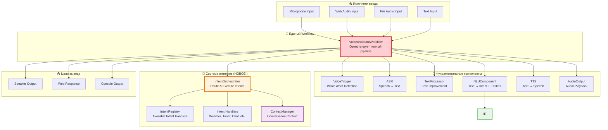
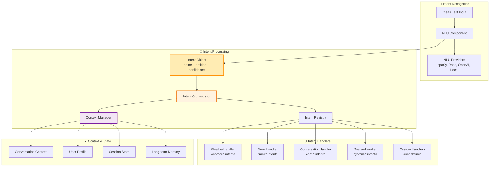
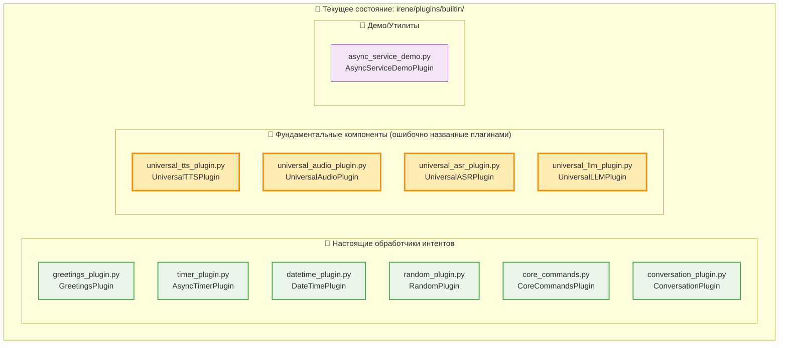
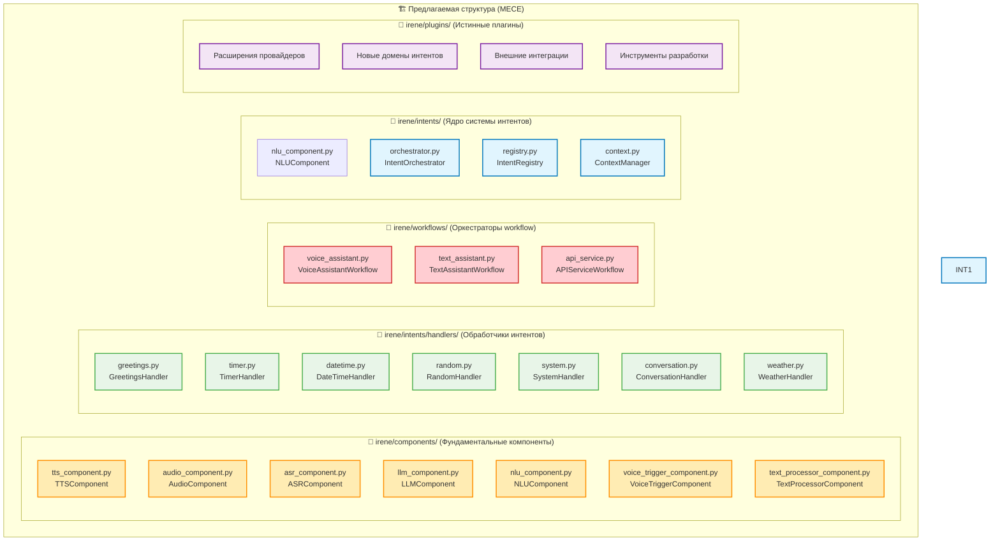
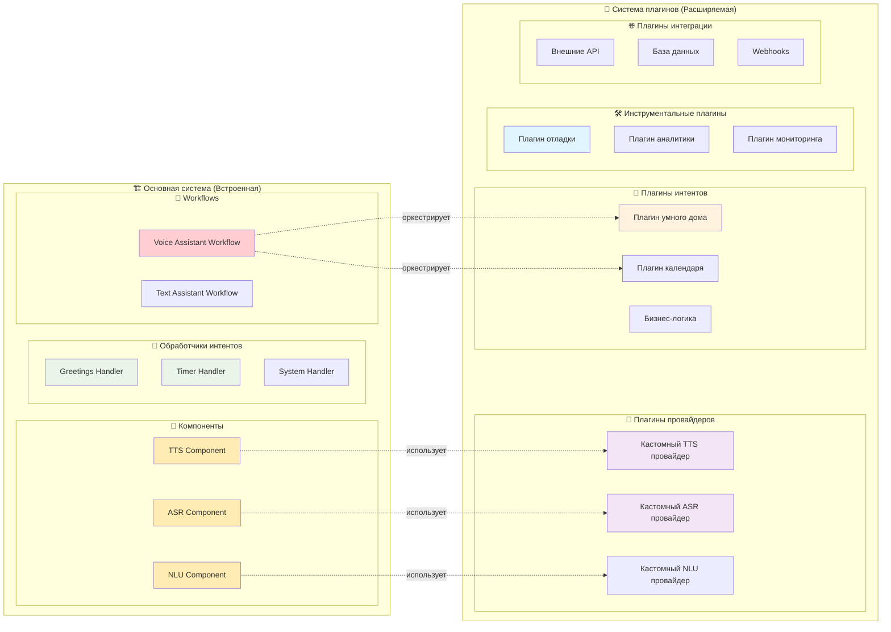

# Архитектура Системы Интентов
## Недостающее звено в архитектуре голосового ассистента

---

## 🎯 **Ключевое архитектурное понимание**

### Фундаментальное открытие

В процессе анализа архитектуры Voice Trigger выявлено **критическое архитектурное понимание**:

1. **"Universal Plugins" = Фундаментальные компоненты** системы
2. **Отсутствует слой Intent Recognition & Orchestration** - ключевой компонент современных голосовых ассистентов
3. **Существует ОДИН универсальный workflow** голосового ассистента с вариациями конфигурации

---

## ❌ **Проблематика текущей архитектуры**

### Пропущенный этап в pipeline

**Текущий поток (НЕПОЛНЫЙ):**
```
Audio → Voice Trigger → ASR → Text → CommandProcessor → Response → TTS → Audio
                                           ↑
                                   Отсутствует Intent Layer!
```

**Проблемы:**
- **Прямой переход** от ASR к обработке команд
- **Отсутствует Intent Recognition** - понимание намерений пользователя
- **Нет контекстного управления** разговором
- **Фрагментированная обработка** команд в отдельных плагинах
- **Отсутствует унифицированный NLU** слой

### Архитектурная путаница

**"Universal Plugins" на самом деле:**
- Это **фундаментальные компоненты** системы (microservices)
- НЕ плагины в традиционном понимании
- Это **строительные блоки** любого голосового ассистента
- Должны называться **"Fundamental Components"**

---

## ✅ **Правильная архитектура голосового ассистента**

### Полный pipeline обработки

```
Input → Voice Trigger → ASR → Text Improvement → Intent Recognition → Intent Execution → TTS → Output
```

**Каждый этап имеет четкую ответственность:**

| Этап | Компонент | Функция | Вход | Выход |
|------|-----------|---------|------|-------|
| **1** | VoiceTrigger | Wake word detection | Audio | Wake Signal |
| **2** | ASR | Speech recognition | Audio | Raw Text |
| **3** | TextProcessor | Text improvement | Raw Text | Clean Text |
| **4** | NLU | Intent recognition | Clean Text | Intent + Entities |
| **5** | IntentOrchestrator | Intent routing & execution | Intent | Intent Result |
| **6** | TTS | Speech synthesis | Response Text | Audio |
| **7** | AudioOutput | Audio playback | Audio | Sound |

---

## 🏗️ **Архитектура системы интентов**

### Общая схема архитектуры



### Детальная схема системы интентов



---

## 🔧 **Компонентная архитектура**

### 1. NLUComponent - NLU компонент

```python
# irene/components/nlu_component.py
class NLUComponent:
    """
    Natural Language Understanding компонент
    Text → Intent + Entities + Confidence
    """
    
    def __init__(self, config: NLUConfig):
        self.providers = {}  # Multiple NLU providers
        self.default_provider = config.default_provider
        self.fallback_provider = config.fallback_provider
        
    async def recognize(self, text: str, context: ConversationContext) -> Intent:
        """
        Распознает намерение пользователя из текста
        
        Args:
            text: Очищенный текст от пользователя
            context: Контекст разговора
            
        Returns:
            Intent: Объект с намерением, сущностями и уверенностью
        """
        
        # Primary NLU provider
        try:
            provider = self.providers[self.default_provider]
            intent = await provider.recognize(text, context)
            
            if intent.confidence >= self.confidence_threshold:
                return intent
                
        except Exception as e:
            self.logger.error(f"Primary NLU failed: {e}")
            
        # Fallback NLU provider
        if self.fallback_provider:
            try:
                provider = self.providers[self.fallback_provider]
                return await provider.recognize(text, context)
            except Exception as e:
                self.logger.error(f"Fallback NLU failed: {e}")
                
        # Default fallback - conversation intent
        return Intent(
            name="conversation.chat",
            entities={"text": text},
            confidence=0.5,
            raw_text=text
        )

class Intent:
    """Объект намерения пользователя"""
    
    def __init__(self, name: str, entities: dict, confidence: float, raw_text: str):
        self.name = name                    # "weather.get_current"
        self.entities = entities            # {"location": "Moscow", "time": "now"}
        self.confidence = confidence        # 0.95
        self.raw_text = raw_text           # Original user text
        self.timestamp = time.time()
        
    @property
    def domain(self) -> str:
        """Домен интента (weather, timer, etc.)"""
        return self.name.split('.')[0] if '.' in self.name else 'general'
        
    @property  
    def action(self) -> str:
        """Действие интента (get_current, set, etc.)"""
        parts = self.name.split('.')
        return parts[1] if len(parts) > 1 else 'default'
```

### 2. IntentOrchestrator - Центральный координатор

```python
# irene/core/intents/orchestrator.py
class IntentOrchestrator:
    """
    Центральный координатор интентов
    Маршрутизирует интенты к соответствующим обработчикам
    """
    
    def __init__(self, registry: IntentRegistry, context_manager: ContextManager):
        self.registry = registry
        self.context_manager = context_manager
        self.middleware = []  # Intent processing middleware
        
    async def execute_intent(self, intent: Intent, context: ConversationContext) -> IntentResult:
        """
        Выполняет интент через соответствующий обработчик
        
        Args:
            intent: Распознанный интент
            context: Контекст разговора
            
        Returns:
            IntentResult: Результат выполнения интента
        """
        
        # Apply middleware (auth, rate limiting, etc.)
        for middleware in self.middleware:
            intent = await middleware.process(intent, context)
            
        # Update conversation context
        await self.context_manager.add_user_turn(intent, context)
        
        try:
            # Get appropriate handler
            handler = await self.registry.get_handler(intent.name)
            if not handler:
                handler = await self.registry.get_fallback_handler()
                
            # Execute intent
            result = await handler.execute(intent, context)
            
            # Update context with result
            await self.context_manager.add_assistant_turn(result, context)
            
            return result
            
        except Exception as e:
            self.logger.error(f"Intent execution failed: {e}")
            
            # Fallback to error handler
            error_handler = await self.registry.get_error_handler()
            return await error_handler.execute(intent, context, error=e)

class IntentResult:
    """Результат выполнения интента"""
    
    def __init__(self, 
                 text: str,
                 should_speak: bool = True,
                 metadata: dict = None,
                 actions: list = None):
        self.text = text                    # Response text
        self.should_speak = should_speak    # Whether to use TTS
        self.metadata = metadata or {}      # Additional data
        self.actions = actions or []        # Additional actions to perform
        self.timestamp = time.time()
        
    def add_action(self, action_type: str, **params):
        """Добавить действие к результату"""
        self.actions.append({
            'type': action_type,
            'params': params,
            'timestamp': time.time()
        })
```

### 3. IntentRegistry - Реестр обработчиков

```python
# irene/core/intents/registry.py
class IntentRegistry:
    """
    Реестр обработчиков интентов
    Управляет регистрацией и маршрутизацией интентов
    """
    
    def __init__(self):
        self._handlers = {}                 # intent_name -> handler
        self._domain_handlers = {}          # domain -> handler
        self._pattern_handlers = []         # regex patterns
        self._fallback_handler = None
        self._error_handler = None
        
    def register_handler(self, intent_pattern: str, handler: IntentHandler):
        """
        Регистрирует обработчик для интента
        
        Args:
            intent_pattern: Паттерн интента ("weather.*", "timer.set", etc.)
            handler: Обработчик интента
        """
        
        if '*' in intent_pattern:
            # Wildcard pattern
            self._pattern_handlers.append((intent_pattern, handler))
        elif '.' in intent_pattern:
            # Specific intent
            self._handlers[intent_pattern] = handler
        else:
            # Domain handler
            self._domain_handlers[intent_pattern] = handler
            
    async def get_handler(self, intent_name: str) -> Optional[IntentHandler]:
        """Получить обработчик для интента"""
        
        # Exact match
        if intent_name in self._handlers:
            return self._handlers[intent_name]
            
        # Domain match
        domain = intent_name.split('.')[0]
        if domain in self._domain_handlers:
            return self._domain_handlers[domain]
            
        # Pattern match
        for pattern, handler in self._pattern_handlers:
            if fnmatch.fnmatch(intent_name, pattern):
                return handler
                
        return None
        
    async def get_fallback_handler(self) -> IntentHandler:
        """Получить fallback обработчик"""
        return self._fallback_handler
        
    async def get_error_handler(self) -> IntentHandler:
        """Получить обработчик ошибок"""
        return self._error_handler
        
    def set_fallback_handler(self, handler: IntentHandler):
        """Установить fallback обработчик"""
        self._fallback_handler = handler
        
    def set_error_handler(self, handler: IntentHandler):
        """Установить обработчик ошибок"""
        self._error_handler = handler
```

### 4. ContextManager - Управление контекстом

```python
# irene/core/intents/context.py
class ContextManager:
    """
    Управление контекстом разговора
    Поддерживает состояние диалога между пользователем и ассистентом
    """
    
    def __init__(self, config: ContextConfig):
        self.sessions = {}              # session_id -> ConversationContext
        self.max_history = config.max_history_turns
        self.session_timeout = config.session_timeout
        
    async def get_context(self, session_id: str) -> ConversationContext:
        """Получить или создать контекст сессии"""
        
        if session_id not in self.sessions:
            self.sessions[session_id] = ConversationContext(
                session_id=session_id,
                started_at=time.time(),
                history=[],
                user_profile={},
                variables={}
            )
            
        context = self.sessions[session_id]
        
        # Check session timeout
        if time.time() - context.last_activity > self.session_timeout:
            await self.reset_context(session_id)
            context = self.sessions[session_id]
            
        return context
        
    async def add_user_turn(self, intent: Intent, context: ConversationContext):
        """Добавить ход пользователя в историю"""
        
        turn = ConversationTurn(
            type="user",
            timestamp=time.time(),
            text=intent.raw_text,
            intent=intent,
            entities=intent.entities
        )
        
        context.history.append(turn)
        context.last_activity = time.time()
        
        # Maintain history limit
        if len(context.history) > self.max_history * 2:  # user + assistant turns
            context.history = context.history[-self.max_history * 2:]
            
    async def add_assistant_turn(self, result: IntentResult, context: ConversationContext):
        """Добавить ответ ассистента в историю"""
        
        turn = ConversationTurn(
            type="assistant",
            timestamp=time.time(),
            text=result.text,
            metadata=result.metadata,
            actions=result.actions
        )
        
        context.history.append(turn)
        context.last_activity = time.time()

class ConversationContext:
    """Контекст разговора"""
    
    def __init__(self, session_id: str, started_at: float, history: list, user_profile: dict, variables: dict):
        self.session_id = session_id
        self.started_at = started_at
        self.last_activity = started_at
        self.history = history              # List of ConversationTurn
        self.user_profile = user_profile    # User preferences, location, etc.
        self.variables = variables          # Session variables
        
    def get_recent_intents(self, limit: int = 5) -> list[Intent]:
        """Получить последние интенты пользователя"""
        user_turns = [turn for turn in self.history if turn.type == "user"]
        return [turn.intent for turn in user_turns[-limit:]]
        
    def get_variable(self, key: str, default=None):
        """Получить переменную сессии"""
        return self.variables.get(key, default)
        
    def set_variable(self, key: str, value):
        """Установить переменную сессии"""
        self.variables[key] = value
```

---

## 🎯 **Обработчики интентов**

### Базовый класс обработчика

```python
# irene/core/intents/handlers/base.py
class IntentHandler(ABC):
    """Базовый класс для обработчиков интентов"""
    
    def __init__(self, name: str):
        self.name = name
        self.logger = logging.getLogger(f"intent.{name}")
        
    @abstractmethod
    async def execute(self, intent: Intent, context: ConversationContext) -> IntentResult:
        """Выполнить интент"""
        pass
        
    @abstractmethod
    def can_handle(self, intent: Intent) -> bool:
        """Проверить, может ли обработчик выполнить интент"""
        pass
        
    async def validate_entities(self, intent: Intent) -> bool:
        """Валидация сущностей интента"""
        return True
```

### Примеры обработчиков

```python
# irene/core/intents/handlers/weather.py
class WeatherIntentHandler(IntentHandler):
    """Обработчик погодных интентов"""
    
    def __init__(self, weather_service: WeatherService):
        super().__init__("weather")
        self.weather_service = weather_service
        
    def can_handle(self, intent: Intent) -> bool:
        return intent.domain == "weather"
        
    async def execute(self, intent: Intent, context: ConversationContext) -> IntentResult:
        if intent.action == "get_current":
            return await self._get_current_weather(intent, context)
        elif intent.action == "get_forecast":
            return await self._get_forecast(intent, context)
        else:
            return IntentResult(
                text="Извините, я не понимаю этот погодный запрос.",
                should_speak=True
            )
            
    async def _get_current_weather(self, intent: Intent, context: ConversationContext) -> IntentResult:
        location = intent.entities.get("location")
        
        if not location:
            # Try to get location from context
            location = context.user_profile.get("default_location")
            
        if not location:
            return IntentResult(
                text="Для какого города вы хотите узнать погоду?",
                should_speak=True
            )
            
        try:
            weather = await self.weather_service.get_current_weather(location)
            
            response = f"В городе {location} сейчас {weather.description}, температура {weather.temperature}°C"
            
            return IntentResult(
                text=response,
                should_speak=True,
                metadata={
                    "weather_data": weather.to_dict(),
                    "location": location
                }
            )
            
        except Exception as e:
            self.logger.error(f"Weather service error: {e}")
            return IntentResult(
                text=f"Не удалось получить погоду для города {location}. Попробуйте позже.",
                should_speak=True
            )

# irene/core/intents/handlers/timer.py  
class TimerIntentHandler(IntentHandler):
    """Обработчик таймеров"""
    
    def __init__(self, timer_service: TimerService):
        super().__init__("timer")
        self.timer_service = timer_service
        
    def can_handle(self, intent: Intent) -> bool:
        return intent.domain == "timer"
        
    async def execute(self, intent: Intent, context: ConversationContext) -> IntentResult:
        if intent.action == "set":
            return await self._set_timer(intent, context)
        elif intent.action == "cancel":
            return await self._cancel_timer(intent, context)
        elif intent.action == "status":
            return await self._get_timer_status(intent, context)
            
    async def _set_timer(self, intent: Intent, context: ConversationContext) -> IntentResult:
        duration = intent.entities.get("duration")
        name = intent.entities.get("name", "Таймер")
        
        if not duration:
            return IntentResult(
                text="На сколько времени установить таймер?",
                should_speak=True
            )
            
        timer_id = await self.timer_service.set_timer(
            duration=duration,
            name=name,
            session_id=context.session_id
        )
        
        return IntentResult(
            text=f"Таймер '{name}' установлен на {duration}",
            should_speak=True,
            metadata={"timer_id": timer_id}
        )

# irene/core/intents/handlers/conversation.py
class ConversationIntentHandler(IntentHandler):
    """Обработчик свободного общения (fallback)"""
    
    def __init__(self, llm_service: LLMService):
        super().__init__("conversation")
        self.llm_service = llm_service
        
    def can_handle(self, intent: Intent) -> bool:
        return intent.domain in ["conversation", "chat", "general"]
        
    async def execute(self, intent: Intent, context: ConversationContext) -> IntentResult:
        # Get conversation history
        recent_messages = []
        for turn in context.history[-10:]:  # Last 5 exchanges
            if turn.type == "user":
                recent_messages.append({"role": "user", "content": turn.text})
            else:
                recent_messages.append({"role": "assistant", "content": turn.text})
                
        # Add current message
        recent_messages.append({"role": "user", "content": intent.raw_text})
        
        try:
            response = await self.llm_service.generate_response(
                messages=recent_messages,
                system_prompt="Ты полезный голосовой ассистент Irene. Отвечай кратко и дружелюбно."
            )
            
            return IntentResult(
                text=response,
                should_speak=True,
                metadata={"conversation_type": "chat"}
            )
            
        except Exception as e:
            self.logger.error(f"LLM service error: {e}")
            return IntentResult(
                text="Извините, у меня возникли технические проблемы. Попробуйте позже.",
                should_speak=True
            )
```

---

## 🔄 **Обновленный Voice Assistant Workflow**

### Полный workflow с интентами

```python
# irene/plugins/builtin/voice_assistant_workflow_plugin.py (UPDATED)
class VoiceAssistantWorkflowPlugin(CommandPlugin):
    """
    ЕДИНЫЙ Voice Assistant Workflow
    Оркестрирует полный pipeline с системой интентов
    """
    
    def __init__(self):
        super().__init__()
        # Fundamental components (injected)
        self.voice_trigger = None
        self.asr = None 
        self.text_processor = None      # NEW: Text improvement
        self.nlu = None                 # NEW: Intent recognition
        self.tts = None
        self.audio_output = None
        
        # Intent system (injected)
        self.intent_orchestrator = None # NEW: Intent orchestration
        self.context_manager = None     # NEW: Conversation context
        
    async def initialize(self):
        """Initialize with dependency injection"""
        pm = self.core.plugin_manager
        
        # Fundamental components
        self.voice_trigger = pm.get_plugin("universal_voice_trigger")
        self.asr = pm.get_plugin("universal_asr")
        self.text_processor = pm.get_plugin("universal_text_processor")  # NEW
        self.nlu = pm.get_plugin("universal_nlu")                       # NEW
        self.tts = pm.get_plugin("universal_tts")
        self.audio_output = pm.get_plugin("universal_audio")
        
        # Intent system
        self.intent_orchestrator = self.core.intent_orchestrator         # NEW
        self.context_manager = self.core.context_manager                 # NEW
        
    async def process_audio_stream(self, audio_stream: AsyncIterator[AudioData], request_context: RequestContext):
        """
        ГЛАВНЫЙ WORKFLOW - полный pipeline голосового ассистента
        """
        
        # Get conversation context
        session_id = request_context.session_id or "default"
        conversation_context = await self.context_manager.get_context(session_id)
        
        async for audio_data in audio_stream:
            try:
                # 1. Voice Trigger Detection (опционально)
                if self.voice_trigger and not request_context.skip_wake_word:
                    wake_result = await self.voice_trigger.detect(audio_data)
                    if not wake_result.detected:
                        continue  # Keep listening for wake word
                        
                    self.logger.info(f"Wake word '{wake_result.word}' detected")
                    
                # 2. Speech Recognition (ASR)
                if not self.asr:
                    self.logger.warning("ASR component not available")
                    continue
                    
                raw_text = await self.asr.transcribe(audio_data)
                if not raw_text.strip():
                    continue
                    
                self.logger.info(f"ASR result: {raw_text}")
                
                # 3. Text Improvement (очистка, нормализация)
                improved_text = raw_text
                if self.text_processor:
                    improved_text = await self.text_processor.improve(raw_text, conversation_context)
                    self.logger.info(f"Improved text: {improved_text}")
                    
                # 4. Intent Recognition (NLU) - КЛЮЧЕВОЙ НОВЫЙ ЭТАП
                if not self.nlu:
                    # Fallback to direct conversation
                    intent = Intent(
                        name="conversation.chat",
                        entities={"text": improved_text},
                        confidence=0.5,
                        raw_text=improved_text
                    )
                else:
                    intent = await self.nlu.recognize(improved_text, conversation_context)
                    
                self.logger.info(f"Intent recognized: {intent.name} (confidence: {intent.confidence})")
                
                # 5. Intent Execution - НОВЫЙ ЦЕНТРАЛЬНЫЙ ЭТАП
                if not self.intent_orchestrator:
                    self.logger.error("Intent orchestrator not available")
                    continue
                    
                intent_result = await self.intent_orchestrator.execute_intent(intent, conversation_context)
                
                # 6. Response Generation & TTS
                if intent_result.should_speak and self.tts:
                    audio_response = await self.tts.synthesize(intent_result.text)
                    
                    # 7. Audio Output
                    if self.audio_output and audio_response:
                        await self.audio_output.play(audio_response)
                        
                # 8. Additional Actions
                for action in intent_result.actions:
                    await self._execute_action(action, conversation_context)
                    
                # 9. Update request context
                request_context.last_response = intent_result.text
                request_context.last_intent = intent.name
                
            except Exception as e:
                self.logger.error(f"Workflow error: {e}")
                
                # Error recovery
                error_response = "Извините, произошла ошибка. Попробуйте ещё раз."
                if self.tts:
                    error_audio = await self.tts.synthesize(error_response)
                    if self.audio_output:
                        await self.audio_output.play(error_audio)
                        
    async def _execute_action(self, action: dict, context: ConversationContext):
        """Выполнить дополнительное действие из intent result"""
        action_type = action.get("type")
        params = action.get("params", {})
        
        if action_type == "set_user_preference":
            context.user_profile.update(params)
        elif action_type == "play_sound":
            sound_file = params.get("file")
            if self.audio_output and sound_file:
                await self.audio_output.play_file(sound_file)
        elif action_type == "send_notification":
            # Send system notification
            pass
```

---

## ⚙️ **Конфигурация системы интентов**

### Структура конфигурации

```toml
# config.toml - ОБНОВЛЕННАЯ КОНФИГУРАЦИЯ
[voice_assistant]
workflow = "standard"           # Единый workflow с вариациями
mode = "voice_triggered"        # voice_triggered | continuous | hybrid

# Фундаментальные компоненты
[components]
voice_trigger = true
asr = true
text_processor = true           # НОВЫЙ: Text improvement
nlu = true                      # НОВЫЙ: Intent recognition
tts = true
audio_output = true

# Система интентов
[intents]
enabled = true
confidence_threshold = 0.7
fallback_handler = "conversation"
max_history_turns = 10
session_timeout = 1800          # 30 minutes

# Intent handlers
[intents.handlers]
weather = true
timer = true
conversation = true
system = true
custom = []                     # List of custom handler modules

# NLU Configuration
[components.nlu]
provider = "spacy"              # spacy | rasa | openai | local
fallback_provider = "rule_based"
confidence_threshold = 0.7

[components.nlu.provider_configs.spacy]
model_path = "./models/nlu/ru_core_news_sm"
custom_entities = ["location", "time", "duration"]

[components.nlu.provider_configs.openai]
api_key = "${OPENAI_API_KEY}"
model = "gpt-3.5-turbo"
temperature = 0.1

# Text Processing
[components.text_processor]
provider = "spacy"
normalize_numbers = true
fix_spelling = true
remove_filler_words = true

# Context Management
[intents.context]
max_history_turns = 10
session_timeout = 1800
persist_sessions = true
storage_backend = "file"        # file | redis | database

# Intent Registry
[intents.registry]
auto_discover = true
custom_handlers_path = "./custom_intents"
builtin_handlers = [
    "weather",
    "timer", 
    "conversation",
    "system",
    "datetime"
]
```

### Переменные окружения

```bash
# Intent System
export IRENE_INTENTS__ENABLED=true
export IRENE_INTENTS__CONFIDENCE_THRESHOLD=0.7
export IRENE_INTENTS__FALLBACK_HANDLER=conversation

# NLU Configuration  
export IRENE_COMPONENTS__NLU__PROVIDER=spacy
export IRENE_COMPONENTS__NLU__MODEL_PATH=/opt/irene/models/nlu/

# OpenAI NLU (if using)
export IRENE_COMPONENTS__NLU__OPENAI_API_KEY=sk-...

# Context Storage
export IRENE_INTENTS__CONTEXT__STORAGE_BACKEND=redis
export IRENE_INTENTS__CONTEXT__REDIS_URL=redis://localhost:6379
```

---

## 🌐 **Web API расширения**

### Новые эндпоинты для системы интентов

```python
# Web API расширения
@app.post("/intents/recognize")
async def recognize_intent(text: str, session_id: str = "default"):
    """Распознать интент из текста"""
    context = await context_manager.get_context(session_id)
    intent = await nlu.recognize(text, context)
    return {
        "intent": intent.name,
        "entities": intent.entities,
        "confidence": intent.confidence
    }

@app.post("/intents/execute") 
async def execute_intent(intent_name: str, entities: dict, session_id: str = "default"):
    """Выполнить интент напрямую"""
    context = await context_manager.get_context(session_id)
    intent = Intent(intent_name, entities, 1.0, "")
    result = await intent_orchestrator.execute_intent(intent, context)
    return {
        "response": result.text,
        "should_speak": result.should_speak,
        "actions": result.actions
    }

@app.get("/intents/handlers")
async def list_intent_handlers():
    """Список доступных обработчиков интентов"""
    return intent_registry.get_all_handlers()

@app.get("/intents/context/{session_id}")
async def get_conversation_context(session_id: str):
    """Получить контекст разговора"""
    context = await context_manager.get_context(session_id)
    return {
        "session_id": context.session_id,
        "history": context.history[-10:],  # Last 10 turns
        "user_profile": context.user_profile,
        "variables": context.variables
    }

@app.post("/intents/context/{session_id}/reset")
async def reset_conversation_context(session_id: str):
    """Сбросить контекст разговора"""
    await context_manager.reset_context(session_id)
    return {"status": "reset", "session_id": session_id}

@app.post("/voice_assistant/process_text")
async def process_text_input(text: str, session_id: str = "default"):
    """Обработать текстовый ввод через полный pipeline"""
    context = await context_manager.get_context(session_id)
    
    # Skip voice trigger and ASR for text input
    improved_text = await text_processor.improve(text, context)
    intent = await nlu.recognize(improved_text, context)
    result = await intent_orchestrator.execute_intent(intent, context)
    
    return {
        "response": result.text,
        "intent": intent.name,
        "confidence": intent.confidence,
        "should_speak": result.should_speak
    }
```

---

## 🚀 **План реализации**

### Phase 1: Core Intent Infrastructure
1. ✅ Создать базовые классы Intent, IntentResult, ConversationContext
2. ✅ Реализовать NLUComponent (NLU компонент)
3. ✅ Создать IntentOrchestrator (центральный координатор)
4. ✅ Реализовать IntentRegistry (реестр обработчиков)
5. ✅ Создать ContextManager (управление контекстом)

### Phase 2: Fundamental Components Update
1. 🔄 Переименовать "Universal Plugins" → "Fundamental Components"
2. 🔄 Создать UniversalNLUPlugin как фундаментальный компонент
3. 🔄 Создать UniversalTextProcessorPlugin для улучшения текста
4. 🔄 Обновить конфигурационные модели для новых компонентов

### Phase 3: Intent Handlers Implementation
1. 🔄 Создать базовый IntentHandler класс
2. 🔄 Реализовать WeatherIntentHandler
3. 🔄 Реализовать TimerIntentHandler  
4. 🔄 Реализовать ConversationIntentHandler (LLM fallback)
5. 🔄 Реализовать SystemIntentHandler (управление ассистентом)

### Phase 4: Workflow Integration
1. 🔄 Обновить VoiceAssistantWorkflowPlugin с полным pipeline
2. 🔄 Интегрировать систему интентов в существующую архитектуру
3. 🔄 Обеспечить обратную совместимость с текущими плагинами
4. 🔄 Обновить InputManager и OutputManager

### Phase 5: NLU Providers
1. 🔄 Реализовать SpaCyNLUProvider (базовый)
2. 🔄 Реализовать RuleBasedNLUProvider (fallback)
3. 🔄 Реализовать OpenAINLUProvider (продвинутый)
4. 🔄 Создать систему обучения и настройки NLU моделей

### Phase 6: Web API & Tools
1. 🔄 Добавить intent management Web API эндпоинты
2. 🔄 Создать веб-интерфейс для управления интентами
3. 🔄 Реализовать систему мониторинга интентов
4. 🔄 Добавить инструменты отладки и тестирования

### Phase 7: Advanced Features
1. 🔄 Реализовать персистентный контекст (Redis/Database)
2. 🔄 Добавить систему middleware для интентов
3. 🔄 Создать систему A/B тестирования интентов
4. 🔄 Реализовать аналитику и метрики

---

## 🔧 **Deployment Profiles Update**

### Обновленные профили развертывания

```python
# Обновленные deployment profiles
def get_deployment_profile(self) -> str:
    available = set(self._components.keys())
    intent_system = "nlu" in available and "intents" in self.config
    
    if {"microphone", "voice_trigger", "asr", "nlu", "tts", "audio_output"} <= available:
        if intent_system:
            return "Smart Voice Assistant"       # Полная система с интентами
        else:
            return "Voice Assistant (Legacy)"   # Без системы интентов
    elif {"asr", "nlu", "tts"} <= available:
        if intent_system:
            return "Text Assistant"             # Текстовый ассистент с интентами
        else:
            return "Text Assistant (Legacy)"
    elif {"voice_trigger", "web_api"} <= available:
        return "Voice Trigger Service"          # Только wake word detection
    elif "web_api" in available:
        return "API Server"
    else:
        return "Headless"
```

---

## 📊 **Метрики и мониторинг**

### Ключевые метрики системы интентов

| Метрика | Описание | Источник |
|---------|----------|----------|
| **Intent Recognition Accuracy** | Точность распознавания интентов | NLU Component |
| **Intent Execution Success Rate** | Процент успешно выполненных интентов | IntentOrchestrator |
| **Intent Confidence Distribution** | Распределение уверенности NLU | Intent Recognition |
| **Average Response Time** | Среднее время обработки интента | End-to-end Pipeline |
| **Fallback Rate** | Частота использования fallback handler | Intent Registry |
| **Context Session Duration** | Средняя длительность сессий | Context Manager |
| **User Satisfaction Score** | Оценка качества ответов пользователями | Feedback System |

### Health checks для системы интентов

```python
@app.get("/health/intents")
async def intent_system_health():
    return {
        "status": "healthy",
        "components": {
            "nlu": await nlu.health_check(),
            "intent_orchestrator": await intent_orchestrator.health_check(),
            "context_manager": await context_manager.health_check(),
            "intent_registry": intent_registry.get_status()
        },
        "metrics": {
            "active_sessions": len(context_manager.sessions),
            "registered_handlers": len(intent_registry._handlers),
            "intent_execution_rate": await get_intent_execution_rate(),
            "average_confidence": await get_average_confidence()
        }
    }
```

---

## 🎯 **Ключевые преимущества новой архитектуры**

### Архитектурные улучшения

✅ **Полный Pipeline**: Завершенный поток от аудио до выполнения интентов  
✅ **Смысловое понимание**: NLU добавляет понимание намерений пользователя  
✅ **Контекстная осведомленность**: Поддержка многоходовых разговоров  
✅ **Модульность**: Каждый компонент имеет четкую ответственность  
✅ **Расширяемость**: Простое добавление новых intent handlers  
✅ **Fallback система**: Грациозная деградация при ошибках NLU  
✅ **Унифицированность**: Один workflow для всех сценариев  

### Функциональные улучшения

✅ **Естественные диалоги**: Поддержка контекста и многоходовых разговоров  
✅ **Точное понимание**: NLU распознает намерения точнее чем regex  
✅ **Персонализация**: User profile и предпочтения в контексте  
✅ **Аналитика**: Подробные метрики и мониторинг системы  
✅ **Масштабируемость**: Легкое добавление новых доменов и навыков  
✅ **Многоязычность**: NLU поддерживает различные языки  

### Технические улучшения

✅ **Производительность**: Асинхронная обработка на всех уровнях  
✅ **Надежность**: Множественные fallback механизмы  
✅ **Тестируемость**: Четкое разделение ответственности  
✅ **Мониторинг**: Подробные метрики каждого этапа pipeline  
✅ **Конфигурируемость**: Гибкая настройка всех компонентов  
✅ **Совместимость**: Полная обратная совместимость с v13  

---

## 📞 **Интеграция с архитектурой v13**

Система интентов **полностью дополняет** существующую архитектуру v13:

- ✅ **Сохраняет все принципы** v13 (асинхронность, модульность, graceful degradation)
- ✅ **Расширяет фундаментальные компоненты** (добавляет NLU и TextProcessor)
- ✅ **Упрощает workflow архитектуру** (один универсальный workflow)
- ✅ **Заполняет архитектурный пробел** (добавляет отсутствующий intent layer)
- ✅ **Поддерживает все режимы развертывания** с дополнительными возможностями
- ✅ **Обеспечивает обратную совместимость** с существующими плагинами

**Система интентов превращает Irene Voice Assistant из простого voice-to-text решения в полноценного интеллектуального ассистента с пониманием контекста и намерений пользователя.**

---

## 🔌 **Анализ текущих плагинов и новая архитектура расширений**

### Анализ существующих плагинов

На основе детального анализа папки `irene/plugins/builtin/` выявлена **критическая архитектурная путаница**:



### Детальная категоризация текущих "плагинов"

#### 🎯 **Обработчики интентов (6 элементов)**
Обрабатывают **конкретные пользовательские намерения**:

| Плагин | Класс | Домен интентов | Функция |
|--------|-------|----------------|---------|
| `greetings_plugin.py` | GreetingsPlugin | greetings.* | Приветствия, прощания |
| `timer_plugin.py` | AsyncTimerPlugin | timer.* | Установка, отмена таймеров |
| `datetime_plugin.py` | DateTimePlugin | datetime.* | Текущее время, дата |
| `random_plugin.py` | RandomPlugin | random.* | Случайные числа, развлечения |
| `core_commands.py` | CoreCommandsPlugin | system.* | Системные команды, помощь |
| `conversation_plugin.py` | ConversationPlugin | conversation.* | Свободное общение через LLM |

#### 🔧 **Фундаментальные компоненты (4 элемента)**
Предоставляют **базовые системные возможности** (ошибочно названы плагинами):

| "Плагин" | Класс | Возможность | Функция |
|----------|-------|-------------|---------|
| `universal_tts_plugin.py` | UniversalTTSPlugin | Text-to-Speech | Координация TTS провайдеров |
| `universal_audio_plugin.py` | UniversalAudioPlugin | Audio I/O | Воспроизведение/запись аудио |
| `universal_asr_plugin.py` | UniversalASRPlugin | Speech Recognition | Speech-to-text |
| `universal_llm_plugin.py` | UniversalLLMPlugin | Language Models | Координация LLM провайдеров |

---

## 🏗️ **Новая архитектура расширений**

### Принципы MECE (Взаимоисключающие и Исчерпывающие категории)



### Детальная структура папок

```
irene/
├── components/                     # 🔧 Фундаментальные компоненты системы
│   ├── __init__.py
│   ├── base.py                    # Базовые классы компонентов
│   ├── tts_component.py           # Было: universal_tts_plugin.py
│   ├── audio_component.py         # Было: universal_audio_plugin.py
│   ├── asr_component.py           # Было: universal_asr_plugin.py
│   ├── llm_component.py           # Было: universal_llm_plugin.py
│   ├── nlu_component.py           # НОВЫЙ: Распознавание интентов
│   ├── voice_trigger_component.py # НОВЫЙ: Wake word detection
│   └── text_processor_component.py # НОВЫЙ: Улучшение текста
│
├── intents/                       # 🎯 Система интентов
│   ├── __init__.py
│   ├── (removed)                  # IntentRecognizer (replaced by NLUComponent)
│   ├── orchestrator.py            # IntentOrchestrator
│   ├── registry.py                # IntentRegistry
│   ├── context.py                 # ContextManager
│   ├── models.py                  # Intent, IntentResult классы
│   └── handlers/                  # Обработчики интентов
│       ├── __init__.py
│       ├── base.py               # Базовый IntentHandler
│       ├── greetings.py          # Было: greetings_plugin.py
│       ├── timer.py              # Было: timer_plugin.py
│       ├── datetime.py           # Было: datetime_plugin.py
│       ├── random.py             # Было: random_plugin.py
│       ├── system.py             # Было: core_commands.py
│       ├── conversation.py       # Было: conversation_plugin.py
│       └── weather.py            # НОВЫЙ: Погодные интенты
│
├── workflows/                     # 🎼 Оркестраторы workflow
│   ├── __init__.py
│   ├── base.py                   # Базовые классы workflow
│   ├── voice_assistant.py        # VoiceAssistantWorkflow
│   ├── text_assistant.py         # TextAssistantWorkflow
│   └── api_service.py            # APIServiceWorkflow
│
└── plugins/                       # 🔌 Истинные плагины расширения
    ├── __init__.py
    ├── base.py                   # Базовые классы плагинов
    ├── manager.py                # Менеджер плагинов
    ├── registry.py               # Реестр плагинов
    ├── external/                 # Внешние плагины
    ├── examples/                 # Примеры для разработчиков
    │   ├── provider_example.py   # Как добавить провайдера
    │   ├── intent_example.py     # Как добавить домен интентов
    │   └── integration_example.py # Как интегрироваться с внешними API
    └── builtin_contrib/          # Опциональные встроенные плагины
        ├── smart_home/           # Умный дом
        ├── productivity/         # Календарь, email, задачи
        ├── entertainment/        # Музыка, игры
        └── development/          # Отладка, профилирование
```

---

## 🔌 **Роль плагинов в новой архитектуре**

### Определение истинных плагинов

**Плагины** в новой архитектуре обеспечивают **расширяемость без модификации основного кода системы**.



### Категории плагинов (MECE)

#### 1. 🔧 **Плагины провайдеров**
**Расширяют возможности компонентов альтернативными реализациями:**

```python
# Пример: Плагин кастомного TTS провайдера
class CustomTTSProviderPlugin(Plugin):
    """Добавляет новый TTS провайдер в TTS компонент"""
    
    def register(self, core):
        # Регистрирует новый провайдер в существующем TTS компоненте
        tts_component = core.get_component("tts")
        tts_component.register_provider("my_custom_tts", MyCustomTTSProvider())
```

**Случаи использования:**
- Новые TTS движки (Azure Cognitive Services, Google Cloud TTS)
- Кастомные ASR провайдеры (Azure Speech, IBM Watson)
- Проприетарные NLU модели
- Кастомные аудио бэкенды
- Экспериментальные провайдеры

#### 2. 🎯 **Плагины доменов интентов**
**Добавляют новые домены интентов, не покрытые встроенными обработчиками:**

```python
# Пример: Плагин умного дома
class SmartHomePlugin(Plugin):
    """Добавляет интенты управления умным домом"""
    
    def register(self, core):
        # Регистрирует новые обработчики интентов
        intent_registry = core.get_intent_registry()
        intent_registry.register_handler("lights.*", LightsHandler())
        intent_registry.register_handler("thermostat.*", ThermostatHandler())
        intent_registry.register_handler("security.*", SecurityHandler())
```

**Случаи использования:**
- Управление умным домом (Philips Hue, Nest, etc.)
- Бизнес-специфичные интенты (CRM, инвентарь, etc.)
- Личная продуктивность (календарь, email, задачи)
- Развлечения (музыка, подкасты, игры)
- Электронная коммерция (покупки, заказы, поддержка)

#### 3. 🌐 **Плагины интеграции**
**Подключаются к внешним сервисам и API:**

```python
# Пример: Плагин интеграции с календарем
class CalendarIntegrationPlugin(Plugin):
    """Интегрируется с Google Calendar, Outlook, etc."""
    
    def register(self, core):
        # Добавляет новые обработчики интентов
        intent_registry = core.get_intent_registry()
        intent_registry.register_handler("calendar.*", CalendarHandler(self.api_client))
        
        # Добавляет Web API эндпоинты
        web_api = core.get_web_api()
        web_api.register_routes("/calendar", self.get_calendar_routes())
```

**Случаи использования:**
- Календарные системы (Google, Outlook, CalDAV)
- Коммуникационные платформы (Slack, Discord, Teams)
- Облачные сервисы (Dropbox, OneDrive, AWS)
- Подключения к базам данных (PostgreSQL, MongoDB)
- IoT платформы (HomeAssistant, OpenHAB)

#### 4. 🛠️ **Плагины разработки и инструментов**
**Улучшают опыт разработки и мониторинг системы:**

```python
# Пример: Плагин отладки
class DebugPlugin(Plugin):
    """Добавляет возможности отладки и профилирования"""
    
    def register(self, core):
        # Добавляет middleware отладки
        core.add_middleware(DebugMiddleware())
        
        # Добавляет эндпоинты отладки
        web_api = core.get_web_api()
        web_api.register_routes("/debug", self.get_debug_routes())
```

**Случаи использования:**
- Профилирование производительности
- Логирование запросов/ответов
- Мониторинг состояния системы
- Фреймворки A/B тестирования
- Сбор аналитики

#### 5. 🎼 **Плагины кастомных workflow**
**Специализированные оркестровки workflow:**

```python
# Пример: Плагин ассистента для встреч
class MeetingAssistantPlugin(Plugin):
    """Специализированный workflow для сценариев встреч"""
    
    def register(self, core):
        # Регистрирует кастомный workflow
        workflow_manager = core.get_workflow_manager()
        workflow_manager.register_workflow("meeting_assistant", MeetingWorkflow())
```

**Случаи использования:**
- Workflow ассистента для встреч
- Режим презентаций
- Workflow с фокусом на доступность
- Отраслевые workflow (медицинские, юридические, etc.)

---

## 🏗️ **Принципы архитектуры плагинов**

### 1. 🚫 **Неинвазивное расширение**
```python
# ✅ ХОРОШО: Плагин расширяет без модификации ядра
class WeatherPlugin(Plugin):
    def register(self, core):
        intent_registry = core.get_intent_registry()
        intent_registry.register_handler("weather.*", WeatherHandler())

# ❌ ПЛОХО: Плагин модифицирует код основного компонента
class BadPlugin(Plugin):
    def register(self, core):
        # НЕ модифицируйте внутренности основных компонентов
        core.tts_component._add_custom_logic()  # ПЛОХО!
```

### 2. 🎯 **Чистое внедрение зависимостей**
```python
class SmartHomePlugin(Plugin):
    def __init__(self, config: SmartHomeConfig):
        self.config = config
        self.hub_client = SmartHomeHubClient(config.hub_url)
        
    def register(self, core):
        # Чистое внедрение зависимостей
        handler = SmartHomeHandler(self.hub_client, self.config)
        core.get_intent_registry().register_handler("lights.*", handler)
```

### 3. 🛡️ **Грациозный отказ**
```python
class ExternalServicePlugin(Plugin):
    async def register(self, core):
        try:
            await self.external_service.connect()
            # Регистрирует обработчики только если сервис доступен
            core.get_intent_registry().register_handler("external.*", self.handler)
        except ConnectionError:
            # Грациозная деградация - плагин не регистрируется если сервис недоступен
            logger.warning("External service unavailable, plugin disabled")
```

---

## ⚙️ **Конфигурация плагинов**

### Структура конфигурации плагинов

```toml
# config.toml - Конфигурация плагинов
[plugins]
# Обнаружение плагинов
auto_discover = true
external_paths = ["./plugins/external", "./custom_plugins"]
builtin_contrib_enabled = true

# Категории плагинов
[plugins.providers]
# Дополнительные провайдеры для компонентов
enabled = ["azure_tts", "google_asr", "custom_nlu"]

[plugins.intents]
# Дополнительные домены интентов
enabled = ["smart_home", "calendar", "music"]

[plugins.integrations]
# Интеграции с внешними сервисами
enabled = ["google_calendar", "philips_hue", "slack"]

[plugins.tools]
# Инструменты разработки и мониторинга
enabled = ["debug", "analytics"]
debug_mode_only = ["debug", "profiler"]

# Конфигурация конкретных плагинов
[plugins.smart_home]
hub_url = "http://192.168.1.100:8123"
api_token = "${SMART_HOME_TOKEN}"

[plugins.google_calendar]
credentials_path = "./credentials/google_calendar.json"
calendar_ids = ["primary", "work@company.com"]
```

---

## 📊 **Матрица принятия решений: Ядро vs Плагин**

| Тип функции | Ядро | Плагин | Обоснование |
|-------------|------|--------|-------------|
| **TTS/ASR/NLU** | ✅ Ядро | ❌ | Фундаментальная возможность голосового ассистента |
| **Базовые интенты** (приветствия, время) | ✅ Ядро | ❌ | Ожидается в любом голосовом ассистенте |
| **Умный дом** | ❌ | ✅ Плагин | Опциональная, домен-специфичная функция |
| **Кастомный TTS движок** | ❌ | ✅ Плагин | Расширяет существующую возможность |
| **Оркестрация Workflow** | ✅ Ядро | ❌ | Ответственность основной системы |
| **Бизнес-логика** | ❌ | ✅ Плагин | Пользователь/домен-специфичная |
| **Инструменты отладки** | ❌ | ✅ Плагин | Только во время разработки |
| **Внешние API** | ❌ | ✅ Плагин | Опциональные интеграции |

---

## 🎯 **Преимущества новой архитектуры плагинов**

### 1. 🎯 **Семантическая ясность**
✅ **Компоненты** = Строительные блоки системы (TTS, ASR, etc.)  
✅ **Интенты** = Обработка пользовательских намерений (приветствия, таймеры, etc.)  
✅ **Workflows** = Оркестрация pipeline  
✅ **Плагины** = Внешние расширения  

### 2. 🔍 **Лучшая обнаруживаемость**
✅ Разработчики точно знают, где найти обработчики интентов  
✅ Компоненты четко отделены от бизнес-логики  
✅ Оркестрация workflow имеет выделенное пространство  

### 3. 🏗️ **Архитектурное соответствие**
✅ Структура отражает реальную архитектуру системы  
✅ Система интентов получает надлежащее выделенное пространство  
✅ Фундаментальные компоненты отделены от плагинов  

### 4. 🔧 **Преимущества сопровождения**
✅ Легче добавлять новые обработчики интентов  
✅ Четкое разделение ответственности  
✅ Лучшая организация для масштабирования  

### 5. 🔌 **Экосистемные преимущества**
✅ Основная система остается сфокусированной и стабильной  
✅ Плагины могут разрабатываться/обновляться независимо  
✅ Сбои плагинов не влияют на основную функциональность  
✅ Сторонние разработчики могут расширять функциональность  
✅ Сообщество может вносить специализированные плагины  
✅ Предприятия могут добавлять проприетарные интеграции  

### 6. 🚀 **Гибкость развертывания**
✅ Минимальное развертывание (только ядро)  
✅ Домен-специфичные развертывания (ядро + соответствующие плагины)  
✅ Полнофункциональные развертывания (ядро + множество плагинов)  

---

## 📋 **План миграции к новой архитектуре**

### Phase 1: Переименование и перемещение компонентов
```bash
# Переместить universal плагины в компоненты
mkdir -p irene/components
mv irene/plugins/builtin/universal_tts_plugin.py irene/components/tts_component.py
mv irene/plugins/builtin/universal_audio_plugin.py irene/components/audio_component.py
mv irene/plugins/builtin/universal_asr_plugin.py irene/components/asr_component.py
mv irene/plugins/builtin/universal_llm_plugin.py irene/components/llm_component.py

# Обновить имена классов (UniversalTTSPlugin → TTSComponent)
```

### Phase 2: Создание системы интентов
```bash
# Создать структуру системы интентов
mkdir -p irene/intents/handlers
# Переместить обработчики интентов из plugins/builtin в intents/handlers
# Создать новые файлы ядра системы интентов
```

### Phase 3: Создание workflows
```bash
# Создать папку workflow
mkdir -p irene/workflows
# Переместить логику workflow из текущих плагинов
```

### Phase 4: Обновление импортов и конфигурации
```bash
# Обновить все операторы import
# Обновить файлы конфигурации
# Обновить систему обнаружения плагинов
```

**В итоге: Плагины обеспечивают расширяемость и кастомизацию без компромиссов с основной функциональностью голосового ассистента!** 