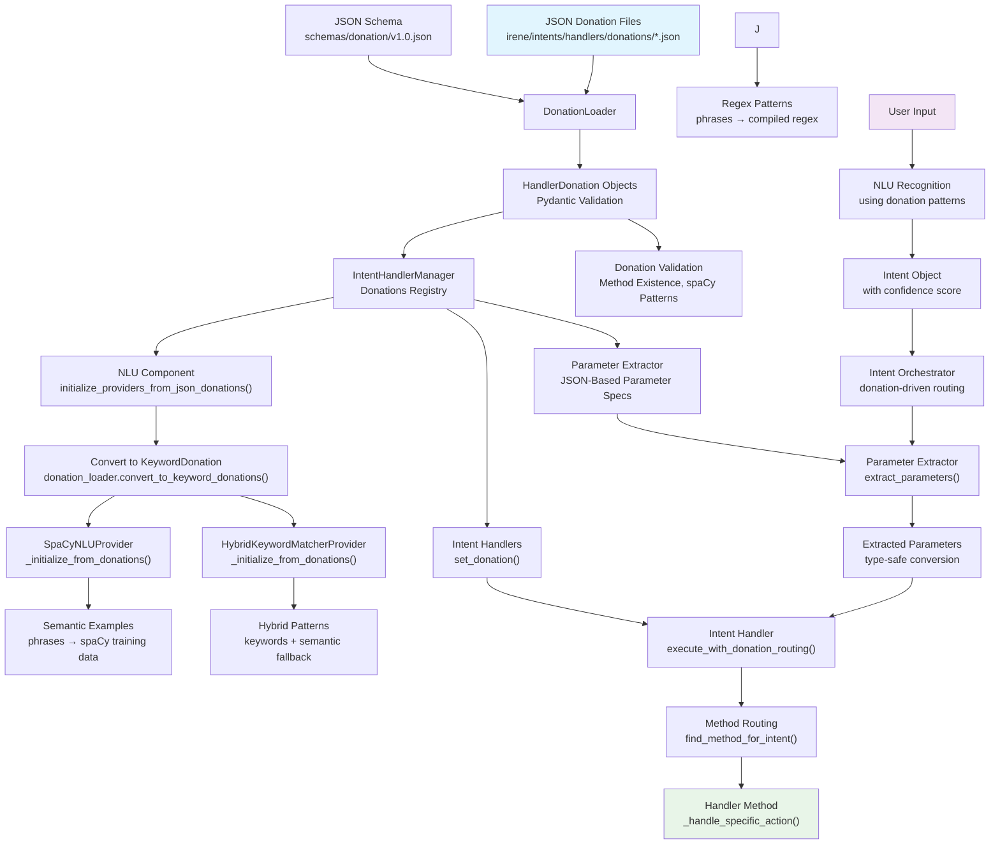

# Donation Data Flow Analysis

## Overview

This document provides a comprehensive analysis of the data flow of donations from intent handlers to NLU providers throughout the Irene Voice Assistant system. The donation system implements a JSON-driven architecture that eliminates hardcoded patterns and enables dynamic intent recognition configuration.

## System Architecture Diagram



## Data Structure Foundation

The donation system is built on a hierarchical data structure defined in `irene/core/donations.py`:

### Core Data Models

- **`HandlerDonation`**: Top-level container for an intent handler's complete donation
  - Contains handler domain, global parameters, and method donations
  - Includes handler-level pattern matching fields for `can_handle()` logic
  - Supports negative patterns and fallback conditions

- **`MethodDonation`**: Individual method specifications within a handler
  - Defines method name, intent suffix, and trigger phrases
  - Contains parameter specifications and spaCy patterns
  - Includes training examples and boost factors

- **`ParameterSpec`**: Parameter extraction and validation rules
  - Supports multiple data types (string, integer, float, duration, datetime, boolean, choice, entity)
  - Defines extraction patterns, validation rules, and aliases
  - Enables type-safe parameter conversion

- **`KeywordDonation`**: Converted format consumed by NLU providers
  - Flattened structure optimized for provider consumption
  - Contains full intent names and consolidated patterns

## Discovery and Loading Phase

**Primary Location**: `irene/core/donation_loader.py`

### File Discovery Process

1. **File Scanning**: System scans `irene/intents/handlers/donations/*.json` for JSON donation files
2. **Handler Mapping**: Each handler file `{handler_name}.py` must have a corresponding `{handler_name}.json` donation file
3. **Directory Structure**: Donations are organized in the `donations/` subdirectory within the handlers directory

### Multi-Layer Validation

The system implements comprehensive validation:

1. **JSON Schema Validation**: 
   - Validates against `schemas/donation/v1.0.json`
   - Ensures structural correctness and required fields
   - Optional dependency on `jsonschema` library

2. **Pydantic Model Validation**:
   - Type checking and field validation using `HandlerDonation` model
   - Automatic conversion and validation of nested structures
   - Support for default values and optional fields

3. **Method Existence Validation**:
   - Dynamically loads Python handler classes
   - Verifies that all donated methods exist in the handler implementation
   - Ensures consistency between JSON donations and Python code

4. **spaCy Pattern Validation**:
   - Validates token patterns and slot patterns using spaCy matcher
   - Ensures pattern syntax correctness before runtime usage
   - Optional dependency on spaCy for advanced validation

### Error Handling Strategy

- **Strict Mode**: Fatal errors on validation failures prevent system startup
- **Non-Strict Mode**: Validation errors are logged but don't halt initialization
- **Graceful Degradation**: Individual handler failures don't affect the entire system

## Distribution Architecture

**Primary Location**: `irene/intents/manager.py` → `IntentHandlerManager`

The loaded donations are distributed to **three critical system components**:

### A. Intent Handlers

**Integration Method**: `handler.set_donation(donation)`

**Purpose**: 
- Enable donation-driven method routing via `execute_with_donation_routing()`
- Replace hardcoded pattern matching with JSON-driven logic
- Support dynamic handler behavior based on donation specifications

**Key Features**:
- Handlers can find appropriate methods using `find_method_for_intent()`
- Support for domain patterns, action patterns, and intent name patterns
- Fallback conditions for complex routing logic

### B. Parameter Extractor

**Class**: `JSONBasedParameterExtractor` in `irene/core/parameter_extractor.py`

**Initialization**: `initialize_from_json_donations(donations)`

**Function**: 
- Creates parameter specifications for type-safe extraction from user input
- Supports multiple extraction strategies (spaCy patterns, regex, type-specific, alias matching)
- Provides automatic type conversion and validation

**Integration**: 
- Used by `IntentOrchestrator` during intent execution
- Extracts parameters before handler method execution
- Merges extracted parameters into intent entities

### C. NLU Component

**Class**: `NLUComponent` in `irene/components/nlu_component.py`

**Method**: `initialize_providers_from_json_donations()`

**Purpose**: 
- Bridge between donation system and NLU provider coordination
- Convert donations to provider-specific formats
- Initialize multiple NLU providers with shared donation data

## NLU Provider Data Flow

**Location**: `irene/components/nlu_component.py`

This represents the **critical transformation point** in the system:

### Data Conversion Process

1. **Format Transformation**: 
   - `HandlerDonation` objects → `KeywordDonation` objects 
   - Performed via `DonationLoader.convert_to_keyword_donations()`
   - Flattens hierarchical structure for provider consumption

2. **Provider Distribution**: 
   - Each enabled NLU provider receives the converted donations
   - Providers implement `_initialize_from_donations()` method
   - Failed providers are removed from the active provider list

### Provider-Specific Processing


- **Features**: Case-insensitive matching, flexible whitespace handling
- **Storage**: Internal `patterns` dictionary indexed by intent name

#### SpaCyNLUProvider
**Location**: `irene/providers/nlu/spacy_provider.py`

- **Pattern Type**: Semantic examples for spaCy training
- **Conversion**: Phrases → semantic examples for similarity matching
- **Features**: Leverages spaCy's semantic understanding
- **Storage**: Internal `intent_patterns` dictionary with semantic examples

#### HybridKeywordMatcherProvider
**Location**: `irene/providers/nlu/hybrid_keyword_matcher.py`

- **Pattern Type**: Hybrid keyword matrices with semantic fallback
- **Conversion**: Combines keyword matching with semantic processing
- **Features**: Optimized for both exact matches and fuzzy matching
- **Storage**: Specialized data structures for hybrid processing

### Pattern Processing Pipeline

```
JSON Donations → HandlerDonation → KeywordDonation → Provider-Specific Patterns
```

Each provider transforms the standardized `KeywordDonation` format into its internal representation optimized for its recognition algorithm.

## Runtime Recognition Flow

### End-to-End Processing

1. **User Input Reception**: Raw text or audio input received by the system

2. **NLU Recognition**: 
   - Multiple providers process input using donation-derived patterns
   - Each provider returns confidence scores and intent candidates
   - Best matching intent is selected based on confidence thresholds

3. **Intent Object Creation**: 
   - Structured intent object created with metadata
   - Includes confidence scores, extracted entities, and raw text

4. **Intent Orchestrator Processing**: 
   - `IntentOrchestrator` receives intent and applies donation-driven routing
   - Validates handler availability and donation compatibility

5. **Parameter Extraction**: 
   - `JSONBasedParameterExtractor` processes intent using JSON-defined specifications
   - Extracts typed parameters using multiple strategies
   - Performs validation and type conversion

6. **Handler Execution**: 
   - Intent handler executes via `execute_with_donation_routing()`
   - Method routing performed using `find_method_for_intent()`
   - Parameters passed to specific handler methods

## Key Technical Insights

### Multiple Loading Instances

The system implements **dual loading architecture**:

1. **Intent System Path**: 
   - `IntentHandlerManager` loads donations for handlers and parameter extraction
   - Focuses on handler method routing and parameter specifications
   - Provides donations to handlers and parameter extractor

2. **NLU System Path**: 
   - `NLUComponent` loads donations independently for provider initialization
   - Focuses on pattern recognition and intent classification
   - Converts donations to provider-specific formats

This dual loading ensures that both intent processing and NLU recognition have access to the same donation data while maintaining component independence.

### Data Transformation Pipeline

The system implements a multi-stage transformation pipeline:

```
JSON Files → Validation → HandlerDonation → Distribution → KeywordDonation → Provider Patterns
```

Each stage adds value:
- **Validation**: Ensures data integrity and consistency
- **Distribution**: Delivers data to appropriate system components
- **Conversion**: Optimizes data format for specific use cases
- **Provider Processing**: Creates runtime-optimized data structures

### Critical Dependencies

- **spaCy**: Required for advanced pattern validation and semantic processing
- **JSON Schema**: Provides structural validation (optional but recommended)
- **Pydantic**: Enables robust data modeling and validation
- **Method Existence**: Ensures donations match actual Python handler methods

### Error Handling and Resilience

- **Validation Failures**: System can operate in strict or permissive mode
- **Provider Failures**: Failed providers are isolated and removed
- **Parameter Extraction Failures**: Don't halt intent execution
- **Graceful Degradation**: System continues operating with available components

## Architecture Benefits

The donation-driven architecture provides several key advantages:

### 1. Complete Pattern Elimination
- **No hardcoded patterns** remain in the codebase
- **JSON donations** serve as the single source of truth for intent recognition
- **Dynamic behavior** without code modifications

### 2. Non-Technical Configurability
- Voice assistant behavior can be modified by editing JSON files
- No programming knowledge required for pattern updates
- Version control and rollback capabilities for pattern changes

### 3. Type-Safe Parameter Handling
- **Automatic type conversion** using donation specifications
- **Validation rules** prevent invalid parameter values
- **Multiple extraction strategies** for robust parameter detection

### 4. Provider Abstraction
- **Unified donation format** works across all NLU providers
- **Provider-specific optimizations** without affecting other components
- **Easy addition** of new NLU providers

### 5. Development Workflow
- **Separation of concerns** between pattern definition and handler logic
- **Independent testing** of patterns and handler methods
- **Collaborative development** with separate responsibilities

## Configuration Examples

### Sample Handler Donation

```json
{
  "$schema": "../../schemas/donation/v1.0.json",
  "schema_version": "1.0",
  "handler_domain": "service",
  "description": "System service status and monitoring",
  
  "intent_name_patterns": ["service.status", "service.health"],
  "action_patterns": ["status", "health", "check"],
  "domain_patterns": ["service"],
  
  "method_donations": [
    {
      "method_name": "_handle_service_status",
      "intent_suffix": "status",
      "description": "Show current service status",
      
      "phrases": [
        "service status", "статус сервиса", "check status"
      ],
      
      "parameters": [
        {
          "name": "component",
          "type": "string",
          "required": false,
          "description": "Specific service component to check"
        }
      ],
      
      "token_patterns": [
        [{"TEXT": "service"}, {"TEXT": "status"}],
        [{"LEMMA": "статус"}, {"LEMMA": "сервис"}]
      ]
    }
  ]
}
```

### Provider Integration

```python
class CustomNLUProvider(NLUProvider):
    async def _initialize_from_donations(self, keyword_donations: List[KeywordDonation]) -> None:
        """Initialize provider with donation patterns"""
        for donation in keyword_donations:
            # Convert donation.phrases to provider-specific format
            patterns = self._convert_phrases_to_patterns(donation.phrases)
            self.intent_patterns[donation.intent] = patterns
```

## Future Considerations

### Scalability
- **Large-scale pattern management** for enterprise deployments
- **Pattern optimization** for high-frequency recognition
- **Distributed pattern loading** for microservice architectures

### Enhanced Validation
- **Cross-pattern conflict detection** to prevent ambiguous patterns
- **Pattern effectiveness scoring** based on recognition success rates
- **Automated pattern suggestion** based on user interaction analysis

### Integration Capabilities
- **External pattern management systems** integration
- **Machine learning-based pattern optimization**
- **A/B testing frameworks** for pattern effectiveness

This donation system represents a sophisticated approach to intent management that balances flexibility, maintainability, and performance while enabling non-technical configuration of voice assistant behavior.
