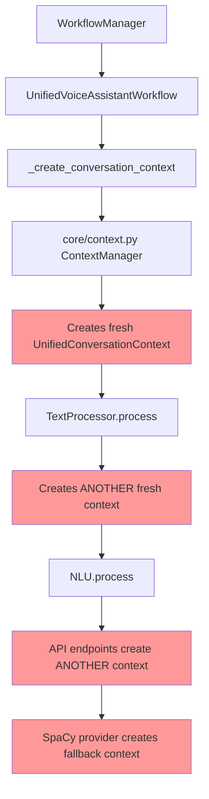

# Context Flow Analysis and Fix Implementation Plan

**Status:** 🔧 **ANALYSIS COMPLETE - READY FOR IMPLEMENTATION**  
**Priority:** Critical  
**Components:** Context Management, Workflow Pipeline, Component Architecture

## Overview

This document provides a comprehensive analysis of the `UnifiedConversationContext` creation and flow issues discovered during Phase 1 review of the session unification implementation. The analysis reveals critical architectural problems where context information is lost throughout the pipeline due to multiple context creation points instead of proper context passing.

## Problem Analysis

### **Root Cause: Multiple Context Creation Points**

The system currently has **8 different locations** where `UnifiedConversationContext` is instantiated, breaking the fundamental principle of context continuity:

```python
# FOUND INSTANCES:
irene/core/context.py:216                    # ✅ LEGITIMATE (ContextManager)
irene/intents/context.py:71                  # ✅ LEGITIMATE (ContextManager)
irene/components/text_processor_component.py:121   # ❌ PROBLEMATIC
irene/components/text_processor_component.py:133   # ❌ PROBLEMATIC  
irene/components/text_processor_component.py:359   # ❌ PROBLEMATIC
irene/components/nlu_component.py:1033       # ❌ PROBLEMATIC
irene/providers/nlu/spacy_provider.py:1272   # ❌ PROBLEMATIC
```

### **Architectural Issue: Dual Context Manager System**

The system has **TWO different ContextManager classes** creating architectural fragmentation:

1. **`irene/core/context.py`** - Basic `ContextManager` (stores basic `Context` objects)
2. **`irene/intents/context.py`** - Unified `ContextManager` (stores `UnifiedConversationContext` objects) ✅ **CORRECT ONE TO USE**

### **Current Broken Context Flow**



**Result:** Multiple disconnected contexts with complete information loss.

## Critical Information Loss

### **Data Lost in Pipeline:**

1. **Room Context**
   - `client_id` (room identifier)
   - `room_name` (human-readable room name)
   - Room-specific device mappings

2. **Device Context**
   - `available_devices` list
   - `device_capabilities` metadata
   - Room-scoped device resolution

3. **Fire-and-Forget Tracking**
   - `active_actions` (domain → action info)
   - `recent_actions` (completed actions)
   - `failed_actions` (error tracking)
   - `action_error_count` (error statistics)

4. **Session Continuity**
   - `conversation_history` (chat history)
   - `handler_contexts` (LLM conversation state)
   - `client_metadata` (session metadata)

5. **Contextual Command Resolution (TODO16)**
   - Room-scoped action disambiguation
   - Cross-room action isolation
   - Domain priority resolution within room boundaries

## Detailed Problem Locations

### **1. TextProcessorComponent Issues**

**File:** `irene/components/text_processor_component.py`

**Lines 121, 133:**
```python
# PROBLEM: Creates fresh context losing all information
from ..intents.models import UnifiedConversationContext
context = UnifiedConversationContext(session_id="text_processing", user_id=None, conversation_history=[])
return await self.improve(text, context, "general")
```

**Line 359 (API endpoint):**
```python
# PROBLEM: Creates fresh context for API calls
context = UnifiedConversationContext(session_id="api")
processed = await self.improve(request.text, context, request.stage)
```

**Impact:** Text processing loses all room context, device information, and session state.

### **2. NLUComponent Issues**

**File:** `irene/components/nlu_component.py`

**Line 1033 (API endpoint):**
```python
# PROBLEM: Creates context from limited API request data
context = UnifiedConversationContext(
    session_id=request.context.get("session_id", "default") if request.context else "default",
    history=request.context.get("history", []) if request.context else []
)
```

**Impact:** NLU processing loses room context, device capabilities, and active action tracking.

### **3. SpaCy Provider Issues**

**File:** `irene/providers/nlu/spacy_provider.py`

**Line 1272:**
```python
# PROBLEM: Creates empty fallback context
from ...intents.models import UnifiedConversationContext
context = kwargs.get('context', UnifiedConversationContext())
intent = await self.recognize(text, context)
```

**Impact:** Provider-level processing operates with completely empty context.

### **4. Workflow Context Creation Issues**

**File:** `irene/workflows/voice_assistant.py`

**Lines 543-549:**
```python
async def _create_conversation_context(self, context: RequestContext) -> UnifiedConversationContext:
    """Create or retrieve conversation context from context manager"""
    return await self.context_manager.get_or_create_context(
        session_id=context.session_id,
        client_id=context.client_id,
        client_metadata=context.metadata
    )
```

**Problem:** Uses `irene/core/context.py` ContextManager which creates fresh contexts and doesn't preserve room information from `RequestContext`.

## Implementation Fix Plan

### **Phase 1: Eliminate Dual Context Manager Architecture** ✅ **COMPLETED**

#### **1.1 Unify Context Management** ✅

**Action:** Remove usage of `irene/core/context.py` ContextManager, use only `irene/intents/context.py` ContextManager (which creates `UnifiedConversationContext` objects).

**Files to Update:**
- ✅ `irene/core/engine.py` - Update ContextManager import
- ✅ `irene/workflows/voice_assistant.py` - Update context manager reference  
- ✅ `irene/core/workflow_manager.py` - Update context manager usage (no changes needed)

**Before:**
```python
from ..core.context import ContextManager  # REMOVE
```

**After:**
```python
from ..intents.context import ContextManager  # USE THIS
```

#### **1.2 Fix Workflow Context Creation** ✅

**File:** `irene/workflows/voice_assistant.py`

**Before (broken):**
```python
async def _create_conversation_context(self, context: RequestContext) -> UnifiedConversationContext:
    """Create or retrieve conversation context from context manager"""
    return await self.context_manager.get_or_create_context(
        session_id=context.session_id,
        client_id=context.client_id,
        client_metadata=context.metadata
    )
```

**After (fixed):**
```python
async def _create_conversation_context(self, context: RequestContext) -> UnifiedConversationContext:
    """Create or retrieve conversation context with proper room context injection"""
    return await self.context_manager.get_context_with_request_info(
        session_id=context.session_id,
        request_context=context  # Pass full RequestContext for room info extraction
    )
```

### **Phase 2: Fix Component Context Handling** ✅ **COMPLETED**

#### **2.1 TextProcessorComponent Fix** ✅

**File:** `irene/components/text_processor_component.py`

**Method Signature Update:**
```python
# BEFORE (broken)
async def process(self, text: str, trace_context: Optional[TraceContext] = None) -> str:

# AFTER (fixed)
async def process(self, text: str, context: UnifiedConversationContext, 
                  trace_context: Optional[TraceContext] = None) -> str:
```

**Implementation Fix:**
```python
async def process(self, text: str, context: UnifiedConversationContext, 
                  trace_context: Optional[TraceContext] = None) -> str:
    """
    Process text using the general text processing provider with optional tracing.
    
    Args:
        text: Input text to process
        context: UnifiedConversationContext with session and room information
        trace_context: Optional trace context for detailed execution tracking
        
    Returns:
        Processed text
    """
    # Fast path - existing logic when no tracing
    if not trace_context or not trace_context.enabled:
        if not self.providers:
            logger.debug("No text processing providers available, returning original text")
            return text
        
        # USE PASSED CONTEXT - NO CREATION
        return await self.improve(text, context, "general")
    
    # Trace path - detailed stage tracking
    stage_start = time.time()
    normalizers_applied = []
    
    if not self.providers:
        processed_text = text
    else:
        # USE PASSED CONTEXT - NO CREATION
        processed_text = await self.improve(text, context, "general")
        
        # Track which providers were used
        if self._stage_providers:
            for stage, provider_name in self._stage_providers.items():
                normalizers_applied.append({
                    "stage": stage,
                    "provider": provider_name,
                    "used": stage == "general"
                })
    
    trace_context.record_stage(
        stage_name="text_processing",
        input_data=text,
        output_data=processed_text,
        metadata={
            "normalizers_applied": normalizers_applied,
            "provider_count": len(self.providers),
            "session_id": context.session_id,
            "room_context": bool(context.client_id)
        },
        processing_time_ms=(time.time() - stage_start) * 1000
    )
    
    return processed_text
```

**API Endpoint Fix:**
```python
# In get_router() method - fix API endpoint
@router.post("/process", response_model=TextProcessingResponse)
async def process_text(request: TextProcessingRequest):
    """Process text through text processing pipeline with context"""
    try:
        # GET CONTEXT FROM CONTEXT MANAGER - NO CREATION
        context = await self.context_manager.get_context(
            request.context.get("session_id", "api_session") if request.context else "api_session"
        )
        
        # Inject API request context if available
        if request.context:
            if "client_id" in request.context:
                context.client_id = request.context["client_id"]
            if "room_name" in request.context:
                context.room_name = request.context["room_name"]
            if "device_context" in request.context:
                context.client_metadata.update(request.context["device_context"])
        
        if request.stage == "bypass":
            processed = request.text
            normalizers_applied = []
        else:
            # Use context from context manager
            processed = await self.improve(request.text, context, request.stage)
            normalizers_applied = [n.__class__.__name__ for n in self.processor.normalizers 
                                 if n.applies_to_stage(request.stage)]
        
        return TextProcessingResponse(
            success=True,
            original_text=request.text,
            processed_text=processed,
            stage=request.stage,
            normalizers_applied=normalizers_applied,
            session_id=context.session_id,
            room_context=bool(context.client_id)
        )
        
    except Exception as e:
        logger.error(f"Text processing error: {e}")
        raise HTTPException(500, f"Text processing failed: {str(e)}")
```

#### **2.2 Update Workflow Pipeline Context Passing** ✅

**File:** `irene/workflows/voice_assistant.py`

**In `_process_pipeline` method:**
```python
async def _process_pipeline(self, input_data: str, context: RequestContext, 
                          conversation_context: UnifiedConversationContext,
                          trace_context: Optional[TraceContext] = None,
                          skip_wake_word: bool = False, skip_asr: bool = False) -> IntentResult:
    """Core unified pipeline processing with conditional stages and optional trace collection"""
    
    # Record initial context state
    if trace_context:
        trace_context.record_context_snapshot("before", conversation_context)
    
    processed_text = input_data
    
    # Stage 1: Text Processing (if enabled and component available)
    if self._text_processing_enabled and self.text_processor:
        self.logger.debug("Stage: Text Processing")
        # PASS CONVERSATION CONTEXT TO TEXT PROCESSOR
        processed_text = await self.text_processor.process(processed_text, conversation_context, trace_context)
    
    # Stage 2: NLU (Natural Language Understanding)
    self.logger.debug("Stage: NLU")
    recognition_start_time = time.time()
    # CONTEXT ALREADY PASSED CORRECTLY
    intent = await self.nlu.process(processed_text, conversation_context, trace_context)
    
    # ... rest of pipeline unchanged
```

#### **2.3 NLUComponent API Endpoint Fix** ✅

**File:** `irene/components/nlu_component.py`

**In `get_router()` method:**
```python
@router.post("/recognize", response_model=IntentResponse)
async def recognize_intent(request: NLURequest):
    """Recognize intent from text input"""
    try:
        # GET CONTEXT FROM CONTEXT MANAGER - NO CREATION
        session_id = request.context.get("session_id", "nlu_api_session") if request.context else "nlu_api_session"
        context = await self.context_manager.get_context(session_id)
        
        # Inject API request context if available
        if request.context:
            if "client_id" in request.context:
                context.client_id = request.context["client_id"]
            if "room_name" in request.context:
                context.room_name = request.context["room_name"]
            if "device_context" in request.context:
                context.client_metadata.update(request.context["device_context"])
            if "history" in request.context:
                context.conversation_history = request.context["history"]
        
        # Use specific provider if requested
        if request.provider and request.provider in self.providers:
            intent = await self.providers[request.provider].recognize_with_parameters(request.text, context)
            provider_name = request.provider
        else:
            intent = await self.recognize(request.text, context)
            provider_name = self.default_provider or "fallback"
        
        return IntentResponse(
            success=True,
            name=intent.name,
            entities=intent.entities,
            confidence=intent.confidence,
            domain=intent.domain,
            action=intent.action,
            provider=provider_name,
            session_id=context.session_id,
            room_context=bool(context.client_id)
        )
        
    except Exception as e:
        logger.error(f"Intent recognition error: {e}")
        raise HTTPException(500, f"Intent recognition failed: {str(e)}")
```

#### **2.4 SpaCy Provider Fix** ✅

**File:** `irene/providers/nlu/spacy_provider.py`

**Line 1272 fix:**
```python
# BEFORE (broken)
async def recognize_with_parameters(self, text: str, **kwargs) -> Intent:
    """
    Recognize intent with parameter extraction (PHASE 4 integration).
    """
    from ...intents.models import UnifiedConversationContext
    context = kwargs.get('context', UnifiedConversationContext())  # WRONG
    intent = await self.recognize(text, context)

# AFTER (fixed)
async def recognize_with_parameters(self, text: str, **kwargs) -> Intent:
    """
    Recognize intent with parameter extraction (PHASE 4 integration).
    """
    context = kwargs.get('context')
    if not context:
        raise ValueError("UnifiedConversationContext is required for SpaCy provider")
    
    intent = await self.recognize(text, context)
```

### **Phase 3: Enhanced Context Manager Implementation** ✅ **COMPLETED**

#### **3.1 Implement Enhanced Context Creation** ✅

**File:** `irene/intents/context.py`

**Enhance `get_context_with_request_info` method:**
```python
async def get_context_with_request_info(self, session_id: str, request_context: 'RequestContext' = None) -> UnifiedConversationContext:
    """Enhanced context creation with proper room context injection
    
    CRITICAL: Preserves room-scoped session boundaries for fire-and-forget actions
    and contextual command resolution.
    """
    
    # Get existing context or create new
    context = await self.get_context(session_id)
    
    # Extract room information from multiple sources
    if request_context:
        # Priority 1: Explicit room information
        if request_context.client_id and not context.client_id:
            context.client_id = request_context.client_id
            
        if request_context.room_name and not context.room_name:
            context.room_name = request_context.room_name
            
        # Priority 2: Extract from session ID if room-based (future SessionManager integration)
        if not context.client_id:
            # TODO: Integrate with SessionManager.extract_room_from_session() from Phase 4
            if session_id.endswith("_session"):
                room_part = session_id[:-8]  # Remove "_session"
                # Check if it looks like a room ID (not a UUID)
                if not any(c.isdigit() for c in room_part[-8:]):
                    context.client_id = room_part
            
        # Priority 3: Extract from device context
        if request_context.device_context:
            if not context.room_name and "room_name" in request_context.device_context:
                context.room_name = request_context.device_context["room_name"]
                
            # Populate device information
            if "available_devices" in request_context.device_context:
                context.available_devices = request_context.device_context["available_devices"]
                
            if "device_capabilities" in request_context.device_context:
                context.client_metadata["device_capabilities"] = request_context.device_context["device_capabilities"]
        
        # Update language if specified
        if request_context.language and request_context.language != context.language:
            context.language = request_context.language
            
        # Merge additional metadata
        if request_context.metadata:
            context.client_metadata.update(request_context.metadata)
    
    # Update activity timestamp
    context.last_activity = time.time()
    
    return context
```

#### **3.2 Enhanced Context Manager Lifecycle** ✅ **ADDED**

**File:** `irene/intents/context.py`

**Enhanced lifecycle methods with automatic cleanup:**
```python
async def start(self) -> None:
    """Start the context manager with periodic cleanup"""
    self._running = True
    # Start periodic cleanup task
    self._cleanup_task = asyncio.create_task(self._cleanup_expired_contexts())
    logger.debug("Context manager started with periodic cleanup")

async def stop(self) -> None:
    """Stop the context manager and cleanup task"""
    self._running = False
    if self._cleanup_task:
        self._cleanup_task.cancel()
        try:
            await self._cleanup_task
        except asyncio.CancelledError:
            pass
        self._cleanup_task = None
    logger.debug("Context manager stopped")

async def _cleanup_expired_contexts(self) -> None:
    """Periodically clean up expired contexts to prevent memory leaks"""
    # Runs every 5 minutes (configurable)
    # Removes contexts inactive for > session_timeout (default 30 minutes)
    # Prevents memory leaks in long-running systems
```

**Key Features Added:**
- ✅ **Automatic session cleanup**: Prevents memory leaks by removing expired contexts
- ✅ **Configurable timeouts**: Default 30-minute session timeout, 5-minute cleanup interval
- ✅ **Background operation**: Non-blocking cleanup task runs in background
- ✅ **Error resilience**: Graceful error handling with retry logic
- ✅ **Resource cleanup**: Properly cleans up active actions and resources
- ✅ **Metrics integration**: Records cleanup events for monitoring
- ✅ **Graceful shutdown**: Proper task cancellation on stop

#### **3.3 Add Context Manager Dependency Injection** ✅ **(Completed in Phase 2)**

**File:** `irene/components/text_processor_component.py`

**Add context manager dependency:**
```python
class TextProcessorComponent(Component, WebAPIPlugin):
    """Text processing component with context-aware processing"""
    
    def __init__(self):
        super().__init__()
        self.providers: Dict[str, TextProcessingProvider] = {}
        self.default_provider: Optional[str] = None
        self._stage_providers: Dict[str, str] = {}
        self.context_manager = None  # Will be injected
    
    def get_service_dependencies(self) -> Dict[str, type]:
        """Define service dependencies for injection"""
        from ..intents.context import ContextManager
        return {
            'context_manager': ContextManager
        }
    
    def inject_dependency(self, name: str, dependency: Any) -> None:
        """Inject service dependencies"""
        if name == 'context_manager':
            self.context_manager = dependency
            logger.debug("Context manager injected into TextProcessorComponent")
        else:
            super().inject_dependency(name, dependency)
```

**File:** `irene/components/nlu_component.py`

**Add context manager dependency:**
```python
class NLUComponent(Component, WebAPIPlugin):
    """Natural Language Understanding component with context-aware processing"""
    
    def __init__(self):
        super().__init__()
        # ... existing initialization
        self.context_manager = None  # Will be injected
    
    def get_service_dependencies(self) -> Dict[str, type]:
        """Define service dependencies for injection"""
        from ..intents.context import ContextManager
        return {
            'context_manager': ContextManager
        }
    
    def inject_dependency(self, name: str, dependency: Any) -> None:
        """Inject service dependencies"""
        if name == 'context_manager':
            self.context_manager = dependency
            logger.debug("Context manager injected into NLUComponent")
        else:
            super().inject_dependency(name, dependency)
```

### **Phase 4: Update Component Manager Service Mapping** ✅ **COMPLETED**

**File:** `irene/core/components.py`

**Update service mapping in `_inject_service_dependencies`:**
```python
async def _inject_service_dependencies(self, component: Component, core) -> None:
    """Inject service dependencies (core services like context manager, etc.)"""
    required_services = component.get_service_dependencies()
    
    for service_name, expected_type in required_services.items():
        service = None
        
        # Map service names to core services
        service_mapping = {
            'context_manager': getattr(core, 'context_manager', None),  # Use unified context manager
            'timer_manager': getattr(core, 'timer_manager', None),
            'workflow_manager': getattr(core, 'workflow_manager', None),
            'plugin_manager': getattr(core, 'plugin_manager', None),
            'input_manager': getattr(core, 'input_manager', None),
            'config': self.config
        }
        
        service = service_mapping.get(service_name)
        
        if service and isinstance(service, expected_type):
            component.inject_dependency(service_name, service)
            logger.debug(f"Injected service dependency '{service_name}' into '{component.name}'")
        elif service:
            logger.warning(f"Service '{service_name}' type mismatch for '{component.name}': expected {expected_type}, got {type(service)}")
        else:
            logger.warning(f"Service dependency '{service_name}' not available for '{component.name}'")
```

## Testing Strategy

### **Phase Testing Requirements**

1. **Context Continuity Testing:**
   - Verify same `UnifiedConversationContext` object flows through entire pipeline
   - Test room context preservation from `RequestContext` to intent execution
   - Validate device context availability in all components

2. **Fire-and-Forget System Integrity:**
   - **Multi-room action independence:** Kitchen timer + living room music in separate contexts
   - **Contextual command resolution:** "stop" targets correct room's actions
   - **Cross-room isolation:** Commands in kitchen don't affect living room actions
   - **Action lifecycle preservation:** Start, track, complete, cancel actions work correctly

3. **Session Continuity Testing:**
   - Test conversation history preservation across pipeline stages
   - Verify handler contexts (LLM state) maintained throughout processing
   - Test session metadata continuity

4. **API Endpoint Testing:**
   - Test API endpoints use context manager instead of creating fresh contexts
   - Verify room context injection works through API calls
   - Test context parameter passing in all API endpoints

5. **Component Integration Testing:**
   - Test TextProcessor receives and uses passed context correctly
   - Test NLU component processes with full context information
   - Test provider-level context handling (SpaCy, etc.)

### **Critical Validation Scenarios**

**Scenario 1: Room-Scoped Context Flow**
```
ESP32 Kitchen → RequestContext(client_id="kitchen", room_name="Кухня") 
→ UnifiedConversationContext(client_id="kitchen", room_name="Кухня")
→ TextProcessor.process(text, context) 
→ NLU.process(text, context)
→ Intent execution with kitchen room context
```

**Scenario 2: Multi-Room Action Independence**
```
Kitchen: User starts timer → active_actions["timers"] in kitchen_session context
Living Room: User starts music → active_actions["audio"] in living_room_session context
Kitchen: User says "stop" → Targets kitchen timer using kitchen context, not living room music
```

**Scenario 3: API Context Injection**
```
POST /nlu/recognize {"text": "turn off lights", "context": {"client_id": "kitchen"}}
→ Context manager retrieves kitchen_session context
→ Injects client_id="kitchen" into context
→ NLU processes with full kitchen room context
→ Device resolution targets kitchen lights
```

## Implementation Timeline

- **Phase 1:** 2-3 days (Unify context managers, fix workflow context creation)
- **Phase 2:** 3-4 days (Fix component context handling, update method signatures)
- **Phase 3:** 2-3 days (Enhanced context manager implementation)
- **Phase 4:** 1-2 days (Component manager service mapping updates)
- **Testing:** 2-3 days (Comprehensive testing and validation)

**Total Estimated Time:** 10-15 days

## Success Criteria

1. ✅ **Single Context Creation Point** - Only context managers create `UnifiedConversationContext`
2. ✅ **Context Continuity** - Same context object flows through entire pipeline
3. ✅ **Room Context Preservation** - Room information flows from `RequestContext` to intent execution
4. ✅ **Fire-and-Forget Integrity** - Active actions tracked in persistent context across all components
5. ✅ **Session Continuity** - Conversation history and metadata preserved throughout processing
6. ✅ **API Context Integration** - API endpoints use context manager, no fresh context creation
7. ✅ **Component Context Passing** - All components receive context as parameter, no internal creation
8. ✅ **Provider Context Handling** - Providers receive proper context, no fallback creation

## Migration Notes

### **Backward Compatibility**

- **API Endpoints:** Existing API calls will continue to work but will now properly use context management
- **Component Interfaces:** Method signatures updated but functionality preserved
- **Context Structure:** `UnifiedConversationContext` structure unchanged, only creation/passing fixed

### **Breaking Changes**

- **TextProcessorComponent.process()** method signature updated to include `context` parameter
- **Component initialization** requires context manager dependency injection
- **Provider interfaces** must receive context parameter (no fallback creation)

### **Migration Path**

1. **Update component method signatures** first
2. **Fix workflow context passing** to match new signatures
3. **Update API endpoints** to use context manager
4. **Remove internal context creation** from all components
5. **Test thoroughly** before removing old context creation code

---

This fix will restore proper context flow throughout the Irene Voice Assistant system, ensuring that room context, device information, session state, and fire-and-forget action tracking work correctly across all components and entry points.
