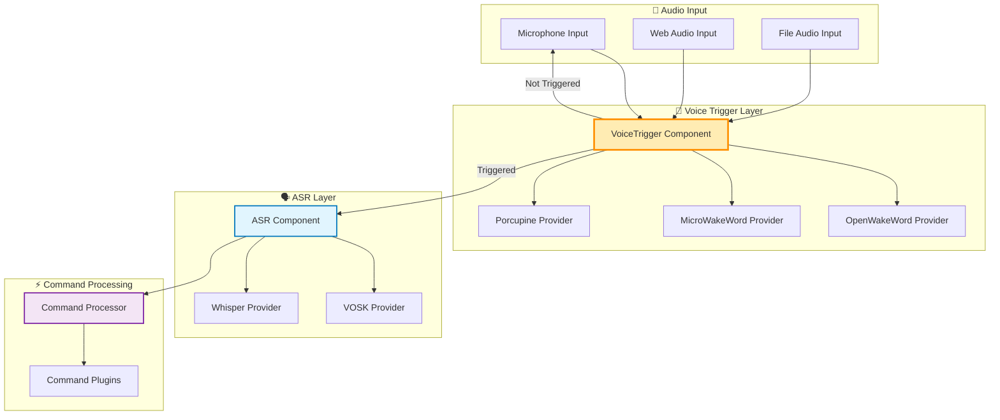
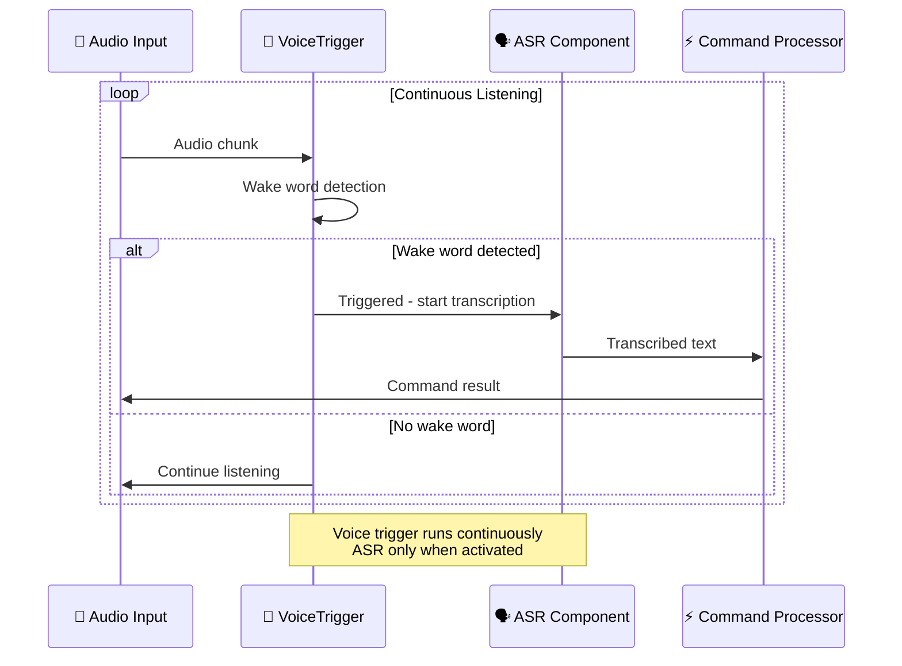

# Voice Trigger Component Design
## Извлечение активации голоса в отдельный компонент

---

## 🎯 **Текущее состояние**

### Анализ существующей архитектуры

**🔴 Python Main Codebase: НЕТ активации голоса**
- Основная Python кодовая база (`irene/`) в настоящее время **НЕ ИМЕЕТ** детекции wake word
- `VoskRunner` и `MicrophoneInput` обеспечивают **непрерывное распознавание речи** - они обрабатывают ВСЕ аудио входы без фильтрации активации
- Все голосовые входы идут напрямую к обработке команд

**✅ ESP32 Firmware: ПОЛНАЯ РЕАЛИЗАЦИЯ**
- **Основное расположение**: `ESP32/firmware/common/include/audio/wake_word_detector.hpp`
- **Реализация**: `ESP32/firmware/common/src/audio/wake_word_detector.cpp`
- **Интеграция**: `ESP32/firmware/common/src/core/state_machine.cpp`
- **Функции**:
  - microWakeWord "medium-12-bn" модель с TensorFlow Lite Micro
  - Пер-узловое обучение wake word (интегрировано в `wake_word_training/`)
  - Отслеживание порога уверенности и задержки
  - Интегрирован с audio manager и state machine

### Текущий поток обработки

```
🎤 Audio Input → 🗣️ VOSK ASR → 📝 ALL Text → ⚡ Command Processing
```

**Что ожидается с VoiceTrigger:**
```
🎤 Audio Input → 👂 Wake Word Detection → [TRIGGERED] → 🗣️ ASR → 📝 Text → ⚡ Command Processing
                                      → [NOT TRIGGERED] → Continue listening
```

---

## 🏗️ **Архитектурное решение**

### 1. Интеграция на уровне компонентов

Следуя паттерну существующих компонентов в `irene/core/components.py`:

```python
class VoiceTriggerComponent(Component):
    """Voice trigger detection component - separate from ASR"""
    
    def __init__(self):
        super().__init__("voice_trigger")
        self._detector = None
        
    def get_dependencies(self) -> list[str]:
        return ["openwakeword", "numpy"]  # НЕ vosk/whisper
        
    async def initialize(self) -> None:
        """Initialize voice trigger detection model"""
        if not self.is_available():
            raise ComponentNotAvailable("Voice trigger dependencies not available")
        
        # Load wake word detection model
        self.logger.info("Voice trigger component initialized")
        
    async def shutdown(self) -> None:
        """Cleanup voice trigger resources"""
        if self._detector:
            await self._detector.cleanup()
        self.logger.info("Voice trigger component shutdown")
```

### 2. Универсальная плагинная архитектура

Следуя паттерну `Universal*Plugin`:

```python
# irene/plugins/builtin/universal_voice_trigger_plugin.py
class UniversalVoiceTriggerPlugin(VoiceTriggerPlugin, WebAPIPlugin, CommandPlugin):
    """
    Universal Voice Trigger Plugin - manages multiple wake word providers
    
    Providers:
    - OpenWakeWordProvider (рекомендуется)
    - MicroWakeWordProvider (совместимость с ESP32)
    - PicovoiceProvider (коммерческое качество)
    - PreciseProvider (Mozilla)
    """
```

### 3. Паттерн Provider

```python
# irene/providers/wake_word/
├── __init__.py
├── base.py                    # VoiceTriggerProvider ABC
├── openwakeword.py           # OpenWakeWord provider (рекомендуется)
├── microwakeword.py          # ESP32-совместимые модели
├── picovoice.py              # Porcupine wake word
└── precise.py                # Mozilla Precise
```

### 4. Интеграция с Input Manager

**Модифицированный поток в `irene/inputs/microphone.py`:**

```python
class MicrophoneInput(InputSource):
    def __init__(self, 
                 asr_plugin: Optional[ASRPlugin] = None,
                 voice_trigger_plugin: Optional[VoiceTriggerPlugin] = None):
        self.asr_plugin = asr_plugin
        self.voice_trigger_plugin = voice_trigger_plugin
        self._voice_triggered = False
        
    async def listen(self) -> AsyncIterator[str]:
        while self._listening:
            audio_data = await self._get_audio_chunk()
            
            if self.voice_trigger_plugin:
                # Сначала проверка wake word
                is_triggered = await self.voice_trigger_plugin.detect(audio_data)
                
                if is_triggered:
                    self._voice_triggered = True
                    logger.info("Voice trigger detected!")
                    
                if self._voice_triggered:
                    # Обработка с ASR до тишины/таймаута
                    text = await self.asr_plugin.transcribe_audio(audio_data)
                    if text.strip():
                        yield text
                        self._voice_triggered = False  # Сброс после команды
            else:
                # Непрерывный режим (текущее поведение)
                text = await self.asr_plugin.transcribe_audio(audio_data)
                if text.strip():
                    yield text
```

---

## 🤖 **Выбор модели**

### Почему НЕ использовать ту же модель, что и для ASR

| Аспект | Wake Word Detection | ASR |
|--------|-------------------|-----|
| **Задача** | Детекция 1-3 специфических фраз | Транскрипция произвольной речи |
| **Режим работы** | Всегда включена, низкая задержка | По запросу после активации |
| **Размер модели** | Маленький (1-5MB) | Большой (100MB-1GB) |
| **Ресурсы** | Минимальные | Ресурсоемкие |
| **Точность** | Высокая для конкретных слов | Общая точность транскрипции |

### Рекомендуемые модели

#### 🥇 **OpenWakeWord (Рекомендуется)**

```python
# irene/providers/wake_word/openwakeword.py
class OpenWakeWordProvider(VoiceTriggerProvider):
    """
    OpenWakeWord - Modern, accurate wake word detection
    Models: alexa, hey_jarvis, hey_irene (custom trainable)
    """
```

**Преимущества:**
- **Готовые модели**: "alexa", "hey_jarvis" доступны
- **Кастомное обучение**: Можно обучить "hey_irene", "irene"
- **Высокая точность**: Низкий уровень ложных срабатываний
- **Активная разработка**: Хорошо поддерживается
- **Python-native**: Легкая интеграция

#### 🏆 **microWakeWord (ESP32 Compatible)**

```python
# irene/providers/wake_word/microwakeword.py
class MicroWakeWordProvider(VoiceTriggerProvider):
    """
    microWakeWord - Compatible with ESP32 models
    Models: medium-12-bn architecture
    """
```

**Преимущества:**
- **ESP32 совместимость**: Те же модели, что в firmware
- **Проверено**: Уже работает в ESP32 реализации
- **Консистентность**: Одинаковое wake word на всех устройствах
- **TensorFlow Lite**: Оптимизированные вычисления

#### 🔧 **Picovoice Porcupine**

```python
# irene/providers/wake_word/picovoice.py  
class PicovoiceProvider(VoiceTriggerProvider):
    """
    Picovoice Porcupine - Commercial-grade wake word detection
    Models: Pre-built + custom training available
    """
```

**Преимущества:**
- **Коммерческое качество**: Очень низкий уровень ложных срабатываний
- **Мультиязычность**: Поддержка русского языка
- **Edge-оптимизация**: Разработано для постоянной работы
- **Кастомное обучение**: Профессиональное создание моделей

### Сравнение моделей

| Provider | Размер модели | Языки | Кастомное обучение | ESP32 совместимость | Лицензия |
|----------|---------------|-------|-------------------|---------------------|----------|
| **OpenWakeWord** | 1-5MB | EN (в основном) | ✅ Да | ❌ Нет | MIT |
| **microWakeWord** | 140KB | Trainable | ✅ Да | ✅ Да | Apache 2.0 |
| **Porcupine** | 1-2MB | Multi | ✅ Платно | ❌ Нет | Commercial |
| **Precise** | 20MB | EN | ✅ Сложно | ❌ Нет | Apache 2.0 |

---

## ⚙️ **Конфигурация**

### Структура конфигурации

```toml
# config.toml
[components]
microphone = true
voice_trigger = true        # НОВЫЙ: Voice trigger component
tts = true
asr = true

[components.voice_trigger]
provider = "openwakeword"           # Отдельно от ASR
wake_words = ["irene", "jarvis"]    # Множественные wake words
threshold = 0.8
buffer_seconds = 1.0                # Буфер аудио контекста
timeout_seconds = 5.0               # Таймаут после активации

[components.voice_trigger.provider_configs.openwakeword]
model_path = "./models/wake_word/"
wake_word_models = { 
    "irene" = "custom_irene_v1.onnx",
    "jarvis" = "hey_jarvis_v2.tflite"
}

[components.asr]  
provider = "vosk"                   # Отдельный провайдер
model_path = "./models/vosk/ru_large"

[plugins.universal_voice_trigger]
enabled = true
default_provider = "openwakeword"
providers = ["openwakeword", "microwakeword"]

[plugins.universal_voice_trigger.provider_configs.microwakeword]
model_path = "./models/microwakeword/jarvis_medium.tflite"
frame_length_ms = 30
sample_rate = 16000
```

### Переменные окружения

```bash
# Voice Trigger настройки
export IRENE_COMPONENTS__VOICE_TRIGGER__PROVIDER=openwakeword
export IRENE_COMPONENTS__VOICE_TRIGGER__THRESHOLD=0.8
export IRENE_COMPONENTS__VOICE_TRIGGER__WAKE_WORDS=irene,jarvis

# Пути к моделям
export IRENE_COMPONENTS__VOICE_TRIGGER__MODEL_PATH=/opt/irene/models/wake_word/
```

---

## 🔄 **Поток обработки**

### Архитектурная диаграмма



### Последовательность обработки



---

## 🌐 **Web API Integration**

### Новые эндпоинты

```python
# Web API расширения в UniversalVoiceTriggerPlugin
@app.post("/voice_trigger/detect")
async def detect_wake_word(audio: UploadFile):
    """Test wake word detection on uploaded audio"""
    
@app.post("/voice_trigger/train")
async def train_wake_word(samples: List[UploadFile], wake_word: str):
    """Train custom wake word model"""
    
@app.get("/voice_trigger/status")
async def voice_trigger_status():
    """Get voice trigger detection status and stats"""
    
@app.get("/voice_trigger/providers")
async def list_providers():
    """List available voice trigger providers"""
    
@app.post("/voice_trigger/threshold")
async def set_threshold(threshold: float):
    """Update detection threshold"""
```

---

## 🚀 **План реализации**

### Phase 1: Core Infrastructure
1. ✅ Создать `VoiceTriggerComponent` в `irene/core/components.py`
2. ✅ Создать `VoiceTriggerProvider` базовый класс в `irene/providers/wake_word/base.py`
3. ✅ Добавить voice trigger конфигурацию в `irene/config/models.py`
4. ✅ Обновить `ComponentManager` для поддержки voice trigger

### Phase 2: Provider Implementation
1. 🔄 Реализовать `OpenWakeWordProvider` (приоритет)
2. 🔄 Добавить `MicroWakeWordProvider` как альтернативу
3. 🔄 Создать систему загрузки и кэширования моделей
4. 🔄 Интегрировать с asset management системой

### Phase 3: Integration
1. 🔄 Модифицировать `MicrophoneInput` для поддержки voice trigger
2. 🔄 Создать `UniversalVoiceTriggerPlugin`
3. 🔄 Обновить `ComponentManager` и deployment profiles
4. 🔄 Добавить voice trigger в input/output pipeline

### Phase 4: Web API & Tools
1. 🔄 Добавить voice trigger Web API эндпоинты
2. 🔄 Создать инструменты обучения/тестирования wake word
3. 🔄 Добавить voice trigger статус в health checks
4. 🔄 Создать веб-интерфейс для управления voice trigger

### Phase 5: ESP32 Integration
1. 🔄 Конвертация ESP32 TensorFlow Lite моделей в Python-совместимый формат
2. 🔄 Общий пайплайн обучения wake word между ESP32 и Python
3. 🔄 Унифицированный формат wake word моделей в экосистеме

---

## 📦 **Установка и зависимости**

### Группы зависимостей

```bash
# Базовая voice trigger функциональность
uv add irene-voice-assistant[voice-trigger]

# OpenWakeWord (рекомендуется)
uv add openwakeword torch torchaudio

# MicroWakeWord (ESP32 совместимость)
uv add microwakeword tensorflow-lite

# Picovoice Porcupine (коммерческий)
uv add pvporcupine

# Полная установка с voice trigger
uv add irene-voice-assistant[voice,voice-trigger]
```

### Проверка зависимостей

```bash
# Проверить доступность voice trigger компонентов
python -m irene.runners.cli --check-voice-trigger

# Показать статус voice trigger
python -c "from irene.utils.loader import get_voice_trigger_status; print(get_voice_trigger_status())"
```

---

## 🔧 **Deployment Profiles Update**

### Обновленные профили развертывания

```python
# Обновленные deployment profiles в ComponentManager
def get_deployment_profile(self) -> str:
    available = set(self._components.keys())
    
    if {"microphone", "voice_trigger", "asr", "tts", "web_api"} <= available:
        return "Smart Voice Assistant"      # НОВЫЙ: Voice trigger включен
    elif {"microphone", "asr", "tts", "web_api"} <= available:
        return "Continuous Voice Assistant" # Текущее поведение
    elif {"voice_trigger", "web_api"} <= available:
        return "Voice Trigger API Server"   # НОВЫЙ: Только voice trigger API
    elif "web_api" in available:
        return "API Server"
    else:
        return "Headless"
```

---

## 🎯 **Ключевые преимущества**

1. **Производительность**: Wake word модель работает непрерывно, ASR только при необходимости
2. **Точность**: Каждая модель оптимизирована для своей специфической задачи  
3. **Эффективность ресурсов**: Маленькая wake word модель vs большая ASR модель
4. **Гибкость**: Можно менять wake word модели без влияния на ASR
5. **Мульти-устройственная консистентность**: Одинаковый опыт wake word на ESP32 и Python
6. **Модульность**: Опциональный компонент с graceful degradation
7. **Расширяемость**: Поддержка множественных провайдеров wake word

---

## 🎓 **Обучение Wake Word моделей**

### Интегрированные инструменты обучения

VoiceTrigger компонент интегрирован с универсальной системой обучения wake word моделей:

```bash
# Установка с инструментами обучения (if working in project directory)
uv sync --extra wake-word-training

# Or if installing as external package:
# uv add irene-voice-assistant[wake-word-training]

# Полный цикл обучения модели
irene-record-samples --wake_word irene --speaker_name your_name --num_samples 50
irene-train-wake-word irene --epochs 55 --batch_size 16
irene-validate-model models/irene_medium_*.tflite

# Конвертация для разных провайдеров
irene-convert-to-onnx models/irene_medium_*.tflite    # → OpenWakeWord
irene-convert-to-tflite models/irene_medium_*.tflite  # → Python microWakeWord
irene-convert-to-esp32 models/irene_medium_*.tflite   # → ESP32 firmware
```

### Совместимость моделей

| Тип обучения | OpenWakeWord Provider | MicroWakeWord Provider | ESP32 Firmware |
|-------------|---------------------|----------------------|----------------|
| **microWakeWord** | ✅ Via ONNX | ✅ Native TFLite | ✅ Native C headers |
| **OpenWakeWord** | ✅ Native ONNX | ❌ Конвертация требуется | ❌ Не поддерживается |
| **Custom Training** | ✅ ONNX export | ✅ TFLite export | ✅ C header export |

### Документация по обучению

- **Полное руководство**: `wake_word_training/README.md`
- **Пример использования**: `wake_word_training/USAGE_EXAMPLE.md`
- **ESP32 интеграция**: `ESP32/firmware/GETTING_STARTED.md`

---

## 📞 **Интеграция с существующей архитектурой**

Этот компонент полностью соответствует принципам архитектуры Irene v13:

- ✅ **Опциональные компоненты** с graceful degradation
- ✅ **Universal Plugin + Provider** паттерн
- ✅ **Асинхронная обработка** на всех уровнях
- ✅ **Web API интеграция** с унифицированными эндпоинтами
- ✅ **Конфигурируемость** через TOML/ENV
- ✅ **Мультимодальность** (CLI, voice, web остаются доступными)
- ✅ **Dependency Injection** и чистая архитектура

Этот дизайн заполняет архитектурный пробел и приводит Python реализацию к функциональному паритету с ESP32 firmware, сохраняя при этом модульную, расширяемую архитектуру, которую подчеркивает v13. 