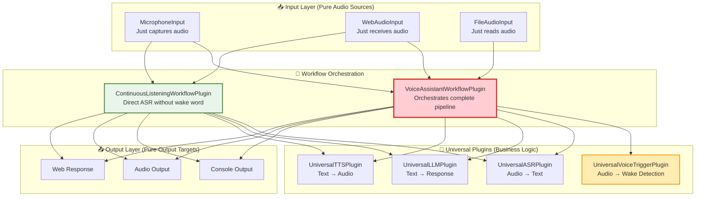
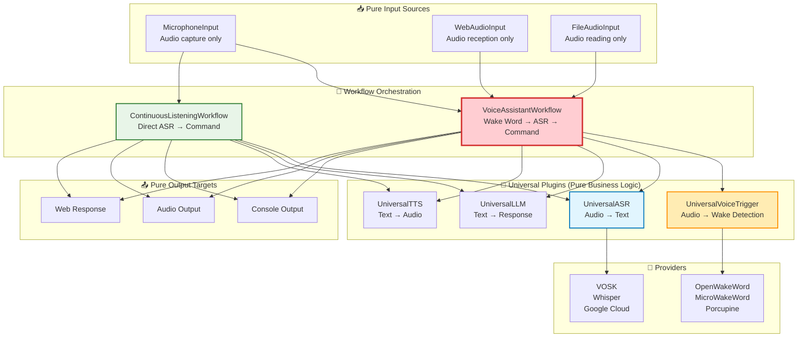
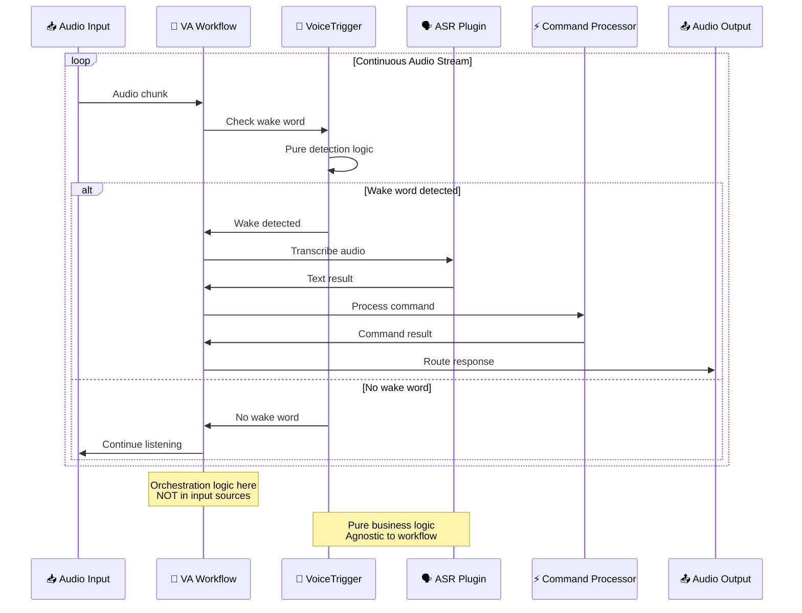

# Voice Trigger Component Design
## Извлечение активации голоса в отдельный компонент

---

## 🎯 **Текущее состояние**

### Анализ существующей архитектуры

**🔴 Python Main Codebase: НЕТ активации голоса**
- Основная Python кодовая база (`irene/`) в настоящее время **НЕ ИМЕЕТ** детекции wake word
- `VoskRunner` и `MicrophoneInput` обеспечивают **непрерывное распознавание речи** - они обрабатывают ВСЕ аудио входы без фильтрации активации
- Все голосовые входы идут напрямую к обработке команд

**✅ ESP32 Firmware: ПОЛНАЯ РЕАЛИЗАЦИЯ**
- **Основное расположение**: `ESP32/firmware/common/include/audio/wake_word_detector.hpp`
- **Реализация**: `ESP32/firmware/common/src/audio/wake_word_detector.cpp`
- **Интеграция**: `ESP32/firmware/common/src/core/state_machine.cpp`
- **Функции**:
  - microWakeWord "medium-12-bn" модель с TensorFlow Lite Micro
  - Пер-узловое обучение wake word (интегрировано в `wake_word_training/`)
  - Отслеживание порога уверенности и задержки
  - Интегрирован с audio manager и state machine

### Текущий поток обработки

```
🎤 Audio Input → 🗣️ VOSK ASR → 📝 ALL Text → ⚡ Command Processing
```

**Что ожидается с VoiceTrigger:**
```
🎤 Audio Input → 🎼 Workflow Orchestrator → 👂 Wake Word Detection → [TRIGGERED] → 🗣️ ASR → 📝 Text → ⚡ Command Processing
                                       → [NOT TRIGGERED] → Continue listening
```

---

## 🏗️ **Архитектурное решение**

### 1. Чистая архитектура с разделением ответственности

Следуя принципам v13 архитектуры, **каждый слой имеет единственную ответственность**:



### 2. Компонентная структура

```python
class VoiceTriggerComponent(Component):
    """Voice trigger detection component - separate from ASR"""
    
    def __init__(self):
        super().__init__("voice_trigger")
        self._detector = None
        
    def get_dependencies(self) -> list[str]:
        return ["openwakeword", "numpy"]  # НЕ vosk/whisper
        
    async def initialize(self) -> None:
        """Initialize voice trigger detection model"""
        if not self.is_available():
            raise ComponentNotAvailable("Voice trigger dependencies not available")
        
        # Load wake word detection model
        self.logger.info("Voice trigger component initialized")
        
    async def shutdown(self) -> None:
        """Cleanup voice trigger resources"""
        if self._detector:
            await self._detector.cleanup()
        self.logger.info("Voice trigger component shutdown")
```

### 3. Универсальная плагинная архитектура

```python
# irene/plugins/builtin/universal_voice_trigger_plugin.py
class UniversalVoiceTriggerPlugin(VoiceTriggerPlugin, WebAPIPlugin):
    """
    Universal Voice Trigger Plugin - manages multiple wake word providers
    
    Pure business logic: Audio → Wake Word Detection Result
    Agnostic to input sources and output consumers
    
    Providers:
    - OpenWakeWordProvider (рекомендуется)
    - MicroWakeWordProvider (совместимость с ESP32)
    - PicovoiceProvider (коммерческое качество)
    - PreciseProvider (Mozilla)
    """
    
    async def detect(self, audio_data: AudioData) -> WakeWordResult:
        """Pure detection logic - no workflow knowledge"""
        provider = self.get_current_provider()
        return await provider.detect_wake_word(audio_data)
```

### 4. Workflow Orchestration Plugin

```python
# irene/plugins/builtin/voice_assistant_workflow_plugin.py
class VoiceAssistantWorkflowPlugin(CommandPlugin):
    """
    Voice Assistant Workflow Orchestrator
    
    Coordinates: Audio Input → Voice Trigger → ASR → Command → Response
    This is where the workflow logic lives, not in input sources!
    """
    
    def __init__(self):
        super().__init__()
        self.voice_trigger = None  # Injected by dependency injection
        self.asr = None           # Injected by dependency injection
        self.llm = None           # Injected by dependency injection
        self.tts = None           # Injected by dependency injection
        
    async def initialize(self):
        """Initialize with injected universal plugins"""
        # Dependency injection from PluginManager
        self.voice_trigger = self.core.plugin_manager.get_plugin("universal_voice_trigger")
        self.asr = self.core.plugin_manager.get_plugin("universal_asr")
        self.llm = self.core.plugin_manager.get_plugin("universal_llm")
        self.tts = self.core.plugin_manager.get_plugin("universal_tts")
        
    async def process_audio_stream(self, audio_stream: AsyncIterator[AudioData], context: RequestContext):
        """Main workflow orchestration logic"""
        
        async for audio_data in audio_stream:
            # Step 1: Voice trigger detection (if enabled)
            if self.voice_trigger and not context.skip_wake_word:
                wake_result = await self.voice_trigger.detect(audio_data)
                if not wake_result.detected:
                    continue  # Keep listening for wake word
                    
                self.logger.info(f"Wake word '{wake_result.word}' detected with confidence {wake_result.confidence}")
                
            # Step 2: Speech recognition
            if self.asr:
                text = await self.asr.transcribe(audio_data)
                if not text.strip():
                    continue
                    
            # Step 3: Command processing
            response = await self.process_command(text, context)
            
            # Step 4: Output routing (based on context)
            await self._route_response(response, context)
            
    async def _route_response(self, response: str, context: RequestContext):
        """Route response to appropriate output channels"""
        # TTS output (if audio response requested)
        if self.tts and context.wants_audio_response:
            audio_response = await self.tts.synthesize(response)
            await self.core.output_manager.send_audio(audio_response, context)
            
        # Text output (console, web, etc.)
        await self.core.output_manager.send_text(response, context)

# irene/plugins/builtin/continuous_listening_workflow_plugin.py  
class ContinuousListeningWorkflowPlugin(CommandPlugin):
    """
    Continuous Listening Workflow - direct ASR without wake word
    Maintains current behavior for backward compatibility
    """
    
    async def process_audio_stream(self, audio_stream: AsyncIterator[AudioData], context: RequestContext):
        """Direct ASR workflow - no wake word detection"""
        
        async for audio_data in audio_stream:
            # Direct speech recognition (current behavior)
            if self.asr:
                text = await self.asr.transcribe(audio_data)
                if not text.strip():
                    continue
                    
            # Command processing and response
            response = await self.process_command(text, context)
            await self._route_response(response, context)
```

### 5. Pure Input Sources

```python
# irene/inputs/microphone.py (CLEANED)
class MicrophoneInput(InputSource):
    """
    Pure microphone input source - no workflow knowledge
    Just captures and yields raw audio data
    """
    
    def __init__(self):
        super().__init__()
        self._audio_stream = None
        
    async def listen(self) -> AsyncIterator[AudioData]:
        """Pure audio capture - no business logic"""
        while self._listening:
            try:
                audio_chunk = await self._capture_audio()
                yield AudioData(
                    data=audio_chunk,
                    timestamp=time.time(),
                    sample_rate=self.config.sample_rate,
                    channels=self.config.channels
                )
            except Exception as e:
                self.logger.error(f"Audio capture error: {e}")
                await asyncio.sleep(0.1)
                
    async def _capture_audio(self) -> bytes:
        """Low-level audio capture implementation"""
        # Just audio capture - no workflow orchestration
        return await self._audio_stream.read()
        
    # NO knowledge of voice trigger, ASR, or workflow logic!
```

### 6. Input Manager Integration

```python
# irene/core/inputs.py (UPDATED)
class InputManager:
    """
    Input manager coordinates between input sources and workflow plugins
    Uses dependency injection to maintain loose coupling
    """
    
    async def start_voice_assistant_mode(self):
        """Start voice assistant with wake word detection"""
        # Get workflow plugin
        va_workflow = self.core.plugin_manager.get_plugin("voice_assistant_workflow")
        if not va_workflow:
            raise RuntimeError("VoiceAssistantWorkflowPlugin not available")
            
        # Get input source
        mic_input = self._get_input_source("microphone")
        if not mic_input:
            raise RuntimeError("Microphone input not available")
            
        # Connect input stream to workflow
        audio_stream = mic_input.listen()
        context = RequestContext(
            source="microphone",
            wants_audio_response=True,
            skip_wake_word=False
        )
        
        # Start workflow processing
        await va_workflow.process_audio_stream(audio_stream, context)
        
    async def start_continuous_mode(self):
        """Start continuous listening without wake word"""
        continuous_workflow = self.core.plugin_manager.get_plugin("continuous_listening_workflow")
        mic_input = self._get_input_source("microphone")
        
        audio_stream = mic_input.listen()
        context = RequestContext(
            source="microphone", 
            wants_audio_response=True,
            skip_wake_word=True
        )
        
        await continuous_workflow.process_audio_stream(audio_stream, context)
```

---

## 🤖 **Выбор модели**

### Почему НЕ использовать ту же модель, что и для ASR

| Аспект | Wake Word Detection | ASR |
|--------|-------------------|-----|
| **Задача** | Детекция 1-3 специфических фраз | Транскрипция произвольной речи |
| **Режим работы** | Всегда включена, низкая задержка | По запросу после активации |
| **Размер модели** | Маленький (1-5MB) | Большой (100MB-1GB) |
| **Ресурсы** | Минимальные | Ресурсоемкие |
| **Точность** | Высокая для конкретных слов | Общая точность транскрипции |

### Рекомендуемые модели

#### 🥇 **OpenWakeWord (Рекомендуется)**

```python
# irene/providers/wake_word/openwakeword.py
class OpenWakeWordProvider(VoiceTriggerProvider):
    """
    OpenWakeWord - Modern, accurate wake word detection
    Models: alexa, hey_jarvis, hey_irene (custom trainable)
    """
    
    async def detect_wake_word(self, audio_data: AudioData) -> WakeWordResult:
        """Pure detection logic - agnostic to workflow"""
        prediction = await self._model.predict(audio_data.data)
        return WakeWordResult(
            detected=prediction.score > self.threshold,
            confidence=prediction.score,
            word=prediction.word,
            timestamp=audio_data.timestamp
        )
```

**Преимущества:**
- **Готовые модели**: "alexa", "hey_jarvis" доступны
- **Кастомное обучение**: Можно обучить "hey_irene", "irene"
- **Высокая точность**: Низкий уровень ложных срабатываний
- **Активная разработка**: Хорошо поддерживается
- **Python-native**: Легкая интеграция

#### 🏆 **microWakeWord (ESP32 Compatible)**

```python
# irene/providers/wake_word/microwakeword.py
class MicroWakeWordProvider(VoiceTriggerProvider):
    """
    microWakeWord - Compatible with ESP32 models
    Models: medium-12-bn architecture
    """
```

**Преимущества:**
- **ESP32 совместимость**: Те же модели, что в firmware
- **Проверено**: Уже работает в ESP32 реализации
- **Консистентность**: Одинаковое wake word на всех устройствах
- **TensorFlow Lite**: Оптимизированные вычисления

#### 🔧 **Picovoice Porcupine**

```python
# irene/providers/wake_word/picovoice.py  
class PicovoiceProvider(VoiceTriggerProvider):
    """
    Picovoice Porcupine - Commercial-grade wake word detection
    Models: Pre-built + custom training available
    """
```

**Преимущества:**
- **Коммерческое качество**: Очень низкий уровень ложных срабатываний
- **Мультиязычность**: Поддержка русского языка
- **Edge-оптимизация**: Разработано для постоянной работы
- **Кастомное обучение**: Профессиональное создание моделей

### Сравнение моделей

| Provider | Размер модели | Языки | Кастомное обучение | ESP32 совместимость | Лицензия |
|----------|---------------|-------|-------------------|---------------------|----------|
| **OpenWakeWord** | 1-5MB | EN (в основном) | ✅ Да | ❌ Нет | MIT |
| **microWakeWord** | 140KB | Trainable | ✅ Да | ✅ Да | Apache 2.0 |
| **Porcupine** | 1-2MB | Multi | ✅ Платно | ❌ Нет | Commercial |
| **Precise** | 20MB | EN | ✅ Сложно | ❌ Нет | Apache 2.0 |

---

## ⚙️ **Конфигурация**

### Структура конфигурации

```toml
# config.toml
[components]
microphone = true
voice_trigger = true        # НОВЫЙ: Voice trigger component
tts = true
asr = true

[components.voice_trigger]
provider = "openwakeword"           # Отдельно от ASR
wake_words = ["irene", "jarvis"]    # Множественные wake words
threshold = 0.8
buffer_seconds = 1.0                # Буфер аудио контекста
timeout_seconds = 5.0               # Таймаут после активации

[components.voice_trigger.provider_configs.openwakeword]
model_path = "./models/wake_word/"
wake_word_models = { 
    "irene" = "custom_irene_v1.onnx",
    "jarvis" = "hey_jarvis_v2.tflite"
}

[components.asr]  
provider = "vosk"                   # Отдельный провайдер
model_path = "./models/vosk/ru_large"

# НОВЫЙ: Workflow configuration
[plugins.voice_assistant_workflow]
enabled = true
default_workflow = "voice_trigger"  # or "continuous"
wake_word_timeout = 5.0
response_timeout = 10.0

[plugins.continuous_listening_workflow]
enabled = true
fallback_enabled = true             # Fallback when voice trigger unavailable

[plugins.universal_voice_trigger]
enabled = true
default_provider = "openwakeword"
providers = ["openwakeword", "microwakeword"]

[plugins.universal_voice_trigger.provider_configs.microwakeword]
model_path = "./models/microwakeword/jarvis_medium.tflite"
frame_length_ms = 30
sample_rate = 16000
```

### Переменные окружения

```bash
# Voice Trigger настройки
export IRENE_COMPONENTS__VOICE_TRIGGER__PROVIDER=openwakeword
export IRENE_COMPONENTS__VOICE_TRIGGER__THRESHOLD=0.8
export IRENE_COMPONENTS__VOICE_TRIGGER__WAKE_WORDS=irene,jarvis

# Workflow настройки
export IRENE_PLUGINS__VOICE_ASSISTANT_WORKFLOW__DEFAULT_WORKFLOW=voice_trigger

# Пути к моделям
export IRENE_COMPONENTS__VOICE_TRIGGER__MODEL_PATH=/opt/irene/models/wake_word/
```

---

## 🔄 **Поток обработки**

### Архитектурная диаграмма



### Последовательность обработки



---

## 🌐 **Web API Integration**

### Новые эндпоинты

```python
# Web API расширения в UniversalVoiceTriggerPlugin
@app.post("/voice_trigger/detect")
async def detect_wake_word(audio: UploadFile):
    """Test wake word detection on uploaded audio"""
    
@app.post("/voice_trigger/train")
async def train_wake_word(samples: List[UploadFile], wake_word: str):
    """Train custom wake word model"""
    
@app.get("/voice_trigger/status")
async def voice_trigger_status():
    """Get voice trigger detection status and stats"""
    
@app.get("/voice_trigger/providers")
async def list_providers():
    """List available voice trigger providers"""
    
@app.post("/voice_trigger/threshold")
async def set_threshold(threshold: float):
    """Update detection threshold"""

# Workflow management endpoints
@app.post("/workflow/start_voice_assistant")
async def start_voice_assistant_mode():
    """Start voice assistant workflow with wake word"""
    
@app.post("/workflow/start_continuous")
async def start_continuous_mode():
    """Start continuous listening workflow"""
    
@app.get("/workflow/status")
async def workflow_status():
    """Get current workflow status"""
```

---

## 🚀 **План реализации**

### Phase 1: Core Infrastructure
1. ✅ Создать `VoiceTriggerComponent` в `irene/core/components.py`
2. ✅ Создать `VoiceTriggerProvider` базовый класс в `irene/providers/wake_word/base.py`
3. ✅ Добавить voice trigger конфигурацию в `irene/config/models.py`
4. ✅ Обновить `ComponentManager` для поддержки voice trigger

### Phase 2: Workflow Orchestration
1. 🔄 Создать `VoiceAssistantWorkflowPlugin` (НОВЫЙ ПРИОРИТЕТ)
2. 🔄 Создать `ContinuousListeningWorkflowPlugin` для обратной совместимости
3. 🔄 Обновить `InputManager` для workflow coordination
4. 🔄 Добавить workflow конфигурацию

### Phase 3: Provider Implementation
1. 🔄 Реализовать `OpenWakeWordProvider` (приоритет)
2. 🔄 Добавить `MicroWakeWordProvider` как альтернативу
3. 🔄 Создать систему загрузки и кэширования моделей
4. 🔄 Интегрировать с asset management системой

### Phase 4: Integration
1. 🔄 Создать `UniversalVoiceTriggerPlugin`
2. 🔄 Обновить `ComponentManager` и deployment profiles
3. 🔄 Протестировать оба workflow режима
4. 🔄 Обеспечить graceful fallback между режимами

### Phase 5: Web API & Tools
1. 🔄 Добавить voice trigger Web API эндпоинты
2. 🔄 Создать инструменты обучения/тестирования wake word
3. 🔄 Добавить workflow management API
4. 🔄 Создать веб-интерфейс для управления workflows

### Phase 6: ESP32 Integration
1. 🔄 Конвертация ESP32 TensorFlow Lite моделей в Python-совместимый формат
2. 🔄 Общий пайплайн обучения wake word между ESP32 и Python
3. 🔄 Унифицированный формат wake word моделей в экосистеме

---

## 📦 **Установка и зависимости**

### Группы зависимостей

```bash
# Базовая voice trigger функциональность
uv add irene-voice-assistant[voice-trigger]

# OpenWakeWord (рекомендуется)
uv add openwakeword torch torchaudio

# MicroWakeWord (ESP32 совместимость)
uv add microwakeword tensorflow-lite

# Picovoice Porcupine (коммерческий)
uv add pvporcupine

# Полная установка с voice trigger
uv add irene-voice-assistant[voice,voice-trigger]
```

### Проверка зависимостей

```bash
# Проверить доступность voice trigger компонентов
python -m irene.runners.cli --check-voice-trigger

# Показать статус voice trigger
python -c "from irene.utils.loader import get_voice_trigger_status; print(get_voice_trigger_status())"

# Проверить workflow плагины
python -m irene.runners.cli --check-workflows
```

---

## 🔧 **Deployment Profiles Update**

### Обновленные профили развертывания

```python
# Обновленные deployment profiles в ComponentManager
def get_deployment_profile(self) -> str:
    available = set(self._components.keys())
    workflows = self._get_available_workflows()
    
    if {"microphone", "voice_trigger", "asr", "tts", "web_api"} <= available:
        if "voice_assistant_workflow" in workflows:
            return "Smart Voice Assistant"      # НОВЫЙ: Voice trigger + workflow
        else:
            return "Voice Assistant (Basic)"   # Components но нет workflow
    elif {"microphone", "asr", "tts", "web_api"} <= available:
        if "continuous_listening_workflow" in workflows:
            return "Continuous Voice Assistant" # Текущее поведение
        else:
            return "Voice Assistant (Limited)"
    elif {"voice_trigger", "web_api"} <= available:
        return "Voice Trigger API Server"   # НОВЫЙ: Только voice trigger API
    elif "web_api" in available:
        return "API Server"
    else:
        return "Headless"

def _get_available_workflows(self) -> set[str]:
    """Get available workflow plugins"""
    workflows = set()
    if self.core.plugin_manager.has_plugin("voice_assistant_workflow"):
        workflows.add("voice_assistant_workflow")
    if self.core.plugin_manager.has_plugin("continuous_listening_workflow"):
        workflows.add("continuous_listening_workflow")
    return workflows
```

---

## 🎯 **Ключевые преимущества ИСПРАВЛЕННОЙ архитектуры**

1. **✅ Separation of Concerns**: Input sources чистые, workflow логика изолирована
2. **✅ Loose Coupling**: Universal plugins агностичны к источникам и потребителям
3. **✅ Testability**: Каждый слой тестируется независимо
4. **✅ Reusability**: TTS/ASR плагины работают с любыми workflows
5. **✅ Flexibility**: Легко добавлять новые workflow типы
6. **✅ Maintainability**: Чистые границы между компонентами
7. **✅ Backward Compatibility**: Continuous workflow сохраняет текущее поведение
8. **✅ Graceful Degradation**: Система работает без voice trigger компонента

---

## 🎓 **Обучение Wake Word моделей**

### Интегрированные инструменты обучения

VoiceTrigger компонент интегрирован с универсальной системой обучения wake word моделей:

```bash
# Установка с инструментами обучения (if working in project directory)
uv sync --extra wake-word-training

# Or if installing as external package:
# uv add irene-voice-assistant[wake-word-training]

# Полный цикл обучения модели
irene-record-samples --wake_word irene --speaker_name your_name --num_samples 50
irene-train-wake-word irene --epochs 55 --batch_size 16
irene-validate-model models/irene_medium_*.tflite

# Конвертация для разных провайдеров
irene-convert-to-onnx models/irene_medium_*.tflite    # → OpenWakeWord
irene-convert-to-tflite models/irene_medium_*.tflite  # → Python microWakeWord
irene-convert-to-esp32 models/irene_medium_*.tflite   # → ESP32 firmware
```

### Совместимость моделей

| Тип обучения | OpenWakeWord Provider | MicroWakeWord Provider | ESP32 Firmware |
|-------------|---------------------|----------------------|----------------|
| **microWakeWord** | ✅ Via ONNX | ✅ Native TFLite | ✅ Native C headers |
| **OpenWakeWord** | ✅ Native ONNX | ❌ Конвертация требуется | ❌ Не поддерживается |
| **Custom Training** | ✅ ONNX export | ✅ TFLite export | ✅ C header export |

### Документация по обучению

- **Полное руководство**: `wake_word_training/README.md`
- **Пример использования**: `wake_word_training/USAGE_EXAMPLE.md`
- **ESP32 интеграция**: `ESP32/firmware/GETTING_STARTED.md`

---

## 📞 **Интеграция с существующей архитектурой**

Этот **ИСПРАВЛЕННЫЙ** компонент полностью соответствует принципам архитектуры Irene v13:

- ✅ **Опциональные компоненты** с graceful degradation
- ✅ **Universal Plugin + Provider** паттерн с чистым разделением
- ✅ **Workflow Orchestration** как отдельный слой ответственности
- ✅ **Асинхронная обработка** на всех уровнях
- ✅ **Web API интеграция** с унифицированными эндпоинтами
- ✅ **Конфигурируемость** через TOML/ENV
- ✅ **Мультимодальность** (CLI, voice, web остаются доступными)
- ✅ **Dependency Injection** и чистая архитектура
- ✅ **Single Responsibility Principle** на каждом уровне

Этот дизайн заполняет архитектурный пробел и приводит Python реализацию к функциональному паритету с ESP32 firmware, **сохраняя при этом чистую v13 архитектуру без нарушения принципов разделения ответственности**. 