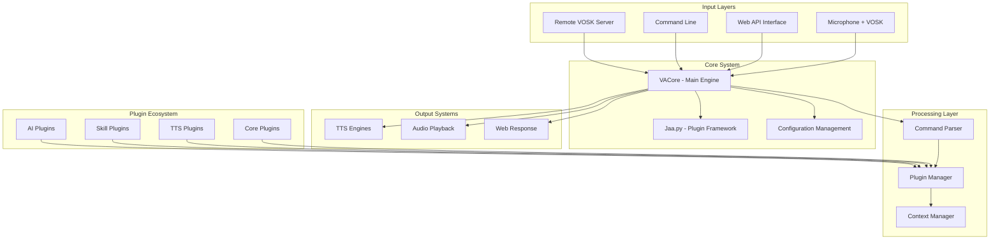

# Comprehensive Codebase Analysis: Irene Voice Assistant

## Project Overview

**Irene Voice Assistant** is a sophisticated Russian offline voice assistant built in Python. The project is designed with modularity, extensibility, and offline-first operation as core principles. It features a robust plugin system, multiple deployment options, and comprehensive multi-modal interaction capabilities.

## Architecture Overview



## Core Components

### 1. **VACore (vacore.py)** - The Heart of the System
- **Purpose**: Main orchestrator extending the Jaa.py plugin framework
- **Key Features**:
  - Voice command processing pipeline
  - Plugin lifecycle management
  - Timer system (8 concurrent timers)
  - Context management for conversational flows
  - Multi-modal TTS and audio handling
  - AI integration with OpenAI-compatible APIs

**Key Architecture Patterns**:
```python
class VACore(JaaCore):
    def __init__(self):
        # Plugin registries
        self.commands = {}        # Command handlers
        self.ttss = {}           # TTS engines
        self.playwavs = {}       # Audio players
        self.normalizers = {}    # Text normalizers
        self.fuzzy_processors = {} # Fuzzy matching
        self.ai_tools = {}       # AI function calls
```

### 2. **Jaa.py - Plugin Framework**
- **Purpose**: Minimalistic single-file plugin system with zero dependencies
- **Features**:
  - Automatic plugin discovery and loading
  - JSON-based configuration management
  - Version-aware option migration
  - Gradio-based settings UI generation
  - Plugin dependency resolution

**Plugin Lifecycle**:
1. Discovery (`plugins/plugin_*.py`)
2. Import and validation
3. Manifest processing
4. Option loading/creation
5. Registration with core systems

### 3. **Multi-Modal Input Systems**

#### Speech Recognition Options:
- **VOSK (Primary)**: `runva_vosk.py` - Offline speech recognition
- **Remote VOSK**: `runva_voskrem.py` - Docker-based ASR server
- **Google Speech**: `runva_speechrecognition.py` - Cloud-based recognition
- **Web Interface**: Real-time browser-based recognition

#### Web API (`runva_webapi.py`):
- **FastAPI-based REST API**
- **WebSocket support** for real-time audio streaming
- **Multiple response formats**: 
  - `none` (server-side TTS)
  - `saytxt` (client-side TTS)
  - `saywav` (server-rendered audio)

## Plugin Ecosystem Analysis

### Plugin Categories:

#### **Core Infrastructure Plugins**:
- `core.py` - System configuration and basic settings
- `plugin_normalizer_*` - Text normalization engines
- `plugin_playwav_*` - Audio playback engines
- `plugin_tts_*` - Text-to-speech engines

#### **Skill Plugins** (User-facing functionality):
- `plugin_greetings.py` - Basic interaction demo
- `plugin_timer.py` - Timer functionality with multi-timer support
- `plugin_weather_*.py` - Weather information services
- `plugin_datetime.py` - Date/time queries
- `plugin_mediacmds.py` - Media player control
- `plugin_random.py` - Random number/decision generation

#### **AI Integration**:
- `plugin_boltalka_vsegpt.py` - ChatGPT integration
- Support for OpenAI-compatible APIs
- Tool-calling capabilities for natural language function invocation

### Plugin Architecture Pattern:
```python
def start(core: VACore):
    return {
        "name": "Plugin Name",
        "version": "1.0",
        "require_online": False,
        "commands": {
            "trigger phrase|alt phrase": handler_function
        },
        "default_options": {...}
    }
```

## Technical Infrastructure

### **Dependencies & Stack**:
```
Core: Python 3.5+ (recommended 3.7-3.11)
Audio: sounddevice, soundfile, audioplayer
ASR: vosk, vosk-tts
TTS: pyttsx3, elevenlabs
Web: fastapi, uvicorn, gradio
Utils: requests, numpy, termcolor, python-dateutil
```

### **Audio Processing Pipeline**:
1. **Input Capture** → sounddevice/PyAudio
2. **Voice Activity Detection** → VOSK's built-in VAD
3. **Speech Recognition** → VOSK offline models
4. **Command Processing** → Plugin system
5. **Response Generation** → TTS engines
6. **Audio Output** → Multiple playback backends

### **Configuration Management**:
- **JSON-based configuration** in `options/` directory
- **Automatic option migration** on version changes
- **Web-based settings manager** via Gradio
- **Docker-specific configurations** in `options_docker/`

## Deployment Architecture

### **Local Installation**:
- Direct Python execution with pip dependencies
- Multiple OS support (Windows/Linux/macOS)
- Platform-specific installation guides

### **Docker Deployment**:
- **Multi-stage Dockerfile** with VOSK model downloading
- **ARM support** for Raspberry Pi deployments
- **Volume mounting** for persistent configuration
- **Component-based** Docker deployment option

### **Multi-Instance Architecture**:
- **Client-Server mode** for distributed microphone access
- **Web API** for remote integration
- **Telegram bot integration** support
- **Home Assistant integration** via third-party plugins

## Advanced Features

### **Context Management**:
- **Conversational state** preservation
- **Configurable timeout** durations
- **Remote client synchronization** for web interfaces

### **AI Integration** (Beta):
- **OpenAI-compatible API** support
- **Tool calling** for natural language function invocation
- **Flexible model backends** (local/remote)
- **Example**: "Set timer for two and a half hours" → automatic parameter extraction

### **Fuzzy Command Processing**:
- **Multiple fuzzy matching backends**:
  - thefuzz for string similarity
  - scikit-learn for ML-based matching
  - sentence-transformers for semantic similarity
- **Configurable confidence thresholds**

### **Extensibility Features**:
- **Plugin manager** for third-party plugin installation
- **GitHub-based plugin catalog**
- **Automatic dependency installation**
- **Plugin development documentation**

## Development & Maintenance

### **Code Quality & Patterns**:
- **Modular architecture** with clear separation of concerns
- **Comprehensive logging** system with configurable levels
- **Error handling** with graceful degradation
- **Type hints** in newer components
- **Consistent plugin API** design

### **Testing & Debugging**:
- **Command-line interface** for development (`runva_cmdline.py`)
- **Comprehensive logging** with file and console output
- **Error isolation** in plugin system
- **Development documentation** for contributors

### **Community & Ecosystem**:
- **Active community** with Telegram group
- **Third-party plugin ecosystem**
- **Documentation** for multiple languages and platforms
- **Contributing guidelines** for code and plugin contributions

## Security & Privacy Considerations

### **Offline-First Design**:
- **Complete offline operation** capability
- **Optional online features** with explicit configuration
- **Local voice processing** without cloud dependencies

### **Data Handling**:
- **Local configuration storage**
- **Optional TTS caching** with user control
- **No telemetry** or usage tracking by default

## File Structure Overview

### **Core System Files**:
- `vacore.py` - Main voice assistant engine (762 lines)
- `jaa.py` - Plugin framework (351 lines)
- `requirements.txt` - Python dependencies

### **Entry Points**:
- `runva_vosk.py` - VOSK-based speech recognition runner
- `runva_webapi.py` - Web API server (410 lines)
- `runva_speechrecognition.py` - Google Speech recognition
- `runva_voskrem.py` - Remote VOSK server client
- `runva_cmdline.py` - Command-line interface
- `runva_settings_manager.py` - Web-based configuration UI

### **Plugin System**:
- `plugins/` - 28 plugin files covering TTS, audio, skills
- `plugins_inactive/` - Disabled/experimental plugins
- `plugins_vasi/` - Compatibility layer for Vasisualy plugins

### **Supporting Infrastructure**:
- `lingua_franca/` - Text normalization library
- `eng_to_ipa/` - Phonetic transcription utilities
- `utils/` - Number-to-text conversion utilities
- `mpcapi/` - Media player control API

### **Web Interfaces**:
- `webapi_client/` - Browser-based voice interface
- `mic_client/` - Microphone access web client

### **Configuration & Data**:
- `model/` - VOSK speech recognition models
- `media/` - Audio assets (timer sounds)
- `docs/` - Installation and development documentation

## Strengths & Innovation

1. **True Offline Operation**: Unlike most modern voice assistants
2. **Modular Plugin Architecture**: Easy extensibility without core changes
3. **Multi-Modal Interface**: Voice, web, command-line, and API access
4. **Language Agnostic Core**: Adaptable to other languages
5. **Docker & Cloud Ready**: Modern deployment options
6. **AI Integration**: Cutting-edge LLM integration with tool calling
7. **Community Driven**: Open-source with active plugin ecosystem

## Areas for Potential Enhancement

1. **Modern Python Features**: Gradual migration to newer Python patterns
2. **Async/Await**: More async processing for better performance
3. **Type Safety**: Increased type annotation coverage
4. **Test Coverage**: Automated testing framework
5. **Internationalization**: Structured multi-language support
6. **Performance Optimization**: Audio processing optimizations

## Conclusion

This codebase represents a well-architected, production-ready voice assistant with a strong focus on privacy, extensibility, and offline capability—rare qualities in the current voice assistant landscape. The project demonstrates sophisticated understanding of both voice processing technologies and software architecture principles, making it a valuable reference implementation for offline voice assistant development.

The modular design allows for easy customization and extension, while the multi-modal interface ensures broad accessibility. The combination of traditional rule-based command processing with modern AI integration positions this project at the forefront of privacy-focused voice assistant technology. 