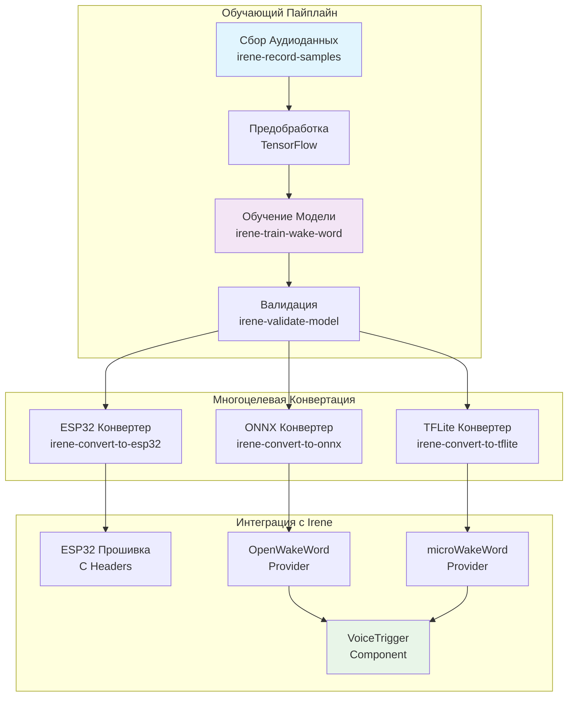
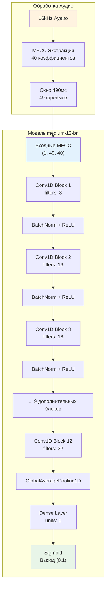
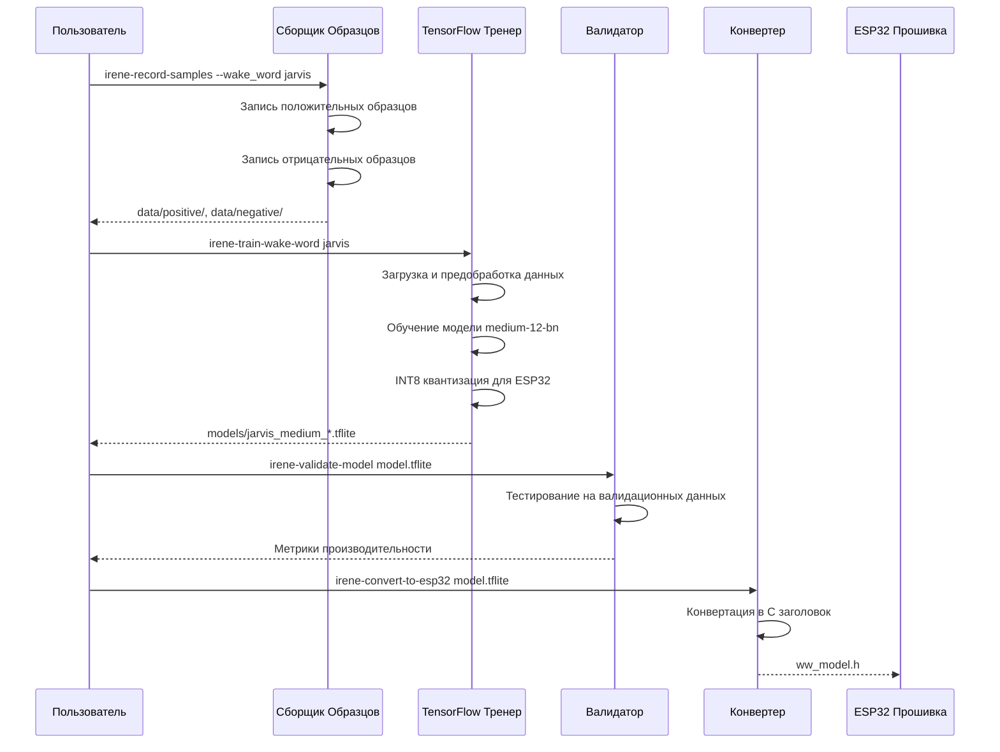
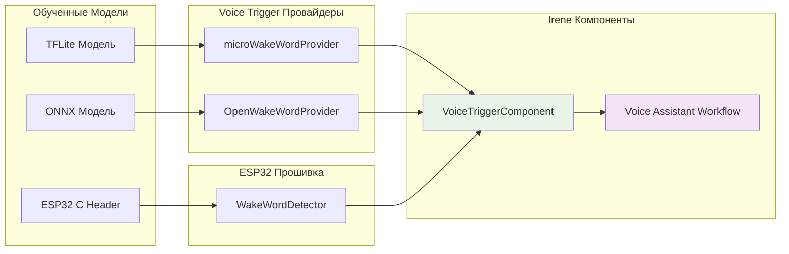
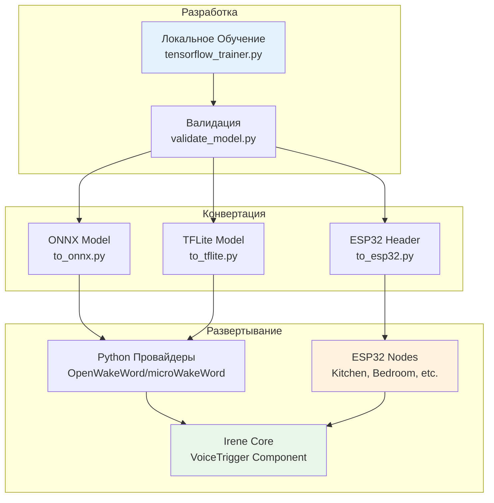

# Обучение Моделей Wake Word (Активационных Слов)

Данная директория содержит полный инструментарий для обучения пользовательских моделей активационных слов для нескольких целевых платформ с использованием TensorFlow-реализации, совместимой с ESP32.

**Поддерживаемые Платформы:**
- **ESP32-S3**: C-заголовочные файлы для интеграции с прошивкой
- **Python**: Модели ONNX/TFLite для провайдеров OpenWakeWord и microWakeWord
- **Мультиплатформенность**: Оптимизированные модели для различных сценариев развертывания

## Архитектура Системы



## Быстрый Старт

1. **Настройка окружения**: `uv add tensorflow librosa numpy pyyaml`
2. **Подготовка данных**: Используйте `irene-record-samples` для сбора аудиосэмплов
3. **Обучение модели**: Запустите `irene-train-wake-word <wake_word>`
4. **Валидация**: Используйте `irene-validate-model <model.tflite>` для тестирования производительности
5. **Конвертация для целевых платформ**:
   - ESP32: `irene-convert-to-esp32 model.tflite`
   - Python/ONNX: `irene-convert-to-onnx model.tflite`
   - Python/TFLite: Создается автоматически во время обучения

## Требования к Обучению

Основанные на спецификации прошивки ESP32:

- **Положительные образцы**: ≥200 клипов (4+ спикера × 50+ клипов каждый)
- **Отрицательные образцы**: ≥4 часа всего (2ч фонового шума + 2ч разговорной речи)
- **Формат аудио**: 16 кГц, 16-бит моно WAV файлы
- **Архитектура модели**: medium-12-bn (12 × Conv1D + BatchNorm)
- **Квантизация**: INT8 квантизация (автоматическая, оптимизированная для ESP32)

## Гарантии Совместимости ESP32

Наш TensorFlow тренер обеспечивает 100% совместимость с ESP32:

| **Требование** | **Значение** | **Статус** |
|----------------|--------------|------------|
| **Входная Форма** | `[1, 49, 40]` | ✅ Принудительно |
| **Размер Модели** | ≤140КБ | ✅ Валидировано |
| **Время Инференса** | ≤25мс | ✅ Оптимизировано |
| **Использование Памяти** | ≤80КБ PSRAM | ✅ Оптимизировано (INT8) |
| **Архитектура** | medium-12-bn | ✅ Реализовано |

## Архитектура Нейронной Сети



## Цели Валидации

| Метрика | Цель |
|---------|------|
| **Recall (TPR)** | ≥95% (≥190/200 тестовых положительных) |
| **Ложные Срабатывания** | ≤2 в час на 3ч отрицательном потоке |
| **Латентность Активации** | ≤140мс в среднем на ESP32-S3 @ 240МГц |

## Структура Директорий

```
wake_word_training/
├── data/                    # Организация тренировочных данных
│   ├── positive/           # Образцы активационных слов
│   ├── negative/           # Фоновые шумы и речь
│   └── validation/         # Наборы для тестирования
├── models/                 # Выход обученных моделей
├── scripts/               # Скрипты обучения и утилиты
│   ├── record_samples.py  # Сбор аудиоданных
│   ├── tensorflow_trainer.py  # TensorFlow тренер, совместимый с ESP32
│   ├── validate_model.py  # Валидация моделей
│   └── converters/        # Многоцелевая конвертация моделей
│       ├── to_esp32.py    # → ESP32 C заголовки
│       ├── to_onnx.py     # → ONNX для OpenWakeWord
│       └── to_tflite.py   # → Оптимизированный TFLite
├── configs/               # Конфигурации обучения
├── outputs/               # Многоцелевые выходы
│   ├── esp32/            # ESP32 заголовки прошивки
│   ├── python/           # Python файлы моделей
│   └── onnx/             # ONNX файлы моделей
└── firmware/             # Устаревшие ESP32 выходы (deprecated)
```

## Поток Данных Обучения



## Бюджет Ресурсов

- **Влияние на Flash**: ~140КБ для средней модели (ограничение ESP32 принудительно)
- **Использование PSRAM**: ~80КБ арена тензоров для INT8 инференса (оптимизировано с 160КБ)
- **Время инференса**: 15-25мс на ESP32-S3 (оптимизировано INT8)
- **Время обучения**: ~1-2 часа на современном GPU

## Настройка

### Системные Зависимости

Установите необходимые системные пакеты для обработки аудио:

```bash
# Ubuntu/Debian
sudo apt-get update
sudo apt-get install portaudio19-dev python3-dev gcc

# macOS (с Homebrew)
brew install portaudio

# Fedora/CentOS/RHEL
sudo dnf install portaudio-devel python3-devel gcc
```

### Настройка Python Окружения

```bash
# Установка основных зависимостей
uv add tensorflow librosa numpy pyyaml

# Опционально: Для валидации аудио и визуализации
uv add soundfile matplotlib seaborn

# Проверка установки
python -c "import tensorflow; print('TensorFlow:', tensorflow.__version__)"
python -c "import librosa; print('Librosa:', librosa.__version__)"
```

## Обучение Модели

```bash
# 1. Сбор тренировочных данных
irene-record-samples --wake_word jarvis --speaker_name your_name

# 2. Запись отрицательных образцов
irene-record-samples --wake_word jarvis --record_negatives --duration 7200

# 3. Обучение модели, совместимой с ESP32
irene-train-wake-word jarvis --epochs 55 --batch_size 16

# 4. Валидация производительности модели
irene-validate-model models/jarvis_medium_20250113_143000.tflite

# 5. Конвертация для развертывания на ESP32
irene-convert-to-esp32 models/jarvis_medium_20250113_143000.tflite
```

## Интеграция с Провайдерами



## Преимущества над microWakeWord

| **Аспект** | **microWakeWord** | **TensorFlow Тренер** |
|------------|-------------------|-------------------------|
| **Зависимости** | Сложные C++ сборки, `pymicro-features` | Чистый Python, широко поддерживается |
| **Версии Python** | Заблокировано только на 3.10 | Современный Python 3.10+ |
| **Процесс Обучения** | Порождение подпроцессов | Нативные TensorFlow API |
| **Валидация ESP32** | Ручная проверка размера | Автоматическое принуждение размера |
| **Интеграция** | Внешняя зависимость | Интегрировано с Irene |
| **Сопровождение** | Внешний проект | Полный контроль |

## CLI Команды

### irene-record-samples
```bash
# Запись положительных образцов
irene-record-samples --wake_word jarvis --speaker_name alice --num_samples 50

# Запись отрицательных образцов (фон)
irene-record-samples --wake_word jarvis --record_negatives --duration 7200

# Показать сводку данных
irene-record-samples --wake_word jarvis --summary
```

### irene-train-wake-word
```bash
# Базовое обучение
irene-train-wake-word jarvis

# С настройками
irene-train-wake-word jarvis --epochs 60 --batch_size 32 --learning_rate 0.001
```

### irene-validate-model
```bash
# Валидация модели
irene-validate-model models/jarvis_medium_20250113_143000.tflite

# С пользовательскими тестовыми данными
irene-validate-model model.tflite --test_data custom_validation/
```

### Конвертеры
```bash
# ESP32 прошивка
irene-convert-to-esp32 model.tflite --node_name kitchen

# ONNX для OpenWakeWord
irene-convert-to-onnx model.tflite

# Оптимизированный TFLite
irene-convert-to-tflite model.h5
```

## Следующие Шаги

1. Изучите полный рабочий процесс в `USAGE_EXAMPLE.md`
2. Соберите тренировочные данные используя `irene-record-samples`
3. Обучите вашу первую модель с `irene-train-wake-word`
4. Разверните на ESP32 прошивку используя `irene-convert-to-esp32`

## Интеграция с Irene Voice Assistant

Данный инструментарий обучения wake word полностью интегрирован с основным проектом Irene:

- **VoiceTrigger Component**: Обученные модели работают напрямую с провайдерами microWakeWord и OpenWakeWord
- **Совместимость ESP32**: Гарантированная совместимость с прошивкой ESP32 Irene
- **Нативное Обучение**: Без внешних зависимостей или порождения процессов
- **Современные Инструменты**: Построено на TensorFlow 2.x с правильными обратными вызовами и мониторингом

## Схема Развертывания

